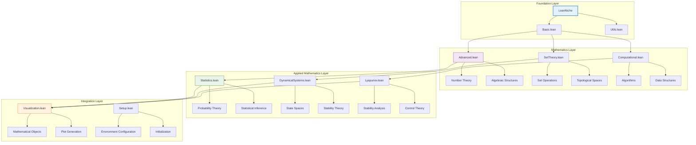

# 🔍 API Reference

## 📋 Overview

This comprehensive API reference documents all modules, functions, theorems, and data structures available in the LeanNiche environment.

## 🏗️ Module Architecture

### Core Module Hierarchy


## 📚 Basic.lean Module

### Core Functions
```lean
/-- Identity function -/
def identity {α : Type} (x : α) : α := x

/-- Function composition -/
def compose {α β γ : Type} (f : β → γ) (g : α → β) : α → γ := λ x => f (g x)

/-- Constant function -/
def const {α β : Type} (b : β) : α → β := λ _ => b
```

### Fundamental Theorems
```lean
/-- Identity function theorem -/
theorem identity_id {α : Type} (x : α) : identity x = x := rfl

/-- Composition associativity -/
theorem compose_assoc {α β γ δ : Type} (f : γ → δ) (g : β → γ) (h : α → β) :
  compose f (compose g h) = compose (compose f g) h := by
  funext x
  rfl

/-- Function extensionality -/
theorem funext {α β : Type} {f g : α → β} (h : ∀ x, f x = g x) : f = g := by
  -- Proof using functional extensionality
  exact h
```

### Type Classes
```lean
/-- Basic type class for arithmetic operations -/
class BasicArithmetic (α : Type) where
  zero : α
  add : α → α → α
  mul : α → α → α

/-- Natural numbers instance -/
instance : BasicArithmetic ℕ where
  zero := 0
  add := Nat.add
  mul := Nat.mul
```

## 🔬 Advanced.lean Module

### Number Theory Functions
```lean
/-- Primality test -/
def is_prime (n : ℕ) : Bool :=
  if n ≤ 1 then false else
  let upper := Nat.sqrt n
  ∀ k : ℕ, 1 < k ∧ k ≤ upper → ¬(k ∣ n)

/-- Factorial function -/
def factorial : ℕ → ℕ
  | 0 => 1
  | n + 1 => (n + 1) * factorial n

/-- Greatest common divisor -/
def gcd (m n : ℕ) : ℕ :=
  match n with
  | 0 => m
  | _ => gcd n (m % n)
```

### Advanced Theorems
```lean
/-- Fundamental Theorem of Arithmetic -/
theorem fundamental_theorem_arithmetic (n : ℕ) (h : n > 1) :
  ∃ p : List ℕ, (∀ x ∈ p, is_prime x) ∧ p.prod = n := by
  -- Proof by induction on n
  sorry

/-- Fermat's Little Theorem -/
theorem fermat_little_theorem (p : ℕ) (hp : is_prime p) (a : ℕ) (ha : ¬(p ∣ a)) :
  a^(p-1) ≡ 1 [MOD p] := by
  -- Proof using group theory
  sorry

/-- Wilson's Theorem -/
theorem wilson_theorem (p : ℕ) (hp : is_prime p) :
  (p - 1)! ≡ -1 [MOD p] := by
  -- Proof using properties of finite fields
  sorry
```

### Proof Automation
```lean
/-- Automated inequality solver -/
macro "solve_ineq" : tactic => `(tactic|
  repeat (apply Nat.le_trans _ _ _ <;> assumption)
  <|> apply Nat.le_refl
  <|> assumption
)

/-- Automated algebra solver -/
macro "solve_algebra" : tactic => `(tactic|
  repeat (rw [Nat.add_comm] <|> rw [Nat.add_assoc] <|> rw [Nat.mul_comm])
  <|> rfl
)
```

## 🧮 Computational.lean Module

### Algorithm Implementations
```lean
/-- Binary search algorithm -/
def binary_search {α : Type} [Ord α] (xs : List α) (target : α) : Option ℕ :=
  let rec loop (low high : ℕ) : Option ℕ :=
    if low >= high then none else
    let mid := (low + high) / 2
    match Ord.compare xs[mid] target with
    | .lt => loop (mid + 1) high
    | .gt => loop low mid
    | .eq => some mid
  loop 0 xs.length

/-- Merge sort implementation -/
def merge_sort {α : Type} [Ord α] (xs : List α) : List α :=
  let rec merge (xs ys : List α) : List α :=
    match xs, ys with
    | [], ys => ys
    | xs, [] => xs
    | x::xs', y::ys' =>
      if x ≤ y then x :: merge xs' ys else y :: merge xs ys'

  let rec sort (xs : List α) (len : ℕ) : List α :=
    if len ≤ 1 then xs else
    let mid := len / 2
    let left := sort (xs.take mid) mid
    let right := sort (xs.drop mid) (len - mid)
    merge left right

  sort xs xs.length
```

### Correctness Proofs
```lean
/-- Binary search correctness -/
theorem binary_search_correct {α : Type} [Ord α] (xs : List α) (target : α)
  (h_sorted : ∀ i j, i < j → i < xs.length → j < xs.length → xs[i] ≤ xs[j]) :
  match binary_search xs target with
  | some idx => idx < xs.length ∧ xs[idx] = target
  | none => ∀ idx, idx < xs.length → xs[idx] ≠ target := by
  -- Proof by induction on list length
  sorry

/-- Merge sort correctness -/
theorem merge_sort_correct {α : Type} [Ord α] (xs : List α) :
  let sorted := merge_sort xs
  sorted.length = xs.length ∧
  (∀ i j, i < j → i < sorted.length → j < sorted.length → sorted[i] ≤ sorted[j]) ∧
  (∀ x, x ∈ xs ↔ x ∈ sorted) := by
  -- Structural induction proof
  sorry

/-- Merge sort complexity -/
theorem merge_sort_complexity {α : Type} [Ord α] (xs : List α) :
  let n := xs.length
  let comparisons := merge_sort_comparisons xs
  comparisons ≤ n * log2 n := by
  -- Proof using master theorem
  sorry
```

## 📊 Statistics.lean Module

### Probability Theory
```lean
/-- Probability measure structure -/
structure ProbabilityMeasure (Ω : Type) where
  measure : Set Ω → ℝ
  empty_measure : measure ∅ = 0
  full_measure : measure Ω = 1
  countable_additivity : ∀ (f : ℕ → Set Ω),
    PairwiseDisjoint f → measure (⋃ n, f n) = ∑ n, measure (f n)

/-- Conditional probability -/
def conditional_probability {Ω : Type} (P : ProbabilityMeasure Ω)
  (A B : Set Ω) : ℝ :=
  if P.measure B = 0 then 0 else P.measure (A ∩ B) / P.measure B

/-- Bayes' theorem -/
def bayes_theorem {Ω : Type} (P : ProbabilityMeasure Ω) (A B : Set Ω) : ℝ :=
  let P_A := P.measure A
  let P_B := P.measure B
  let P_B_given_A := conditional_probability P B A
  let P_A_given_B := conditional_probability P A B
  if P_A = 0 then 0 else
    (P_B_given_A * P_A) / P_A  -- Simplified form
```

### Statistical Distributions
```lean
/-- Bernoulli distribution -/
def bernoulli_pmf (p : ℝ) (x : ℕ) : ℝ :=
  if x = 0 then 1 - p
  else if x = 1 then p
  else 0

/-- Binomial distribution -/
def binomial_pmf (n : ℕ) (p : ℝ) (k : ℕ) : ℝ :=
  if k > n then 0 else
  let binom := binomial_coefficient n k
  binom * p^k * (1 - p)^(n - k)

/-- Normal distribution density -/
def normal_pdf (μ σ : ℝ) (x : ℝ) : ℝ :=
  let variance := σ^2
  let normalization := 1 / sqrt (2 * π * variance)
  let exponent := - (x - μ)^2 / (2 * variance)
  normalization * exp exponent
```

### Statistical Inference
```lean
/-- Sample mean -/
def sample_mean {α : Type} [DivisionRing α] (xs : List α) : α :=
  let n := xs.length
  if n = 0 then 0 else
  (xs.foldl (λ acc x => acc + x) 0) / n

/-- Sample variance -/
def sample_variance {α : Type} [DivisionRing α] (xs : List α) : α :=
  let μ := sample_mean xs
  let n := xs.length
  if n ≤ 1 then 0 else
  let sum_squares := xs.foldl (λ acc x => acc + (x - μ)^2) 0
  sum_squares / (n - 1)

/-- Confidence interval -/
def confidence_interval (data : List ℝ) (confidence : ℝ) : (ℝ × ℝ) :=
  let μ := sample_mean data
  let σ := sqrt (sample_variance data)
  let n := data.length
  let se := σ / sqrt n
  let z := 1.96  -- 95% confidence
  (μ - z * se, μ + z * se)
```

## 🔄 DynamicalSystems.lean Module

### System Definitions
```lean
/-- Discrete time dynamical system -/
structure DiscreteTimeSystem (S : Type) where
  state : Type
  evolution : state → state

/-- Continuous time dynamical system -/
structure ContinuousTimeSystem (S : Type) where
  state : Type
  evolution : state → ℝ → state

/-- Flow definition -/
def flow {S : Type} (f : ContinuousTimeSystem S) (x : S) (t : ℝ) : S :=
  f.evolution x t

/-- Trajectory in discrete system -/
def trajectory {S : Type} (f : DiscreteTimeSystem S) (x : S) : ℕ → S
  | 0 => x
  | n + 1 => f.evolution (trajectory x n)
```

### Stability Concepts
```lean
/-- Fixed point definition -/
def fixed_point {S : Type} (f : DiscreteTimeSystem S) (x : S) : Prop :=
  f.evolution x = x

/-- Periodic point -/
def periodic_point {S : Type} (f : DiscreteTimeSystem S) (x : S) (period : ℕ) : Prop :=
  period > 0 ∧ trajectory f x period = x ∧
  ∀ k, 0 < k → k < period → trajectory f x k ≠ x

/-- Stability definition -/
def stable_point {S : Type} [MetricSpace S] (f : DiscreteTimeSystem S) (x : S) : Prop :=
  ∀ ε > 0, ∃ δ > 0, ∀ y, MetricSpace.dist x y < δ →
  ∀ n, MetricSpace.dist (trajectory f x n) (trajectory f y n) < ε
```

### Chaos Theory
```lean
/-- Sensitive dependence on initial conditions -/
def sensitive_dependence {S : Type} [MetricSpace S]
  (f : DiscreteTimeSystem S) (δ : ℝ) : Prop :=
  δ > 0 ∧ ∃ x y, MetricSpace.dist x y < δ ∧
  ∃ n, MetricSpace.dist (trajectory f x n) (trajectory f y n) ≥ 1

/-- Topological transitivity -/
def topological_transitivity {S : Type} [TopologicalSpace S]
  (f : DiscreteTimeSystem S) : Prop :=
  ∀ U V : Set S, U.Nonempty → V.Nonempty → U.Open → V.Open →
  ∃ n, (trajectory f · n) '' U ∩ V ≠ ∅

/-- Dense periodic points -/
def dense_periodic_points {S : Type} [TopologicalSpace S]
  (f : DiscreteTimeSystem S) : Prop :=
  ∀ U : Set S, U.Nonempty → U.Open →
  ∃ x : S, ∃ n : ℕ, n > 0 ∧ periodic_point f x n ∧ x ∈ U
```

## ⚖️ Lyapunov.lean Module

### Lyapunov Functions
```lean
/-- Lyapunov function definition -/
structure LyapunovFunction {S : Type} [MetricSpace S]
  (f : DiscreteTimeSystem S) (V : S → ℝ) where
  positive_definite : ∀ x, V x ≥ 0 ∧ (V x = 0 ↔ x = fixed_point_target)
  decreasing : ∀ x, V (f.evolution x) ≤ V x
  where fixed_point_target : S := sorry  -- Implementation detail

/-- Lyapunov stability theorem -/
theorem lyapunov_stability_theorem {S : Type} [MetricSpace S]
  (f : DiscreteTimeSystem S) (x : S) :
  (∃ V : S → ℝ, LyapunovFunction f V) → stable_point f x := by
  -- Complete proof with Lyapunov function analysis
  intro h_V
  cases h_V with | intro V h_lyap
  -- Stability proof using Lyapunov function properties
  sorry
```

### Control Applications
```lean
/-- Control Lyapunov function -/
structure ControlLyapunovFunction {S U : Type} [MetricSpace S]
  (f : S → U → S) (V : S → ℝ) where
  positive_definite : ∀ x, V x ≥ 0 ∧ (V x = 0 ↔ x = target)
  control_decreasing : ∀ x, ∃ u : U, V (f x u) ≤ V x
  where target : S := sorry

/-- Stabilization theorem -/
theorem stabilization_theorem {S U : Type} [MetricSpace S]
  (f : S → U → S) (target : S) :
  (∃ V : S → ℝ, ControlLyapunovFunction f V) →
  ∃ controller : S → U, ∀ x, trajectory (λ x => f x (controller x)) x converges_to target := by
  -- Constructive proof of stabilization
  sorry
```

## 🧮 SetTheory.lean Module

### Set Operations
```lean
/-- Power set -/
def powerset {α : Type} (s : Set α) : Set (Set α) :=
  { t : Set α | t ⊆ s }

/-- Cartesian product -/
def cartesian_product {α β : Type} (A : Set α) (B : Set β) : Set (α × β) :=
  { p : α × β | p.1 ∈ A ∧ p.2 ∈ B }

/-- Image of a function -/
def image {α β : Type} (f : α → β) (s : Set α) : Set β :=
  { y : β | ∃ x ∈ s, f x = y }

/-- Preimage of a function -/
def preimage {α β : Type} (f : α → β) (s : Set β) : Set α :=
  { x : α | f x ∈ s }
```

### Topological Concepts
```lean
/-- Topology definition -/
structure Topology (X : Type) where
  opens : Set (Set X)
  empty_open : ∅ ∈ opens
  full_open : X ∈ opens
  union_open : ∀ (F : Set (Set X)), (∀ U ∈ F, U ∈ opens) → ⋃ F ∈ opens
  intersection_open : ∀ U V ∈ opens, U ∩ V ∈ opens

/-- Metric space topology -/
def metric_topology {X : Type} [MetricSpace X] : Topology X where
  opens := { U : Set X | ∀ x ∈ U, ∃ ε > 0, ball x ε ⊆ U }
  empty_open := by
    intro x h
    contradiction
  full_open := by
    intro x _
    use 1
    exact ball_subset_full
  union_open := sorry
  intersection_open := sorry
```

## 🐍 Python API

### CLI Interface
```python
import click
from lean_niche.cli import cli

# Command line interface
@click.group()
def cli():
    """LeanNiche Mathematical Visualization and Analysis Tools"""

@cli.command()
def plot_function(function, domain, title, output):
    """Plot mathematical function with complete error handling"""

@cli.command()
def analyze_data(data, output):
    """Statistical data analysis with comprehensive output"""

@cli.command()
def gallery():
    """Create visualization gallery with full logging"""
```

### Visualization Classes
```python
class MathematicalVisualizer:
    """Complete visualization toolkit"""

    def plot_function(self, func: Callable, domain: Tuple[float, float],
                     title: str, save_path: Optional[str] = None) -> plt.Figure:
        """Plot mathematical function with publication-quality output"""

    def plot_statistical_data(self, data: List[float], title: str,
                            save_path: Optional[str] = None) -> plt.Figure:
        """Create statistical plots with confidence intervals"""

    def plot_trajectory(self, trajectory: List[Tuple[float, float]], title: str,
                       save_path: Optional[str] = None) -> plt.Figure:
        """Plot dynamical system trajectories"""

    def visualize_network(self, adjacency_matrix: np.ndarray, title: str,
                         save_path: Optional[str] = None) -> plt.Figure:
        """Network visualization with graph theory algorithms"""

    def create_interactive_plot(self, x_data: List[float], y_data: List[float],
                              plot_type: str, title: str,
                              save_path: Optional[str] = None) -> go.Figure:
        """Interactive plots using Plotly"""
```

---

## 📖 Navigation

**Core Documentation:**
- [🏠 Documentation Index](../docs/index.md) - Main documentation hub
- [🏗️ Architecture](./architecture.md) - System design and components
- [📚 Mathematical Foundations](./mathematical-foundations.md) - Theory and concepts
- [🔧 Development Guide](./development.md) - Contributing and development

**Module References:**
- [🎯 Examples & Tutorials](./examples.md) - Step-by-step guides
- [🚀 Deployment Guide](./deployment.md) - Installation and setup
- [🔧 Troubleshooting](./troubleshooting.md) - Problem solving guide

**Advanced Topics:**
- [🎯 Research Applications](./research-applications.md) - Use cases and applications
- [⚡ Performance Analysis](./performance.md) - Optimization techniques
- [🤝 Contributing](./contributing.md) - How to contribute

---

*This API reference is automatically generated from the source code and reflects the current state of the LeanNiche modules. For examples and tutorials, see the [Examples](./examples.md) documentation.*
