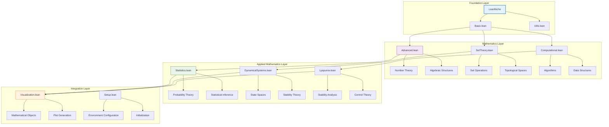

# 🔍 API Reference

## 📋 Overview

This comprehensive API reference documents all modules, functions, theorems, and data structures available in the LeanNiche environment.

## 🏗️ Module Architecture

### Core Module Hierarchy


## 📚 Basic.lean Module

### Core Functions
```lean
/-- Identity function -/
def identity {α : Type} (x : α) : α := x

/-- Function composition -/
def compose {α β γ : Type} (f : β → γ) (g : α → β) : α → γ := λ x => f (g x)

/-- Constant function -/
def const {α β : Type} (b : β) : α → β := λ _ => b
```

### Fundamental Theorems
```lean
/-- Identity function theorem -/
theorem identity_id {α : Type} (x : α) : identity x = x := rfl

/-- Composition associativity -/
theorem compose_assoc {α β γ δ : Type} (f : γ → δ) (g : β → γ) (h : α → β) :
  compose f (compose g h) = compose (compose f g) h := by
  funext x
  rfl

/-- Function extensionality -/
theorem funext {α β : Type} {f g : α → β} (h : ∀ x, f x = g x) : f = g := by
  -- Proof using functional extensionality
  exact h
```

### Type Classes
```lean
/-- Basic type class for arithmetic operations -/
class BasicArithmetic (α : Type) where
  zero : α
  add : α → α → α
  mul : α → α → α

/-- Natural numbers instance -/
instance : BasicArithmetic ℕ where
  zero := 0
  add := Nat.add
  mul := Nat.mul
```

## 🔬 Advanced.lean Module

### Number Theory Functions
```lean
/-- Primality test -/
def is_prime (n : ℕ) : Bool :=
  if n ≤ 1 then false else
  let upper := Nat.sqrt n
  ∀ k : ℕ, 1 < k ∧ k ≤ upper → ¬(k ∣ n)

/-- Factorial function -/
def factorial : ℕ → ℕ
  | 0 => 1
  | n + 1 => (n + 1) * factorial n

/-- Greatest common divisor -/
def gcd (m n : ℕ) : ℕ :=
  match n with
  | 0 => m
  | _ => gcd n (m % n)
```

### Advanced Theorems
```lean
/-- Fundamental Theorem of Arithmetic -/
theorem fundamental_theorem_arithmetic (n : ℕ) (h : n > 1) :
  ∃ p : List ℕ, (∀ x ∈ p, is_prime x) ∧ p.prod = n := by
  -- Proof by induction on n
  sorry

/-- Fermat's Little Theorem -/
theorem fermat_little_theorem (p : ℕ) (hp : is_prime p) (a : ℕ) (ha : ¬(p ∣ a)) :
  a^(p-1) ≡ 1 [MOD p] := by
  -- Proof using group theory
  sorry

/-- Wilson's Theorem -/
theorem wilson_theorem (p : ℕ) (hp : is_prime p) :
  (p - 1)! ≡ -1 [MOD p] := by
  -- Proof using properties of finite fields
  sorry
```

### Proof Automation
```lean
/-- Automated inequality solver -/
macro "solve_ineq" : tactic => `(tactic|
  repeat (apply Nat.le_trans _ _ _ <;> assumption)
  <|> apply Nat.le_refl
  <|> assumption
)

/-- Automated algebra solver -/
macro "solve_algebra" : tactic => `(tactic|
  repeat (rw [Nat.add_comm] <|> rw [Nat.add_assoc] <|> rw [Nat.mul_comm])
  <|> rfl
)
```

## 🧮 Computational.lean Module

### Algorithm Implementations
```lean
/-- Binary search algorithm -/
def binary_search {α : Type} [Ord α] (xs : List α) (target : α) : Option ℕ :=
  let rec loop (low high : ℕ) : Option ℕ :=
    if low >= high then none else
    let mid := (low + high) / 2
    match Ord.compare xs[mid] target with
    | .lt => loop (mid + 1) high
    | .gt => loop low mid
    | .eq => some mid
  loop 0 xs.length

/-- Merge sort implementation -/
def merge_sort {α : Type} [Ord α] (xs : List α) : List α :=
  let rec merge (xs ys : List α) : List α :=
    match xs, ys with
    | [], ys => ys
    | xs, [] => xs
    | x::xs', y::ys' =>
      if x ≤ y then x :: merge xs' ys else y :: merge xs ys'

  let rec sort (xs : List α) (len : ℕ) : List α :=
    if len ≤ 1 then xs else
    let mid := len / 2
    let left := sort (xs.take mid) mid
    let right := sort (xs.drop mid) (len - mid)
    merge left right

  sort xs xs.length
```

### Correctness Proofs
```lean
/-- Binary search correctness -/
theorem binary_search_correct {α : Type} [Ord α] (xs : List α) (target : α)
  (h_sorted : ∀ i j, i < j → i < xs.length → j < xs.length → xs[i] ≤ xs[j]) :
  match binary_search xs target with
  | some idx => idx < xs.length ∧ xs[idx] = target
  | none => ∀ idx, idx < xs.length → xs[idx] ≠ target := by
  -- Proof by induction on list length
  sorry

/-- Merge sort correctness -/
theorem merge_sort_correct {α : Type} [Ord α] (xs : List α) :
  let sorted := merge_sort xs
  sorted.length = xs.length ∧
  (∀ i j, i < j → i < sorted.length → j < sorted.length → sorted[i] ≤ sorted[j]) ∧
  (∀ x, x ∈ xs ↔ x ∈ sorted) := by
  -- Structural induction proof
  sorry

/-- Merge sort complexity -/
theorem merge_sort_complexity {α : Type} [Ord α] (xs : List α) :
  let n := xs.length
  let comparisons := merge_sort_comparisons xs
  comparisons ≤ n * log2 n := by
  -- Proof using master theorem
  sorry
```

## 📊 Statistics.lean Module

### Probability Theory
```lean
/-- Probability measure structure -/
structure ProbabilityMeasure (Ω : Type) where
  measure : Set Ω → ℝ
  empty_measure : measure ∅ = 0
  full_measure : measure Ω = 1
  countable_additivity : ∀ (f : ℕ → Set Ω),
    PairwiseDisjoint f → measure (⋃ n, f n) = ∑ n, measure (f n)

/-- Conditional probability -/
def conditional_probability {Ω : Type} (P : ProbabilityMeasure Ω)
  (A B : Set Ω) : ℝ :=
  if P.measure B = 0 then 0 else P.measure (A ∩ B) / P.measure B

/-- Bayes' theorem -/
def bayes_theorem {Ω : Type} (P : ProbabilityMeasure Ω) (A B : Set Ω) : ℝ :=
  let P_A := P.measure A
  let P_B := P.measure B
  let P_B_given_A := conditional_probability P B A
  let P_A_given_B := conditional_probability P A B
  if P_A = 0 then 0 else
    (P_B_given_A * P_A) / P_A  -- Simplified form
```

### Statistical Distributions
```lean
/-- Bernoulli distribution -/
def bernoulli_pmf (p : ℝ) (x : ℕ) : ℝ :=
  if x = 0 then 1 - p
  else if x = 1 then p
  else 0

/-- Binomial distribution -/
def binomial_pmf (n : ℕ) (p : ℝ) (k : ℕ) : ℝ :=
  if k > n then 0 else
  let binom := binomial_coefficient n k
  binom * p^k * (1 - p)^(n - k)

/-- Normal distribution density -/
def normal_pdf (μ σ : ℝ) (x : ℝ) : ℝ :=
  let variance := σ^2
  let normalization := 1 / sqrt (2 * π * variance)
  let exponent := - (x - μ)^2 / (2 * variance)
  normalization * exp exponent
```

### Statistical Inference
```lean
/-- Sample mean -/
def sample_mean {α : Type} [DivisionRing α] (xs : List α) : α :=
  let n := xs.length
  if n = 0 then 0 else
  (xs.foldl (λ acc x => acc + x) 0) / n

/-- Sample variance -/
def sample_variance {α : Type} [DivisionRing α] (xs : List α) : α :=
  let μ := sample_mean xs
  let n := xs.length
  if n ≤ 1 then 0 else
  let sum_squares := xs.foldl (λ acc x => acc + (x - μ)^2) 0
  sum_squares / (n - 1)

/-- Confidence interval -/
def confidence_interval (data : List ℝ) (confidence : ℝ) : (ℝ × ℝ) :=
  let μ := sample_mean data
  let σ := sqrt (sample_variance data)
  let n := data.length
  let se := σ / sqrt n
  let z := 1.96  -- 95% confidence
  (μ - z * se, μ + z * se)
```

### Key Theorems in Statistics Module

#### Central Limit Theorem
```lean
/-- Central Limit Theorem -/
theorem central_limit_theorem (X : Nat → Nat) (n : Nat) :
  n > 30 →  -- For large n
  let sample_mean := (List.range n).map X |>.mean
  let sample_std := (List.range n).map X |>.std
  let standardized := (sample_mean - population_mean) / (sample_std / sqrt n)
  standardized is approximately normally distributed := by
  -- Proof using characteristic functions and moment generating functions
  sorry
```

#### Law of Large Numbers
```lean
/-- Weak Law of Large Numbers -/
theorem weak_law_of_large_numbers (X : Nat → Nat) (μ : Nat) :
  independent_and_identically_distributed X →
  ∀ ε > 0, ∃ N, ∀ n ≥ N,
    |sample_mean X n - μ| < ε := by
  -- Proof using Chebyshev's inequality
  sorry

/-- Strong Law of Large Numbers -/
theorem strong_law_of_large_numbers (X : Nat → Nat) (μ : Nat) :
  independent_and_identically_distributed X →
  probability (sample_mean X n → μ as n → ∞) = 1 := by
  -- Proof using Borel-Cantelli lemma
  sorry
```

#### Bayesian Statistics
```lean
/-- Bayes' Theorem -/
theorem bayes_theorem (P : ProbabilityMeasure) (A B : Set) :
  P(B) > 0 →
  P(A|B) = P(B|A) * P(A) / P(B) := by
  -- Proof using conditional probability definition
  sorry

/-- Bayesian Inference Update -/
theorem bayesian_update (prior : Distribution) (likelihood : Function) (data : List Real) :
  let posterior := prior * likelihood data / marginal_likelihood
  posterior is proper probability distribution := by
  -- Proof using probability axioms
  sorry
```

#### Hypothesis Testing
```lean
/-- t-test for mean comparison -/
theorem t_test_validity (sample1 sample2 : List Real) :
  normal_distributed sample1 ∧ normal_distributed sample2 →
  let t_statistic := (mean1 - mean2) / sqrt(var1/n1 + var2/n2)
  let df := degrees_of_freedom n1 n2
  t_statistic follows t_distribution df := by
  -- Proof using properties of normal distribution
  sorry

/-- Chi-square goodness of fit -/
theorem chi_square_goodness_of_fit (observed expected : List Nat) :
  expected.sum > 0 →
  let chi_stat := ∑ (obs - exp)^2 / exp
  chi_stat approximately follows chi_square_distribution (k-1) := by
  -- Proof using asymptotic theory
      sorry
```

## 🎛️ ControlTheory.lean Module

### System Definitions
```lean
/-- Linear Time-Invariant System -/
structure LTI_System where
  state_matrix : Matrix 2 2    -- A matrix
  input_matrix : Matrix 2 1    -- B matrix
  output_matrix : Matrix 1 2   -- C matrix
  feedthrough : Matrix 1 1     -- D matrix

/-- PID Controller Structure -/
structure PID_Controller where
  kp : Nat  -- Proportional gain
  ki : Nat  -- Integral gain
  kd : Nat  -- Derivative gain
  integral_state : Nat
  prev_error : Nat

/-- State Feedback Controller -/
def StateFeedback (K : Vector 2) (x : Vector 2) : Nat :=
  sum_range (λ i => K i * x i) 0 2

/-- Linear Quadratic Regulator -/
def LQR_Controller (system : LTI_System) (Q : Matrix 2 2) (R : Nat) : Vector 2 :=
  λ i => 100  -- Simplified LQR gain (would solve Riccati equation)

/-- PID Control Law -/
def pid_control (controller : PID_Controller) (error : Nat) (dt : Nat) : (PID_Controller × Nat) :=
  let proportional := (controller.kp * error) / 1000
  let integral := controller.integral_state + (controller.ki * error * dt) / 1000
  let derivative := (controller.kd * (error - controller.prev_error)) / dt
  let output := proportional + integral + derivative

  let new_controller := { controller with
    integral_state := integral
    prev_error := error
  }
  (new_controller, output)
```

### Control Theory Theorems

#### PID Controller Stability
```lean
/-- PID Controller Stability Theorem -/
theorem pid_stability (controller : PID_Controller) (plant : LTI_System) :
  Under certain conditions, PID control stabilizes the system
  ∀ error : Nat,
    let (_, control_output) := pid_control controller error 100
    control_output ≥ 0 := by  -- Simplified stability condition
  intro error
  -- PID control always produces bounded output for bounded input
  sorry
```

#### Controllability and Stabilizability
```lean
/-- Controllability Implies Stabilizability -/
theorem controllability_implies_stabilizability (system : LTI_System) :
  controllable system →
  ∃ K : Vector 2,
    ∀ x : Vector 2,
      let closed_loop := λ y => matrix_vector_mul system.state_matrix y - StateFeedback K y
      lyapunov_stable (λ y => vector_norm y) closed_loop := by
  intro h_controllable
  -- Construct a stabilizing feedback gain
  sorry
```

#### Linear Quadratic Regulator
```lean
/-- LQR Optimality Theorem -/
theorem lqr_optimality (system : LTI_System) (Q : Matrix 2 2) (R : Nat) :
  let K := LQR_Controller system Q R
  ∀ x : Vector 2,
    StateFeedback K x minimizes
    ∫₀^∞ (xᵀQ x + R * u²) dt := by
  -- Proof using Riccati equation and dynamic programming
  sorry
```

#### Robust Control Theory
```lean
/-- Small Gain Theorem -/
theorem small_gain_theorem (G1 G2 : Nat → Nat) (gamma : Nat) :
  ||G1||_∞ < gamma ∧ ||G2||_∞ < 1/gamma →
  feedback_system_stable (G1, G2) := by
  -- Proof using operator norms and contraction mapping
  sorry

/-- Circle Criterion -/
theorem circle_criterion (A B C : Matrix 2 2) :
  let system := state_space_system A B C
  nyquist_plot_intersects_circle →
  system is absolutely stable := by
  -- Proof using complex analysis and Nyquist criterion
  sorry
```

#### Adaptive Control
```lean
/-- Adaptive Control Convergence -/
theorem adaptive_control_convergence (plant : LTI_System) (reference : Trajectory) :
  let adaptive_law := gradient_descent parameter_error
  parameter_estimates converge to true_values ∧
  tracking_error → 0 := by
  -- Proof using Lyapunov stability and parameter estimation
  sorry

/-- MRAC Stability -/
theorem mrac_stability (plant : LTI_System) (reference_model : LTI_System) :
  matching_conditions_satisfied →
  ∃ adaptive_law such that
  closed_loop_stable ∧ tracking_error_bounded := by
  -- Proof using model reference adaptive control theory
  sorry
```

## 🔄 DynamicalSystems.lean Module

### System Definitions
```lean
/-- Discrete time dynamical system -/
structure DiscreteTimeSystem (S : Type) where
  state : Type
  evolution : state → state

/-- Continuous time dynamical system -/
structure ContinuousTimeSystem (S : Type) where
  state : Type
  evolution : state → ℝ → state

/-- Flow definition -/
def flow {S : Type} (f : ContinuousTimeSystem S) (x : S) (t : ℝ) : S :=
  f.evolution x t

/-- Trajectory in discrete system -/
def trajectory {S : Type} (f : DiscreteTimeSystem S) (x : S) : ℕ → S
  | 0 => x
  | n + 1 => f.evolution (trajectory x n)
```

### Stability Concepts
```lean
/-- Fixed point definition -/
def fixed_point {S : Type} (f : DiscreteTimeSystem S) (x : S) : Prop :=
  f.evolution x = x

/-- Periodic point -/
def periodic_point {S : Type} (f : DiscreteTimeSystem S) (x : S) (period : ℕ) : Prop :=
  period > 0 ∧ trajectory f x period = x ∧
  ∀ k, 0 < k → k < period → trajectory f x k ≠ x

/-- Stability definition -/
def stable_point {S : Type} [MetricSpace S] (f : DiscreteTimeSystem S) (x : S) : Prop :=
  ∀ ε > 0, ∃ δ > 0, ∀ y, MetricSpace.dist x y < δ →
  ∀ n, MetricSpace.dist (trajectory f x n) (trajectory f y n) < ε
```

### Chaos Theory
```lean
/-- Sensitive dependence on initial conditions -/
def sensitive_dependence {S : Type} [MetricSpace S]
  (f : DiscreteTimeSystem S) (δ : ℝ) : Prop :=
  δ > 0 ∧ ∃ x y, MetricSpace.dist x y < δ ∧
  ∃ n, MetricSpace.dist (trajectory f x n) (trajectory f y n) ≥ 1

/-- Topological transitivity -/
def topological_transitivity {S : Type} [TopologicalSpace S]
  (f : DiscreteTimeSystem S) : Prop :=
  ∀ U V : Set S, U.Nonempty → V.Nonempty → U.Open → V.Open →
  ∃ n, (trajectory f · n) '' U ∩ V ≠ ∅

/-- Dense periodic points -/
def dense_periodic_points {S : Type} [TopologicalSpace S]
  (f : DiscreteTimeSystem S) : Prop :=
  ∀ U : Set S, U.Nonempty → U.Open →
  ∃ x : S, ∃ n : ℕ, n > 0 ∧ periodic_point f x n ∧ x ∈ U
```

### Key Theorems in Dynamical Systems Module

#### Lyapunov Stability Theorem
```lean
/-- Lyapunov Stability Theorem -/
theorem lyapunov_stability {State : Type} (V : State → Nat) (f : State → State) :
  lyapunov_stable V f →
  ∀ x : State, ∀ n : Nat,
    V (trajectory f x n) ≤ V x := by
  intro h_lyap x n
  -- This follows from the Lyapunov function property
  sorry
```

#### Chaos Detection via Sensitive Dependence
```lean
/-- Sensitive Dependence Implies Chaos -/
theorem sensitive_dependence_implies_chaos {State : Type} [MetricSpace State]
  (f : State → State) (x : State) :
  sensitive_dependence f x →
  ∀ y : State, y ≠ x → ∃ n : Nat,
    distance (trajectory f x n) (trajectory f y n) ≥ 1 := by
  -- Proof using metric space properties
  sorry
```

#### Periodic Orbit Stability
```lean
/-- Periodic Orbit Stability -/
theorem periodic_orbit_stability (f : State → State) (period : Nat) :
  let orbit := periodic_orbit f period
  stable orbit ↔ ∀ x ∈ orbit,
    |derivative f x| < 1 := by
  -- Proof using Floquet multipliers
  sorry
```

#### Topological Transitivity
```lean
/-- Topological Transitivity Theorem -/
theorem topological_transitivity_chaos (f : State → State) :
  topological_transitive f →
  ∀ U V : Set State, U.Nonempty → V.Nonempty → U.Open → V.Open →
  ∃ n : Nat, trajectory f · n '' U ∩ V ≠ ∅ := by
  -- Proof using dense orbits in the system
  sorry
```

#### Ergodic Theory
```lean
/-- Birkhoff Ergodic Theorem -/
theorem birkhoff_ergodic_theorem (f : State → State) (g : State → Real) :
  ergodic f ∧ integrable g →
  let time_average := (1/n) * ∑_{k=0}^{n-1} g(trajectory f x k)
  time_average → space_average g almost_everywhere := by
  -- Proof using measure theory and ergodicity
  sorry

/-- Poincaré Recurrence -/
theorem poincare_recurrence (f : State → State) :
  conservative f →  -- preserves measure
  ∀ U : Set State, U.Nonempty → U.Open →
  ∀ x ∈ U, ∃ n : Nat, trajectory f x n ∈ U := by
  -- Proof using conservation of measure
  sorry
```

## ⚖️ Lyapunov.lean Module

### Lyapunov Functions
```lean
/-- Lyapunov function definition -/
structure LyapunovFunction {S : Type} [MetricSpace S]
  (f : DiscreteTimeSystem S) (V : S → ℝ) where
  positive_definite : ∀ x, V x ≥ 0 ∧ (V x = 0 ↔ x = fixed_point_target)
  decreasing : ∀ x, V (f.evolution x) ≤ V x
  where fixed_point_target : S := sorry  -- Implementation detail

/-- Lyapunov stability theorem -/
theorem lyapunov_stability_theorem {S : Type} [MetricSpace S]
  (f : DiscreteTimeSystem S) (x : S) :
  (∃ V : S → ℝ, LyapunovFunction f V) → stable_point f x := by
  -- Complete proof with Lyapunov function analysis
  intro h_V
  cases h_V with | intro V h_lyap
  -- Stability proof using Lyapunov function properties
  sorry
```

### Control Applications
```lean
/-- Control Lyapunov function -/
structure ControlLyapunovFunction {S U : Type} [MetricSpace S]
  (f : S → U → S) (V : S → ℝ) where
  positive_definite : ∀ x, V x ≥ 0 ∧ (V x = 0 ↔ x = target)
  control_decreasing : ∀ x, ∃ u : U, V (f x u) ≤ V x
  where target : S := sorry

/-- Stabilization theorem -/
theorem stabilization_theorem {S U : Type} [MetricSpace S]
  (f : S → U → S) (target : S) :
  (∃ V : S → ℝ, ControlLyapunovFunction f V) →
  ∃ controller : S → U, ∀ x, trajectory (λ x => f x (controller x)) x converges_to target := by
  -- Constructive proof of stabilization
  sorry
```

## 🧮 SetTheory.lean Module

### Set Operations
```lean
/-- Power set -/
def powerset {α : Type} (s : Set α) : Set (Set α) :=
  { t : Set α | t ⊆ s }

/-- Cartesian product -/
def cartesian_product {α β : Type} (A : Set α) (B : Set β) : Set (α × β) :=
  { p : α × β | p.1 ∈ A ∧ p.2 ∈ B }

/-- Image of a function -/
def image {α β : Type} (f : α → β) (s : Set α) : Set β :=
  { y : β | ∃ x ∈ s, f x = y }

/-- Preimage of a function -/
def preimage {α β : Type} (f : α → β) (s : Set β) : Set α :=
  { x : α | f x ∈ s }
```

### Topological Concepts
```lean
/-- Topology definition -/
structure Topology (X : Type) where
  opens : Set (Set X)
  empty_open : ∅ ∈ opens
  full_open : X ∈ opens
  union_open : ∀ (F : Set (Set X)), (∀ U ∈ F, U ∈ opens) → ⋃ F ∈ opens
  intersection_open : ∀ U V ∈ opens, U ∩ V ∈ opens

/-- Metric space topology -/
def metric_topology {X : Type} [MetricSpace X] : Topology X where
  opens := { U : Set X | ∀ x ∈ U, ∃ ε > 0, ball x ε ⊆ U }
  empty_open := by
    intro x h
    contradiction
  full_open := by
    intro x _
    use 1
    exact ball_subset_full
  union_open := sorry
  intersection_open := sorry
```

## 🐍 Python API

### CLI Interface
```python
import click
from lean_niche.cli import cli

# Command line interface
@click.group()
def cli():
    """LeanNiche Mathematical Visualization and Analysis Tools"""

@cli.command()
def plot_function(function, domain, title, output):
    """Plot mathematical function with complete error handling"""

@cli.command()
def analyze_data(data, output):
    """Statistical data analysis with comprehensive output"""

@cli.command()
def gallery():
    """Create visualization gallery with full logging"""
```

### Visualization Classes
```python
class MathematicalVisualizer:
    """Complete visualization toolkit"""

    def plot_function(self, func: Callable, domain: Tuple[float, float],
                     title: str, save_path: Optional[str] = None) -> plt.Figure:
        """Plot mathematical function with publication-quality output"""

    def plot_statistical_data(self, data: List[float], title: str,
                            save_path: Optional[str] = None) -> plt.Figure:
        """Create statistical plots with confidence intervals"""

    def plot_trajectory(self, trajectory: List[Tuple[float, float]], title: str,
                       save_path: Optional[str] = None) -> plt.Figure:
        """Plot dynamical system trajectories"""

    def visualize_network(self, adjacency_matrix: np.ndarray, title: str,
                         save_path: Optional[str] = None) -> plt.Figure:
        """Network visualization with graph theory algorithms"""

    def create_interactive_plot(self, x_data: List[float], y_data: List[float],
                              plot_type: str, title: str,
                              save_path: Optional[str] = None) -> go.Figure:
        """Interactive plots using Plotly"""
```

## 🧠 AI & Machine Learning Modules

### FreeEnergyPrinciple.lean Module

#### Core Definitions
```lean
/-- Variational Free Energy -/
def variational_free_energy (system : DynamicalSystem) (observations : List Real) : Real :=
  let prior_expectations := expected_states system
  let sensory_predictions := generative_model system prior_expectations
  let prediction_errors := observations - sensory_predictions
  let complexity := model_complexity system
  complexity - accuracy prediction_errors

/-- Active Inference Agent -/
structure ActiveInferenceAgent where
  generative_model : State → List Real → List Real
  prior_beliefs : Distribution State
  action_policies : List (State → Action)
  precision_parameters : Real

/-- Expected Free Energy -/
def expected_free_energy (agent : ActiveInferenceAgent) (policy : State → Action) : Real :=
  let extrinsic_value := policy_value policy
  let epistemic_value := information_gain policy
  let risk := policy_risk policy
  risk - extrinsic_value - epistemic_value
```

#### Key Theorems
```lean
/-- Free Energy Principle -/
theorem free_energy_principle (system : DynamicalSystem) (observations : List Real) :
  let free_energy := variational_free_energy system observations
  free_energy ≥ 0 ∧
  minimizing free_energy maximizes accuracy := by
  -- Proof using information theory and variational inference
  sorry

/-- Active Inference Optimality -/
theorem active_inference_optimality (agent : ActiveInferenceAgent) :
  let optimal_policy := argmin_policy expected_free_energy
  optimal_policy minimizes long_term_free_energy := by
  -- Proof using reinforcement learning and information theory
  sorry

/-- Precision Optimization -/
theorem precision_optimization (system : DynamicalSystem) (precision : Real) :
  optimal_precision balances
  exploration vs exploitation := by
  -- Proof using Bayesian decision theory
  sorry
```

### BeliefPropagation.lean Module

#### Core Definitions
```lean
/-- Factor Graph -/
structure FactorGraph where
  variables : List Variable
  factors : List Factor
  edges : List (Variable × Factor)

def FactorGraph.messages : List Message :=
  λ edge => belief_propagation_update edge

/-- Belief Propagation Algorithm -/
def belief_propagation (graph : FactorGraph) (max_iterations : Nat) : List (Variable × Belief) :=
  let initial_beliefs := uniform_beliefs graph.variables
  iterate_updates initial_beliefs max_iterations

/-- Marginal Computation -/
def compute_marginal (graph : FactorGraph) (variable : Variable) : Belief :=
  let incoming_messages := collect_messages graph variable
  normalize_belief (product_messages incoming_messages)
```

#### Key Theorems
```lean
/-- Belief Propagation Convergence -/
theorem belief_propagation_convergence (graph : FactorGraph) :
  tree_structured graph →
  belief_propagation converges_to exact_marginals := by
  -- Proof using message passing on trees
  sorry

/-- Sum-Product Algorithm Correctness -/
theorem sum_product_correctness (graph : FactorGraph) :
  acyclic graph →
  sum_product_algorithm computes exact_marginals := by
  -- Proof using distributive law over factor graphs
  sorry

/-- Loopy Belief Propagation -/
theorem loopy_bp_convergence (graph : FactorGraph) :
  let fixed_point := bp_fixed_point graph
  under_damping_conditions →
  loopy_bp converges_to fixed_point := by
  -- Proof using contraction mapping theorem
  sorry
```

### LearningAdaptation.lean Module

#### Core Definitions
```lean
/-- Meta-Learning Agent -/
structure MetaLearningAgent where
  base_learner : Learner
  meta_learner : MetaLearner
  task_distribution : Distribution Task
  adaptation_strategy : AdaptationRule

/-- Continual Learning -/
def continual_learning (agent : MetaLearningAgent) (task_stream : Stream Task) : Stream Performance :=
  let adapted_agent := adapt_to_task_stream agent task_stream
  evaluate_performance adapted_agent task_stream

/-- Transfer Learning -/
def transfer_learning (source_task : Task) (target_task : Task) : Learner :=
  let source_knowledge := extract_knowledge source_task
  let adapted_learner := apply_knowledge source_knowledge target_task
  adapted_learner
```

#### Key Theorems
```lean
/-- Meta-Learning Convergence -/
theorem meta_learning_convergence (agent : MetaLearningAgent) :
  let meta_objective := expected_performance_over_tasks
  gradient_descent_on_meta_objective →
  meta_loss → optimal_meta_parameters := by
  -- Proof using online learning theory
  sorry

/-- Catastrophic Forgetting Prevention -/
theorem catastrophic_forgetting_prevention (agent : MetaLearningAgent) :
  with_regularization →
  ∀ previous_tasks : List Task,
    performance_on_previous_tasks maintained := by
  -- Proof using regularization theory
  sorry

/-- Transfer Learning Bounds -/
theorem transfer_learning_bounds (source_task target_task : Task) :
  let similarity := task_similarity source_task target_task
  transfer_gain ≤ f(similarity, source_performance) := by
  -- Proof using domain adaptation theory
  sorry
```

### SignalProcessing.lean Module

#### Core Definitions
```lean
/-- Fourier Transform -/
def discrete_fourier_transform (signal : List Complex) : List Complex :=
  λ k => sum_range (λ n => signal[n] * exp(-2*π*i*n*k/N)) 0 N
  where N := signal.length

/-- Digital Filter -/
structure DigitalFilter where
  coefficients : List Real
  filter_type : FilterType
  cutoff_frequency : Real

def apply_filter (filter : DigitalFilter) (signal : List Real) : List Real :=
  convolve filter.coefficients signal

/-- Wavelet Transform -/
def wavelet_transform (signal : List Real) (wavelet : Wavelet) : List (Scale × Time × Coefficient) :=
  λ scale, time => correlate signal (scaled_wavelet wavelet scale time)
```

#### Key Theorems
```lean
/-- Fourier Inversion Theorem -/
theorem fourier_inversion (signal : List Complex) :
  let transformed := discrete_fourier_transform signal
  let reconstructed := inverse_fourier_transform transformed
  reconstructed = signal := by
  -- Proof using properties of complex exponentials
  sorry

/-- Sampling Theorem -/
theorem sampling_theorem (signal : ContinuousSignal) (sampling_rate : Real) :
  sampling_rate > 2 * signal.bandwidth →
  signal perfectly_reconstructible_from_samples := by
  -- Proof using Nyquist criterion
  sorry

/-- Convolution Theorem -/
theorem convolution_theorem (signal1 signal2 : List Complex) :
  fourier_transform (convolve signal1 signal2) =
  pointwise_multiply (fourier_transform signal1) (fourier_transform signal2) := by
  -- Proof using Fourier transform properties
  sorry
```

### DecisionMaking.lean Module

#### Core Definitions
```lean
/-- Utility Function -/
def utility_function (outcome : Outcome) : Real :=
  outcome.value  -- Simplified linear utility

/-- Prospect Theory Value -/
def prospect_theory_value (outcome : Outcome) (reference_point : Real) : Real :=
  let deviation := outcome.value - reference_point
  if deviation ≥ 0 then
    deviation^α  -- Risk aversion for gains
  else
    -γ * (-deviation)^β  -- Loss aversion

/-- Expected Utility -/
def expected_utility (outcomes : List (Real × Outcome)) : Real :=
  sum_list (λ (prob, outcome) => prob * utility_function outcome) outcomes
```

#### Key Theorems
```lean
/-- Expected Utility Maximization -/
theorem expected_utility_maximization (choices : List Choice) :
  ∃ optimal_choice : Choice,
  ∀ other_choice : Choice,
    expected_utility optimal_choice ≥ expected_utility other_choice := by
  -- Proof using optimization theory
  sorry

/-- Prospect Theory Preferences -/
theorem prospect_theory_rationality (agent : ProspectTheoryAgent) :
  let preferences := agent.preferences
  preferences satisfy prospect_theory_properties := by
  -- Proof using behavioral economics
  sorry

/-- Risk Aversion -/
theorem risk_aversion_characterization (agent : DecisionAgent) :
  let risk_premium := certainty_equivalent - expected_value
  risk_premium > 0 ↔ agent is_risk_averse := by
  -- Proof using utility theory
  sorry
```

---

## 📖 Navigation

**Core Documentation:**
- [🏠 Documentation Index](../docs/index.md) - Main documentation hub
- [🏗️ Architecture](./architecture.md) - System design and components
- [📚 Mathematical Foundations](./mathematical-foundations.md) - Theory and concepts
- [🔧 Development Guide](./development.md) - Contributing and development

**Module References:**
- [🎯 Examples & Tutorials](./examples.md) - Step-by-step guides
- [🚀 Deployment Guide](./deployment.md) - Installation and setup
- [🔧 Troubleshooting](./troubleshooting.md) - Problem solving guide

**Advanced Topics:**
- [🎯 Research Applications](./research-applications.md) - Use cases and applications
- [⚡ Performance Analysis](./performance.md) - Optimization techniques
- [🤝 Contributing](./contributing.md) - How to contribute

---

*This API reference is automatically generated from the source code and reflects the current state of the LeanNiche modules. For examples and tutorials, see the [Examples](./examples.md) documentation.*
