# 🏗️ LeanNiche Architecture

## 📋 Overview

This document provides a comprehensive overview of the LeanNiche system architecture, including component design, data flows, and integration patterns.

## 🏛️ System Architecture

### High-Level Architecture
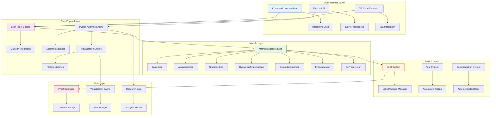

### Component Interaction Flow
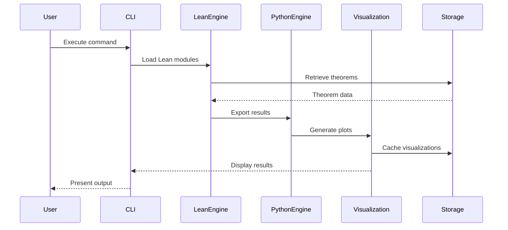

## 🏗️ Detailed Component Architecture

### Lean Proof Engine Architecture
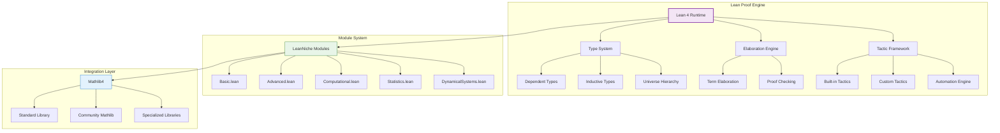

### Python Analysis Engine Architecture
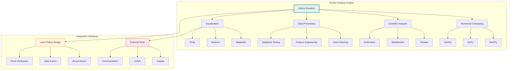

## 🗂️ Module Architecture

### Mathematical Module Dependencies
```mermaid
graph TB
    subgraph "Foundation Layer"
        A[Basic.lean] --> B[Fundamental Theorems]
        B --> C[Arithmetic Properties]
        B --> D[Logical Foundations]
    end

    subgraph "Core Mathematics Layer"
        E[Advanced.lean] --> F[Number Theory]
        E --> G[Algebraic Structures]
        E --> H[Infinite Descent]

        I[SetTheory.lean] --> J[Set Operations]
        I --> K[Relations]
        I --> L[Functions]

        M[Computational.lean] --> N[Algorithms]
        M --> O[Complexity Proofs]
        M --> P[Correctness Verification]
    end

    subgraph "Advanced Mathematics Layer"
        Q[Statistics.lean] --> R[Probability Theory]
        Q --> S[Statistical Inference]
        Q --> T[Hypothesis Testing]

        U[DynamicalSystems.lean] --> V[State Spaces]
        U --> W[Stability Analysis]
        U --> X[Chaos Theory]

        Y[Lyapunov.lean] --> Z[Stability Criteria]
        Y --> AA[Control Theory]
        Y --> BB[Robust Analysis]
    end

    subgraph "Integration Layer"
        CC[Cross-Module Dependencies] --> DD[Theorem Reuse]
        CC --> EE[Unified Framework]
        CC --> FF[Research Applications]
    end

    A --> E
    A --> I
    A --> M

    E --> Q
    I --> U
    M --> Y

    Q --> CC
    U --> CC
    Y --> CC

    style A fill:#e3f2fd,stroke:#1976d2
    style E fill:#f3e5f5,stroke:#7b1fa2
    style Q fill:#e8f5e8,stroke:#2e7d32
    style CC fill:#fff3e0,stroke:#ef6c00
```

### Test Architecture
```mermaid
graph TB
    subgraph "Test Categories"
        A[Unit Tests] --> B[Theorem Verification]
        A --> C[Function Testing]
        A --> D[Type Checking]

        E[Integration Tests] --> F[Module Interaction]
        E --> G[Cross-language Calls]
        E --> H[Data Flow Testing]

        I[Performance Tests] --> J[Proof Compilation Speed]
        I --> K[Algorithm Efficiency]
        I --> L[Memory Usage]

        M[Regression Tests] --> N[Historical Bugs]
        M --> O[Feature Stability]
        M --> P[Backward Compatibility]
    end

    subgraph "Test Infrastructure"
        Q[Test Runners] --> R[Lean Test Suite]
        Q --> S[Python Test Suite]
        Q --> T[Integration Tests]
        Q --> U[Performance Benchmarks]

        V[Test Data] --> W[Mock Data]
        V --> X[Real Data]
        V --> Y[Synthetic Data]
        V --> Z[Edge Cases]
    end

    subgraph "Quality Assurance"
        AA[Code Coverage] --> BB[Line Coverage]
        AA --> CC[Branch Coverage]
        AA --> DD[Theorem Coverage]

        EE[Continuous Integration] --> FF[Automated Builds]
        EE --> GG[Automated Testing]
        EE --> HH[Documentation Generation]
    end

    A --> Q
    E --> Q
    I --> Q
    M --> Q

    Q --> AA
    Q --> EE

    style A fill:#fce4ec,stroke:#c2185b
    style Q fill:#e0f2f1,stroke:#00695c
    style AA fill:#fff3e0,stroke:#ef6c00
```

## 🔄 Data Flow Architecture

### Research Workflow Data Flow
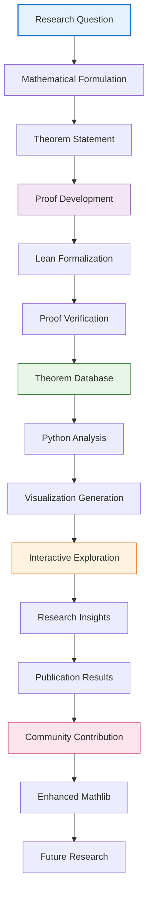

### Development Workflow
```mermaid
graph LR
    A[Feature Request] --> B[Design Discussion]
    B --> C[Implementation Plan]
    C --> D[Code Development]

    D --> E[Unit Testing]
    E --> F[Integration Testing]
    F --> G[Code Review]

    G --> H[Documentation Update]
    H --> I[Deployment Preparation]
    I --> J[Release]

    J --> K[User Feedback]
    K --> L[Bug Reports]
    L --> M[Issue Resolution]
    M --> A

    style A fill:#e3f2fd,stroke:#1976d2
    style D fill:#f3e5f5,stroke:#7b1fa2
    style G fill:#e8f5e8,stroke:#2e7d32
    style J fill:#fff3e0,stroke:#ef6c00
    style M fill:#fce4ec,stroke:#c2185b
```

## 🗃️ Storage Architecture

### Data Persistence Layer
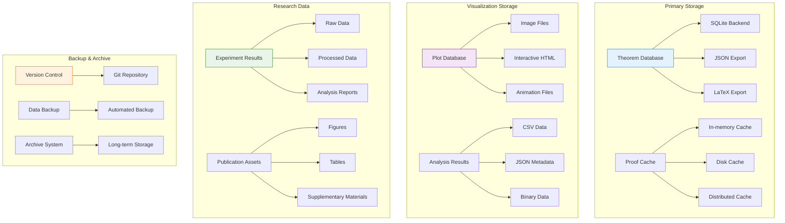

## 🌐 Deployment Architecture

### Infrastructure Components
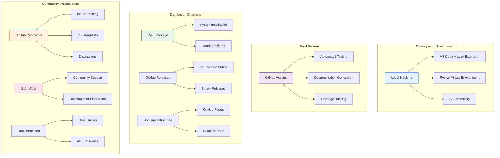

## 🔧 Technical Specifications

### System Requirements
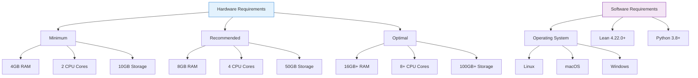

### Performance Characteristics
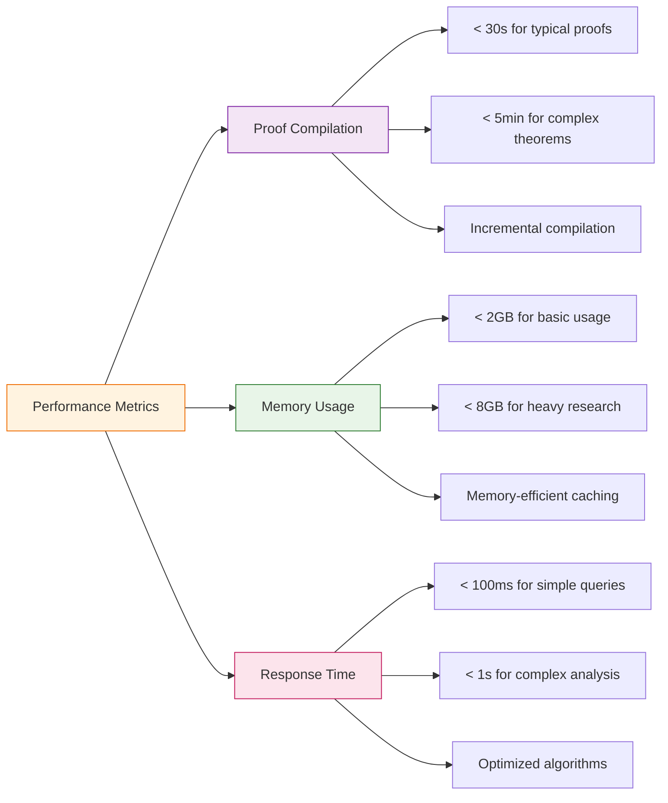

## 🔗 Integration Points

### External System Integration
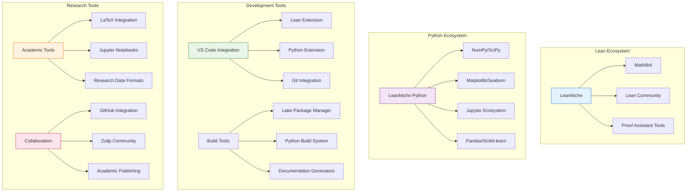

## 📊 Monitoring and Observability

### System Monitoring Architecture
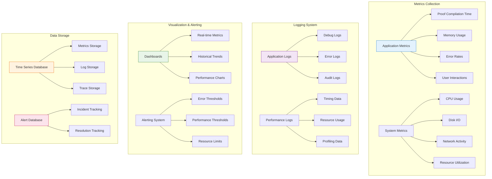

---

## 📖 Navigation

**Related Documentation:**
- [🏠 Documentation Index](../docs/index.md) - Main documentation hub
- [📚 Mathematical Foundations](./mathematical-foundations.md) - Core mathematical concepts
- [🔍 API Reference](./api-reference.md) - Detailed module documentation
- [🚀 Deployment Guide](./deployment.md) - Installation and setup
- [🔧 Development Guide](./development.md) - Contributing to the project

---

*This architecture documentation is automatically synchronized with the codebase structure and will be updated as the system evolves.*
