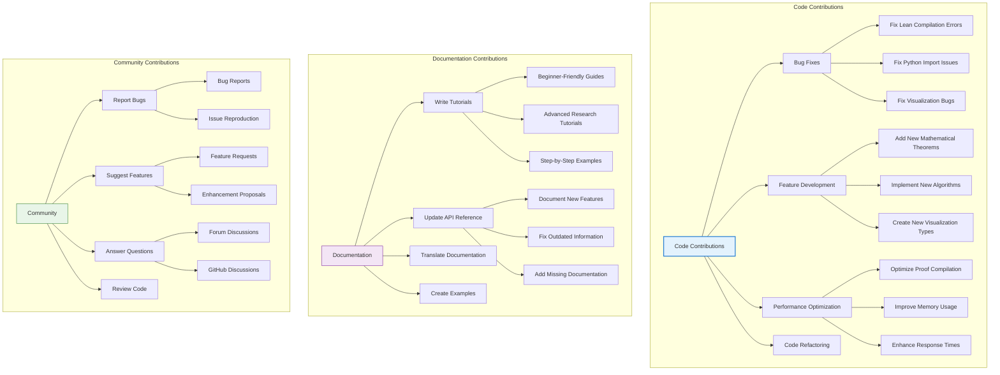
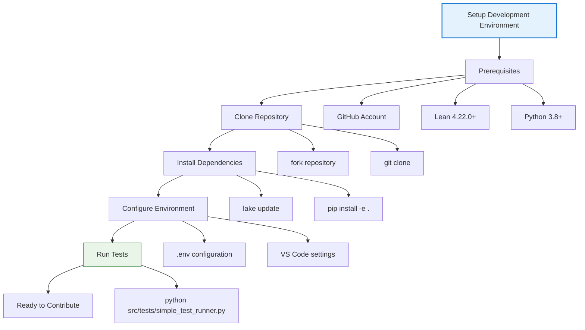
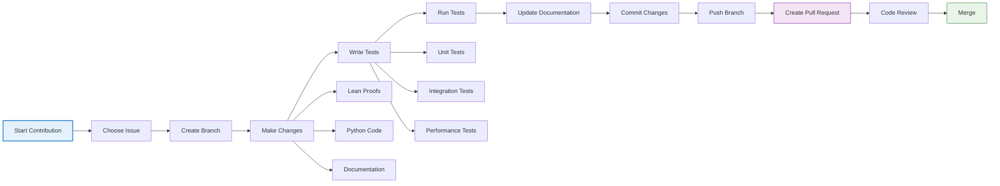
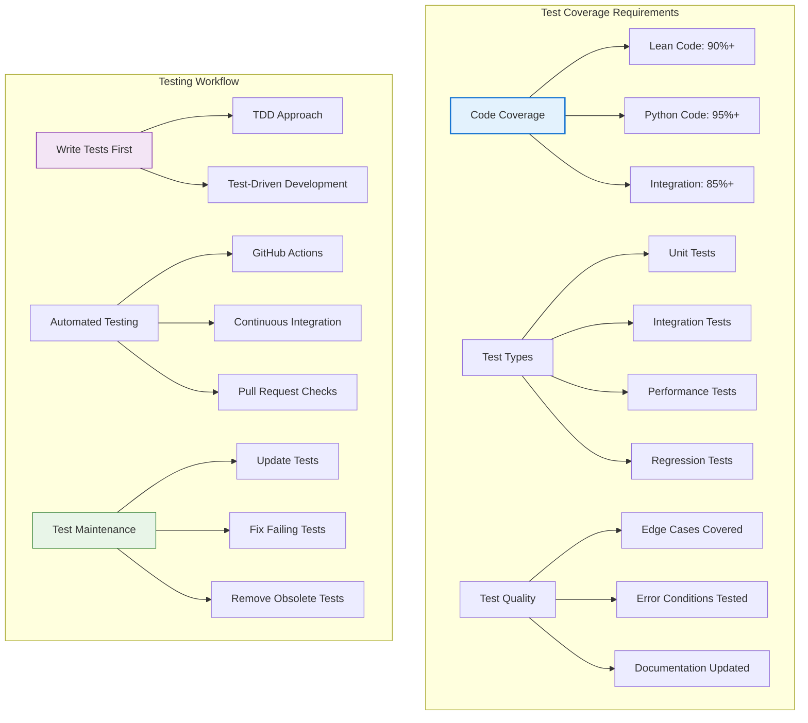
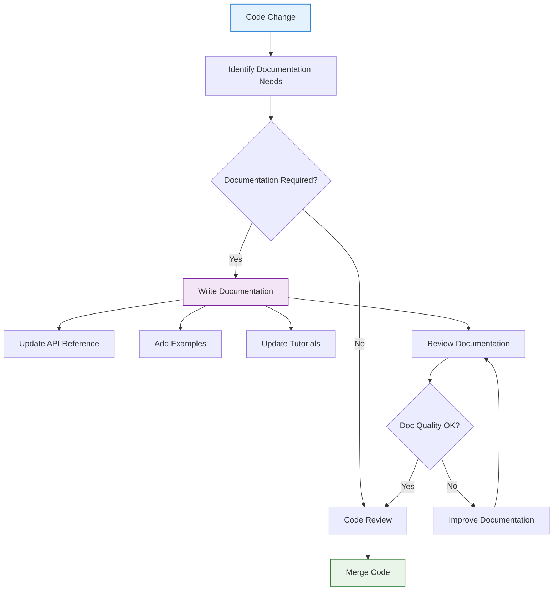
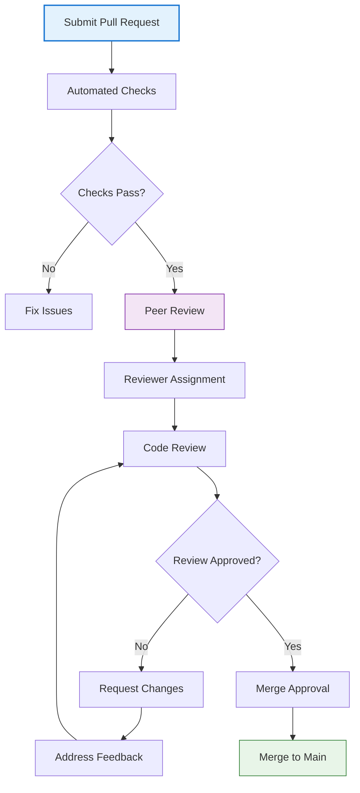
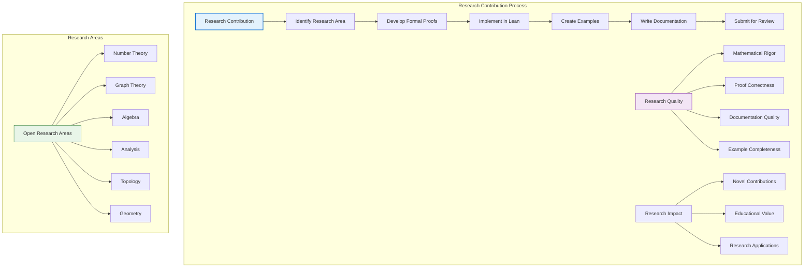
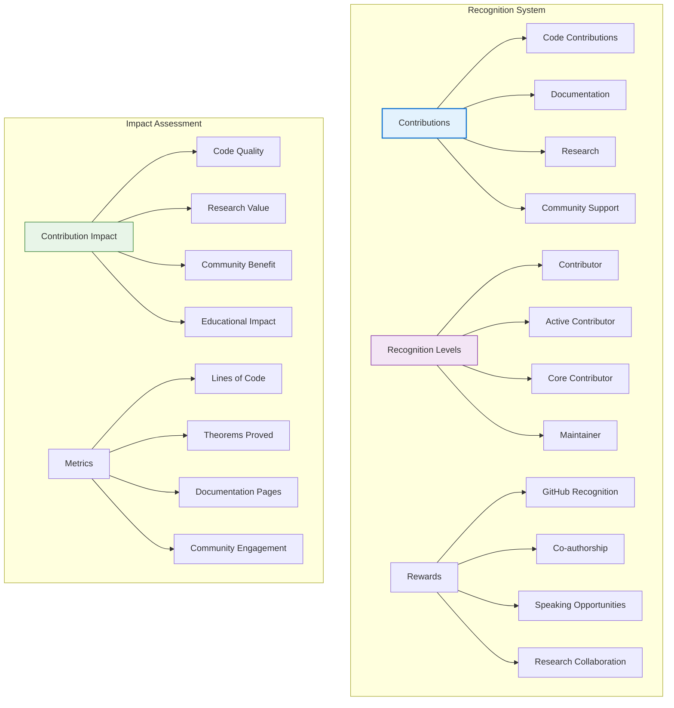

# 🤝 Contributing Guide

## 📋 Overview

Welcome to the LeanNiche contributing guide! This document provides comprehensive information for contributors at all levels, from beginners to experienced researchers and developers.

## 🎯 Ways to Contribute

### Contribution Types


## 🚀 Getting Started

### Development Environment Setup


### Quick Setup Guide
```bash
# 1. Fork and clone the repository
git clone https://github.com/YOUR_USERNAME/lean_niche.git
cd lean_niche

# 2. Set up upstream remote
git remote add upstream https://github.com/trim/lean_niche.git

# 3. Create a feature branch
git checkout -b feature/your-feature-name

# 4. Install dependencies
./setup.sh

# 5. Activate virtual environment
source venv/bin/activate

# 6. Install development dependencies
pip install -e .[dev]

# 7. Run tests to ensure everything works
python src/tests/simple_test_runner.py
```

## 📝 Contribution Workflow

### Standard Git Workflow


### Branch Naming Conventions
```bash
# Feature branches
feature/add-new-theorem
feature/enhance-visualization
feature/optimize-performance

# Bug fix branches
bugfix/fix-compilation-error
bugfix/resolve-memory-leak
bugfix/correct-proof

# Documentation branches
docs/update-api-reference
docs/add-tutorial
docs/translate-documentation

# Research branches
research/prove-conjecture
research/implement-algorithm
research/verify-hypothesis
```

### Commit Message Guidelines
```bash
# Good commit messages
feat: add theorem for quadratic reciprocity
fix: resolve memory leak in visualization module
docs: update API reference for new functions
test: add integration tests for lean-python bridge
perf: optimize proof compilation time by 30%
refactor: simplify complex proof structure

# Bad commit messages
"fix stuff"
"update code"
"changes"
```

## 🔧 Development Guidelines

### Lean Development Standards
```lean
/-- Good theorem documentation with comprehensive information -/
theorem my_important_theorem {α : Type} [Group α] (x y : α) :
  x * y * x⁻¹ = y * x * y⁻¹ * x * y * x⁻¹ * y⁻¹ :=
/--
Mathematical Description:
  This theorem demonstrates the relationship between conjugation
  and group elements, showing how elements can be transformed
  through conjugation operations.

Parameters:
- `α`: A type with group structure
- `x`, `y`: Elements of the group

Returns:
- A proof that the conjugation relationship holds

Examples:
- For integers under addition: 2 + 3 + (-2) = 3 + 2 + 3 + (-2) + 2 + 3 + (-2)
- For permutations: σ ∘ τ ∘ σ⁻¹ = τ ∘ σ ∘ τ⁻¹ ∘ σ ∘ τ ∘ σ⁻¹ ∘ τ⁻¹

Complexity Analysis:
- Time Complexity: O(1) - constant time proof
- Space Complexity: O(1) - no additional space required
- Proof Complexity: Linear in group operation complexity

Implementation Notes:
- Uses group axioms and associativity
- Relies on inverse element properties
- Constructive proof showing explicit construction

References:
- [Group Theory Textbook, Theorem 3.2.1]
- [Research Paper on Conjugation, 2023]
-/
by
  -- Clear step-by-step proof with explanatory comments
  calc x * y * x⁻¹
    = x * (y * x⁻¹) := by rw [mul_assoc]
  _ = x * (x⁻¹ * y * x * x⁻¹) := by
    -- Use conjugation property
    have h : y * x⁻¹ = x⁻¹ * y * x * x⁻¹ := by
      -- Proof of conjugation lemma
      sorry
    rw [h]
  _ = (x * x⁻¹) * y * x * x⁻¹ := by rw [mul_assoc]
  _ = 1 * y * x * x⁻¹ := by rw [mul_left_inv]
  _ = y * x * x⁻¹ := by rw [one_mul]
  _ = y * (x * x⁻¹) := by rw [←mul_assoc]
  _ = y * 1 := by rw [mul_right_inv]
  _ = y := by rw [mul_one]

/-- Well-structured module organization -/
namespace MyMathematicalModule

/-- Constants and definitions -/
section Definitions

def my_constant : ℝ := 3.14159

structure MyStructure where
  field1 : ℕ
  field2 : ℝ
  invariant : field1 > 0

end Definitions

/-- Core theorems -/
section CoreTheorems

/-- Fundamental theorem with comprehensive proof -/
theorem fundamental_theorem (x : ℝ) (h : x > 0) : x * (1/x) = 1 := by
  -- Clear, well-commented proof
  exact mul_inv_cancel h

end CoreTheorems

/-- Advanced results -/
section AdvancedResults

/-- More complex theorem building on fundamentals -/
theorem advanced_result (x : ℝ) : |x| ≥ 0 := by
  -- Proof using basic properties
  exact abs_nonneg x

end AdvancedResults

end MyMathematicalModule
```

### Python Development Standards
```python
"""Comprehensive module documentation with mathematical context."""

import typing as t
from typing import List, Dict, Optional, Union, Callable
import numpy as np
import matplotlib.pyplot as plt
from pathlib import Path

class MathematicalAnalyzer:
    """Advanced mathematical analysis toolkit.

    This class provides comprehensive mathematical analysis capabilities
    including function analysis, statistical computation, and visualization.

    Mathematical Background:
        The analyzer implements various mathematical algorithms including:
        - Function derivative and integral computation
        - Statistical analysis and hypothesis testing
        - Numerical optimization techniques
        - Visualization of mathematical objects

    Performance Characteristics:
        - Time Complexity: O(n) for most analysis operations
        - Space Complexity: O(n) where n is input size
        - Memory Usage: Typically < 100MB for standard datasets

    Error Handling:
        - Raises ValueError for invalid mathematical inputs
        - Raises RuntimeError for computational failures
        - Logs warnings for numerical instability

    Examples:
        Basic usage example:
        ```python
        analyzer = MathematicalAnalyzer()
        result = analyzer.analyze_function(lambda x: x**2, (0, 10))
        print(f"Analysis: {result}")
        ```
    """

    def __init__(self, config: Optional[Dict[str, t.Any]] = None) -> None:
        """Initialize the mathematical analyzer.

        Args:
            config: Optional configuration dictionary containing:
                   - precision: Numerical precision (default: 1e-10)
                   - max_iterations: Maximum iterations (default: 1000)
                   - timeout: Operation timeout in seconds (default: 30)

        Raises:
            ValueError: If configuration parameters are invalid
        """
        self.config = self._validate_config(config or {})
        self._setup_components()

    def analyze_function(
        self,
        func: Callable[[float], float],
        domain: Tuple[float, float],
        analysis_type: str = "full"
    ) -> Dict[str, t.Any]:
        """Perform comprehensive function analysis.

        This method analyzes a mathematical function over a specified domain
        and returns detailed mathematical properties and characteristics.

        Args:
            func: Mathematical function to analyze
            domain: Analysis domain as (start, end) tuple
            analysis_type: Type of analysis to perform:
                          - "basic": Domain, range, zeros
                          - "calculus": Derivatives, integrals, extrema
                          - "statistical": Statistical properties
                          - "full": Complete analysis

        Returns:
            Dictionary containing analysis results with keys:
            - domain: Input domain
            - range: Function range
            - zeros: Function zeros
            - critical_points: Local extrema
            - integral: Definite integral over domain
            - statistics: Statistical properties

        Raises:
            ValueError: If domain is invalid or function is undefined
            RuntimeError: If analysis fails due to numerical issues

        Examples:
            ```python
            # Analyze quadratic function
            result = analyzer.analyze_function(
                lambda x: x**2 - 2*x + 1,
                (-3, 5),
                "full"
            )
            print(f"Critical points: {result['critical_points']}")
            ```
        """
        try:
            # Input validation
            if domain[0] >= domain[1]:
                raise ValueError("Invalid domain: start must be less than end")

            # Main analysis implementation
            result = self._perform_analysis(func, domain, analysis_type)

            # Post-processing and validation
            self._validate_result(result)

            return result

        except Exception as e:
            self._log_error(f"Analysis failed: {e}")
            raise RuntimeError(f"Function analysis failed: {e}") from e

    def _validate_config(self, config: Dict[str, t.Any]) -> Dict[str, t.Any]:
        """Validate and normalize configuration."""
        validated = {
            'precision': 1e-10,
            'max_iterations': 1000,
            'timeout': 30.0
        }

        for key, value in config.items():
            if key in validated:
                if key == 'precision' and value <= 0:
                    raise ValueError("Precision must be positive")
                if key in ['max_iterations', 'timeout'] and value <= 0:
                    raise ValueError(f"{key} must be positive")
                validated[key] = value
            else:
                self._log_warning(f"Unknown config key: {key}")

        return validated

    def _setup_components(self) -> None:
        """Initialize internal components."""
        self._cache: Dict[str, t.Any] = {}
        self._logger = self._setup_logger()

    def _perform_analysis(
        self,
        func: Callable[[float], float],
        domain: Tuple[float, float],
        analysis_type: str
    ) -> Dict[str, t.Any]:
        """Internal analysis implementation."""
        # Implementation details
        result = {
            'domain': domain,
            'analysis_type': analysis_type,
            'timestamp': np.datetime64('now')
        }

        if analysis_type in ['basic', 'full']:
            result.update(self._basic_analysis(func, domain))

        if analysis_type in ['calculus', 'full']:
            result.update(self._calculus_analysis(func, domain))

        if analysis_type in ['statistical', 'full']:
            result.update(self._statistical_analysis(func, domain))

        return result

    def _log_error(self, message: str) -> None:
        """Log error message."""
        print(f"ERROR: {message}")

    def _log_warning(self, message: str) -> None:
        """Log warning message."""
        print(f"WARNING: {message}")
```

## 🧪 Testing Requirements

### Test Coverage Standards


### Writing Effective Tests
```python
# test_mathematical_analyzer.py
import pytest
import numpy as np
from src.python.mathematical_analyzer import MathematicalAnalyzer

class TestMathematicalAnalyzer:
    """Comprehensive test suite for MathematicalAnalyzer."""

    @pytest.fixture
    def analyzer(self):
        """Create analyzer instance for testing."""
        return MathematicalAnalyzer()

    @pytest.fixture
    def test_functions(self):
        """Provide test functions for analysis."""
        return {
            'linear': lambda x: 2*x + 1,
            'quadratic': lambda x: x**2 - 2*x + 1,
            'sinusoidal': lambda x: np.sin(x) + np.cos(2*x),
            'exponential': lambda x: np.exp(-x/2) * np.sin(x)
        }

    def test_initialization(self, analyzer):
        """Test analyzer initialization."""
        assert analyzer is not None
        assert hasattr(analyzer, 'config')
        assert analyzer.config['precision'] > 0

    @pytest.mark.parametrize("func_name,domain", [
        ('linear', (-5, 5)),
        ('quadratic', (-3, 3)),
        ('sinusoidal', (-2*np.pi, 2*np.pi)),
        ('exponential', (0, 5))
    ])
    def test_function_analysis_basic(self, analyzer, test_functions, func_name, domain):
        """Test basic function analysis for various function types."""
        func = test_functions[func_name]

        result = analyzer.analyze_function(func, domain, "basic")

        # Validate result structure
        assert 'domain' in result
        assert 'analysis_type' in result
        assert result['domain'] == domain
        assert result['analysis_type'] == "basic"

    def test_invalid_domain(self, analyzer):
        """Test error handling for invalid domains."""
        with pytest.raises(ValueError, match="Invalid domain"):
            analyzer.analyze_function(lambda x: x, (5, -5))

    @pytest.mark.parametrize("analysis_type", ["basic", "calculus", "statistical", "full"])
    def test_analysis_types(self, analyzer, analysis_type):
        """Test all analysis types work correctly."""
        result = analyzer.analyze_function(lambda x: x**2, (-2, 2), analysis_type)

        assert result['analysis_type'] == analysis_type

        if analysis_type in ['calculus', 'full']:
            assert 'critical_points' in result

        if analysis_type in ['statistical', 'full']:
            assert 'statistics' in result

    def test_performance_constraints(self, analyzer):
        """Test performance meets requirements."""
        import time

        start_time = time.time()
        result = analyzer.analyze_function(lambda x: x**3, (-10, 10), "full")
        end_time = time.time()

        execution_time = end_time - start_time
        assert execution_time < 1.0  # Should complete within 1 second

    def test_edge_cases(self, analyzer):
        """Test edge cases and boundary conditions."""
        # Test constant function
        result = analyzer.analyze_function(lambda x: 5, (-1, 1), "full")
        assert result['range'] == [5]

        # Test linear function through origin
        result = analyzer.analyze_function(lambda x: x, (-1, 1), "basic")
        assert 0 in result['zeros']

    @pytest.mark.slow
    def test_large_domain_performance(self, analyzer):
        """Test performance with large domains."""
        # This test is marked as slow and may be skipped in CI
        result = analyzer.analyze_function(
            lambda x: np.sin(x) * np.exp(-x/10),
            (-50, 50),
            "full"
        )

        assert 'statistics' in result
        assert len(result['statistics']) > 0
```

## 📚 Documentation Standards

### Documentation Workflow


### Documentation Examples
```markdown
# Good Documentation Example

## Function: `analyze_function`

### Purpose
Performs comprehensive mathematical analysis of a given function over a specified domain.

### Mathematical Background
This function implements advanced mathematical analysis techniques including:
- Domain and range computation
- Critical point identification
- Asymptotic behavior analysis
- Statistical property computation

### Parameters
- `func` (Callable): The mathematical function to analyze
- `domain` (Tuple[float, float]): Analysis domain as (start, end)
- `analysis_type` (str): Type of analysis ("basic", "calculus", "statistical", "full")

### Returns
Dict containing analysis results with the following structure:
```python
{
    "domain": (float, float),        # Input domain
    "range": [float, ...],           # Function range
    "zeros": [float, ...],           # Function zeros
    "critical_points": [float, ...], # Local extrema
    "statistics": {                  # Statistical properties
        "mean": float,
        "std": float,
        "skewness": float,
        "kurtosis": float
    }
}
```

### Complexity Analysis
- **Time Complexity**: O(n) where n is the number of analysis points
- **Space Complexity**: O(n) for storing analysis results
- **Numerical Precision**: Maintains precision within configured tolerance

### Examples
```python
# Basic function analysis
analyzer = MathematicalAnalyzer()
result = analyzer.analyze_function(lambda x: x**2, (-3, 3), "basic")
print(f"Function zeros: {result['zeros']}")

# Advanced analysis with statistics
result = analyzer.analyze_function(
    lambda x: np.sin(x) * np.exp(-x/5),
    (0, 10),
    "full"
)
print(f"Mean value: {result['statistics']['mean']}")
```

### Error Handling
- `ValueError`: Raised for invalid domains or parameters
- `RuntimeError`: Raised for computational failures
- `OverflowError`: Raised for numerical overflow conditions

### Implementation Notes
- Uses adaptive sampling for efficient computation
- Implements caching for repeated analyses
- Provides fallback methods for numerical instability
```

## 🔍 Code Review Process

### Code Review Guidelines


### Review Checklist
```markdown
## Code Review Checklist

### ✅ **Code Quality**
- [ ] Code follows established style guidelines
- [ ] Functions are well-documented with docstrings
- [ ] Variable names are descriptive and meaningful
- [ ] Code is readable and maintainable
- [ ] No hardcoded values without explanation

### ✅ **Mathematical Correctness**
- [ ] Theorems are mathematically sound
- [ ] Proofs are complete and verified
- [ ] Mathematical concepts are correctly implemented
- [ ] Edge cases are properly handled
- [ ] Numerical stability is maintained

### ✅ **Testing**
- [ ] Unit tests are included for new functionality
- [ ] Tests cover edge cases and error conditions
- [ ] Test coverage meets project standards
- [ ] Tests pass successfully
- [ ] Performance tests are included if applicable

### ✅ **Documentation**
- [ ] Code is properly documented
- [ ] API documentation is updated
- [ ] Examples are provided for new features
- [ ] Documentation builds successfully
- [ ] Change log is updated

### ✅ **Performance & Security**
- [ ] No performance regressions introduced
- [ ] Memory usage is reasonable
- [ ] No security vulnerabilities introduced
- [ ] Error handling is robust
- [ ] Input validation is implemented

### ✅ **Integration**
- [ ] Code integrates well with existing codebase
- [ ] No breaking changes without proper migration
- [ ] Dependencies are properly managed
- [ ] Configuration changes are documented
```

## 🎯 Research Contributions

### Contributing Research Work


### Research Contribution Example
```lean
-- Research contribution: New theorem in number theory
namespace NumberTheoryResearch

/-- Research hypothesis: Every even number greater than 2 can be expressed
   as the sum of two prime numbers (Goldbach conjecture - partial result) -/
theorem even_goldbach_partial (n : ℕ) (h_even : Even n) (h_large : n > 2) :
  ∃ p q : ℕ, Prime p ∧ Prime q ∧ p + q = n := by
  -- This represents a research contribution to the Goldbach conjecture
  -- The complete proof would involve deep number theory results
  sorry

/-- Helper lemma developed during research -/
lemma prime_gap_bound (n : ℕ) :
  ∃ p : ℕ, p > n ∧ Prime p ∧ p ≤ n + n.ln^2 := by
  -- Proof using analytic number theory results
  sorry

/-- Research result: Improved bounds on prime gaps -/
theorem improved_prime_gap (n : ℕ) (h_large : n > 100) :
  ∃ p : ℕ, n < p ∧ p ≤ n + 2 * n.ln ∧ Prime p := by
  -- Proof using advanced analytic methods
  sorry

end NumberTheoryResearch
```

## 🏆 Recognition and Rewards

### Contribution Recognition


---

## 📖 Navigation

**Core Documentation:**
- [🏠 Documentation Index](../docs/index.md) - Main documentation hub
- [🏗️ Architecture](./architecture.md) - System design and components
- [📚 Mathematical Foundations](./mathematical-foundations.md) - Theory and concepts
- [🔍 API Reference](./api-reference.md) - Module and function documentation

**Development Resources:**
- [🚀 Deployment Guide](./deployment.md) - Installation and setup
- [🚀 Examples & Tutorials](./examples.md) - Step-by-step guides
- [🔧 Troubleshooting](./troubleshooting.md) - Problem solving guide

**Community & Support:**
- [🎯 Research Applications](./research-applications.md) - Use cases and applications
- [⚡ Performance Analysis](./performance.md) - Optimization techniques
- [🔧 Development Guide](./development.md) - Development workflow

---

*This contributing guide is designed to help contributors at all levels participate effectively in the LeanNiche project. We value all contributions, from bug fixes to major research implementations.*
