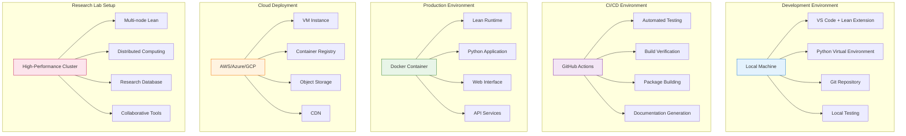
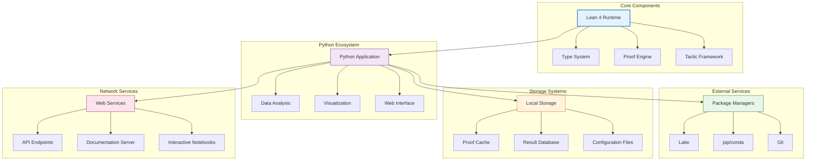
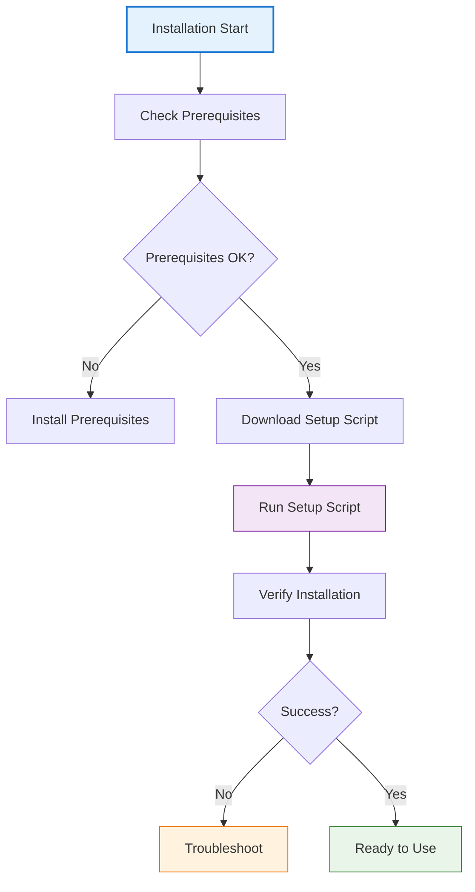
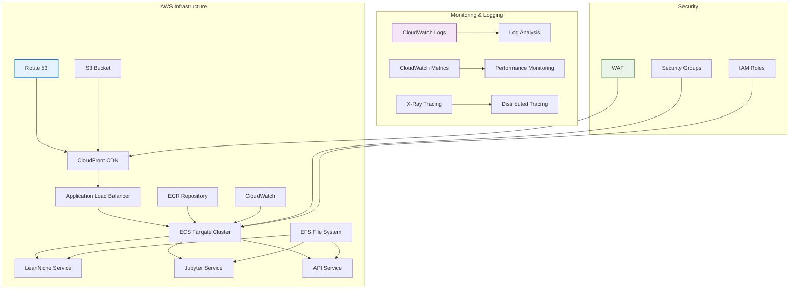
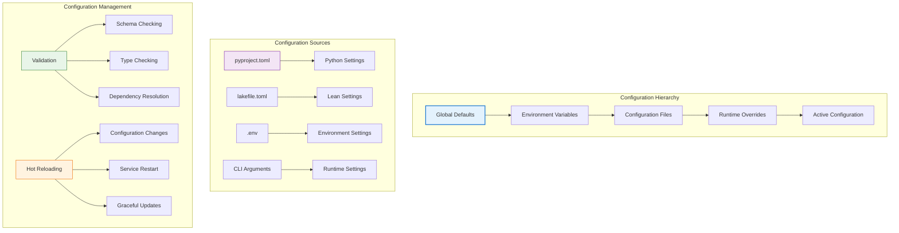

# 🚀 Deployment Guide

## 📋 Overview

This comprehensive deployment guide covers all aspects of installing, configuring, and running the LeanNiche environment across different platforms and deployment scenarios.

## 🏗️ Infrastructure Architecture

### Deployment Environments


### Infrastructure Components


## 🛠️ Installation Methods

### Quick Start Installation


### Prerequisites Installation
```bash
# Ubuntu/Debian
sudo apt update
sudo apt install -y build-essential git curl

# macOS
xcode-select --install
brew install git curl

# Windows (using WSL)
wsl --install
```

### Automated Setup Script
```bash
#!/bin/bash
# Comprehensive setup script for LeanNiche

set -e

# Colors
RED='\033[0;31m'
GREEN='\033[0;32m'
YELLOW='\033[1;33m'
BLUE='\033[0;34m'
NC='\033[0m'

print_status() {
    echo -e "${BLUE}[INFO]${NC} $1"
}

print_success() {
    echo -e "${GREEN}[SUCCESS]${NC} $1"
}

print_error() {
    echo -e "${RED}[ERROR]${NC} $1"
}

print_warning() {
    echo -e "${YELLOW}[WARNING]${NC} $1"
}

# System checks
check_system() {
    print_status "Checking system requirements..."

    # Check OS
    if [[ "$OSTYPE" == "linux-gnu"* ]]; then
        OS="linux"
    elif [[ "$OSTYPE" == "darwin"* ]]; then
        OS="macos"
    else
        print_error "Unsupported operating system"
        exit 1
    fi

    # Check memory
    if command -v free >/dev/null 2>&1; then
        MEM_GB=$(free -m | awk 'NR==2{printf "%.1f", $2/1024}')
        if (( $(echo "$MEM_GB < 4" | bc -l) )); then
            print_warning "Less than 4GB RAM detected. Lean compilation may be slow."
        fi
    fi

    # Check disk space
    if command -v df >/dev/null 2>&1; then
        DISK_GB=$(df -BG . | awk 'NR==2 {print $4}' | sed 's/G//')
        if [ "$DISK_GB" -lt 10 ]; then
            print_warning "Less than 10GB disk space available"
        fi
    fi

    print_success "System requirements check completed"
}

# Install Elan
install_elan() {
    print_status "Installing Elan (Lean version manager)..."

    if command -v elan >/dev/null 2>&1; then
        print_success "Elan is already installed"
        elan --version
    else
        if command -v curl >/dev/null 2>&1; then
            curl https://raw.githubusercontent.com/leanprover/elan/master/elan-init.sh -sSf | sh -s -- -y
            source $HOME/.elan/env
        elif command -v wget >/dev/null 2>&1; then
            wget -qO- https://raw.githubusercontent.com/leanprover/elan/master/elan-init.sh | sh -s -- -y
            source $HOME/.elan/env
        else
            print_error "Neither curl nor wget found"
            exit 1
        fi

        if command -v elan >/dev/null 2>&1; then
            print_success "Elan installed successfully"
            elan --version
        else
            print_error "Failed to install Elan"
            exit 1
        fi
    fi
}

# Setup Python environment
setup_python() {
    print_status "Setting up Python environment..."

    if ! command -v python3 >/dev/null 2>&1; then
        print_error "Python 3 not found. Please install Python 3.8+"
        exit 1
    fi

    local python_version=$(python3 --version)
    print_status "Python version: $python_version"

    # Create virtual environment
    if [ ! -d "venv" ]; then
        print_status "Creating Python virtual environment..."
        python3 -m venv venv
        print_success "Virtual environment created"
    fi

    # Activate virtual environment
    source venv/bin/activate

    # Upgrade pip
    pip install --upgrade pip

    # Install dependencies
    if [ -f "pyproject.toml" ]; then
        pip install -e .
        print_success "Dependencies installed from pyproject.toml"
    else
        print_status "Installing basic dependencies..."
        pip install matplotlib numpy seaborn plotly pandas scipy networkx rich click jupyter
        print_success "Basic dependencies installed"
    fi
}

# Setup Lean project
setup_lean() {
    print_status "Setting up Lean project..."

    if ! command -v lean >/dev/null 2>&1; then
        print_error "Lean not found. Please ensure Elan is properly installed"
        exit 1
    fi

    print_status "Lean version: $(lean --version)"

    # Check Lake
    if ! command -v lake >/dev/null 2>&1; then
        print_error "Lake not found"
        exit 1
    fi

    print_status "Lake version: $(lake --version)"

    # Update dependencies
    print_status "Updating Lean dependencies..."
    lake update

    # Build project
    print_status "Building Lean project..."
    if lake build; then
        print_success "Lean project built successfully"
    else
        print_error "Failed to build Lean project"
        exit 1
    fi
}

# Create configuration
create_config() {
    print_status "Creating configuration files..."

    # Create .env if it doesn't exist
    if [ ! -f ".env" ] && [ -f ".env.example" ]; then
        cp .env.example .env
        print_success ".env created from template"
    fi

    # Make scripts executable
    chmod +x scripts/*.sh
    chmod +x scripts/*.py
    print_success "Scripts made executable"
}

# Verification
verify_installation() {
    print_status "Verifying installation..."

    local tests_passed=0
    local total_tests=0

    # Test Lean
    total_tests=$((total_tests + 1))
    if lake exe lean_niche >/dev/null 2>&1; then
        tests_passed=$((tests_passed + 1))
        print_success "Lean test passed"
    else
        print_error "Lean test failed"
    fi

    # Test Python
    total_tests=$((total_tests + 1))
    if python -c "import sys; sys.path.append('src'); from python.cli import cli; print('Python import successful')" >/dev/null 2>&1; then
        tests_passed=$((tests_passed + 1))
        print_success "Python test passed"
    else
        print_error "Python test failed"
    fi

    local success_rate=$((tests_passed * 100 / total_tests))
    print_status "Installation verification: $tests_passed/$total_tests tests passed ($success_rate%)"

    if [ $tests_passed -eq $total_tests ]; then
        print_success "Installation completed successfully!"
        return 0
    else
        print_warning "Some tests failed. Please check the output above."
        return 1
    fi
}

# Main installation process
main() {
    print_status "Starting LeanNiche installation..."

    check_system
    install_elan
    setup_python
    setup_lean
    create_config
    verify_installation

    if [ $? -eq 0 ]; then
        echo ""
        echo "🎉 LeanNiche installation completed successfully!"
        echo ""
        echo "Next steps:"
        echo "  1. source venv/bin/activate  # Activate Python environment"
        echo "  2. lake exe lean_niche       # Run Lean environment"
        echo "  3. lean-niche --help         # Show Python CLI help"
        echo "  4. jupyter notebook notebooks/  # Start Jupyter"
        echo ""
        echo "For more information, see README.md"
    else
        echo ""
        print_error "Installation completed with errors. Please check the output above."
        exit 1
    fi
}

# Run main function
main "$@"
```

## 🐳 Docker Deployment

### Docker Architecture
```mermaid
graph TB
    subgraph "Docker Environment"
        A[Docker Host] --> B[LeanNiche Container]
        B --> C[Lean Runtime]
        B --> D[Python Environment]
        B --> E[Jupyter Server]
        B --> F[API Service]
    end

    subgraph "Container Layers"
        G[Base OS] --> H[Lean Installation]
        H --> I[Python Dependencies]
        I --> J[LeanNiche Code]
        J --> K[Configuration]
    end

    subgraph "Volume Mounts"
        L[Data Volume] --> M[/app/data]
        N[Cache Volume] --> O[/app/.cache]
        P[Config Volume] --> Q[/app/.env]
    end

    subgraph "Network Configuration"
        R[Port Mapping] --> S[8888: Jupyter]
        R --> T[8000: API]
        R --> U[3000: Dashboard]
    end

    style A fill:#e3f2fd,stroke:#1976d2,stroke-width:2px
    style G fill:#f3e5f5,stroke:#7b1fa2
    style L fill:#e8f5e8,stroke:#2e7d32
    style R fill:#fff3e0,stroke:#ef6c00
```

### Dockerfile
```dockerfile
# Multi-stage Docker build for LeanNiche
FROM ubuntu:22.04 AS base

# Install system dependencies
RUN apt-get update && apt-get install -y \
    build-essential \
    git \
    curl \
    python3 \
    python3-pip \
    python3-venv \
    && rm -rf /var/lib/apt/lists/*

# Install Elan (Lean version manager)
RUN curl https://raw.githubusercontent.com/leanprover/elan/master/elan-init.sh -sSf | sh -s -- -y
ENV PATH="/root/.elan/bin:$PATH"

# Set Lean toolchain
RUN elan toolchain install leanprover/lean4:v4.22.0
RUN elan default leanprover/lean4:v4.22.0

FROM base AS dependencies

# Copy project files
WORKDIR /app
COPY pyproject.toml lakefile.toml lean-toolchain ./
COPY src/ ./src/
COPY scripts/ ./scripts/

# Install Python dependencies
RUN python3 -m venv /app/venv
ENV PATH="/app/venv/bin:$PATH"
RUN pip install --upgrade pip
RUN pip install -e .

# Build Lean project
RUN lake update
RUN lake build

FROM dependencies AS runtime

# Copy built artifacts
COPY --from=dependencies /app/.lake ./.lake
COPY --from=dependencies /app/build ./build

# Create directories
RUN mkdir -p data visualizations notebooks logs

# Set environment variables
ENV PYTHONPATH=/app/src
ENV LEAN_PATH=/root/.elan/bin

# Expose ports
EXPOSE 8888 8000

# Health check
HEALTHCHECK --interval=30s --timeout=10s --start-period=5s --retries=3 \
    CMD lake exe lean_niche >/dev/null 2>&1 || exit 1

# Default command
CMD ["python", "-c", "
import sys
sys.path.append('/app/src')
from python.cli import cli
cli()
"]
```

### Docker Compose Configuration
```yaml
version: '3.8'

services:
  leanniche:
    build:
      context: .
      dockerfile: Dockerfile
    ports:
      - "8888:8888"  # Jupyter
      - "8000:8000"  # API
    volumes:
      - ./data:/app/data
      - ./notebooks:/app/notebooks
      - ./visualizations:/app/visualizations
      - ./.env:/app/.env
    environment:
      - PYTHONPATH=/app/src
      - LEAN_PATH=/root/.elan/bin
    restart: unless-stopped

  jupyter:
    build:
      context: .
      dockerfile: Dockerfile.jupyter
    ports:
      - "8889:8888"
    volumes:
      - ./notebooks:/home/jovyan/work
    environment:
      - JUPYTER_TOKEN=leanniche
    depends_on:
      - leanniche

  api:
    build:
      context: .
      dockerfile: Dockerfile.api
    ports:
      - "8001:8000"
    environment:
      - PYTHONPATH=/app/src
    depends_on:
      - leanniche
```

## ☁️ Cloud Deployment

### AWS Deployment Architecture


### AWS CloudFormation Template
```yaml
AWSTemplateFormatVersion: '2010-09-09'
Description: 'LeanNiche Research Environment'

Parameters:
  VpcId:
    Type: AWS::EC2::VPC::Id
    Description: VPC ID for deployment

  SubnetIds:
    Type: List<AWS::EC2::Subnet::Id>
    Description: List of subnet IDs

  KeyName:
    Type: AWS::EC2::KeyPair::KeyName
    Description: EC2 key pair name

Resources:
  # ECS Cluster
  ECSCluster:
    Type: AWS::ECS::Cluster
    Properties:
      ClusterName: !Sub '${AWS::StackName}-cluster'
      CapacityProviders:
        - FARGATE
        - FARGATE_SPOT
      DefaultCapacityProviderStrategy:
        - CapacityProvider: FARGATE
          Weight: 1

  # ECR Repository
  ECRRepository:
    Type: AWS::ECR::Repository
    Properties:
      RepositoryName: !Sub '${AWS::StackName}-repository'
      ImageScanningConfiguration:
        ScanOnPush: true
      LifecyclePolicy:
        LifecyclePolicyText: |
          {
            "rules": [
              {
                "rulePriority": 1,
                "description": "Keep last 10 images",
                "selection": {
                  "tagStatus": "any",
                  "countType": "imageCountMoreThan",
                  "countNumber": 10
                },
                "action": {
                  "type": "expire"
                }
              }
            ]
          }

  # ECS Task Definition
  ECSTaskDefinition:
    Type: AWS::ECS::TaskDefinition
    Properties:
      Family: !Sub '${AWS::StackName}-task'
      Cpu: '2048'
      Memory: '4096'
      NetworkMode: awsvpc
      RequiresCompatibilities:
        - FARGATE
      ExecutionRoleArn: !GetAtt ECSExecutionRole.Arn
      TaskRoleArn: !GetAtt ECSTaskRole.Arn
      ContainerDefinitions:
        - Name: leanniche
          Image: !Sub '${AWS::AccountId}.dkr.ecr.${AWS::Region}.amazonaws.com/${ECRRepository}:latest'
          Essential: true
          PortMappings:
            - ContainerPort: 8000
              Protocol: tcp
          Environment:
            - Name: PYTHONPATH
              Value: /app/src
            - Name: LEAN_PATH
              Value: /root/.elan/bin
          LogConfiguration:
            LogDriver: awslogs
            Options:
              awslogs-group: !Ref CloudWatchLogGroup
              awslogs-region: !Ref AWS::Region
              awslogs-stream-prefix: leanniche

  # Load Balancer
  ApplicationLoadBalancer:
    Type: AWS::ElasticLoadBalancingV2::LoadBalancer
    Properties:
      Name: !Sub '${AWS::StackName}-alb'
      Type: application
      Subnets: !Ref SubnetIds
      SecurityGroups:
        - !Ref ALBSecurityGroup
      LoadBalancerAttributes:
        - Key: idle_timeout.timeout_seconds
          Value: '60'

  # Target Group
  ECSTargetGroup:
    Type: AWS::ElasticLoadBalancingV2::TargetGroup
    Properties:
      Name: !Sub '${AWS::StackName}-target-group'
      Protocol: HTTP
      Port: 8000
      VpcId: !Ref VpcId
      TargetType: ip
      HealthCheckPath: /health
      HealthCheckIntervalSeconds: 30
      HealthCheckTimeoutSeconds: 5
      HealthyThresholdCount: 2
      UnhealthyThresholdCount: 2

  # Listener
  ALBListener:
    Type: AWS::ElasticLoadBalancingV2::Listener
    Properties:
      LoadBalancerArn: !Ref ApplicationLoadBalancer
      Protocol: HTTP
      Port: 80
      DefaultActions:
        - Type: forward
          TargetGroupArn: !Ref ECSTargetGroup

  # ECS Service
  ECSService:
    Type: AWS::ECS::Service
    Properties:
      ServiceName: !Sub '${AWS::StackName}-service'
      Cluster: !Ref ECSCluster
      TaskDefinition: !Ref ECSTaskDefinition
      DesiredCount: 1
      LaunchType: FARGATE
      NetworkConfiguration:
        AwsvpcConfiguration:
          Subnets: !Ref SubnetIds
          SecurityGroups:
            - !Ref ECSSecurityGroup
          AssignPublicIp: ENABLED
      LoadBalancers:
        - TargetGroupArn: !Ref ECSTargetGroup
          ContainerName: leanniche
          ContainerPort: 8000
      HealthCheckGracePeriodSeconds: 60

  # CloudWatch Log Group
  CloudWatchLogGroup:
    Type: AWS::Logs::LogGroup
    Properties:
      LogGroupName: !Sub '${AWS::StackName}-logs'
      RetentionInDays: 30

  # IAM Roles
  ECSExecutionRole:
    Type: AWS::IAM::Role
    Properties:
      RoleName: !Sub '${AWS::StackName}-execution-role'
      AssumeRolePolicyDocument:
        Version: '2012-10-17'
        Statement:
          - Effect: Allow
            Principal:
              Service: ecs-tasks.amazonaws.com
            Action: sts:AssumeRole
      ManagedPolicyArns:
        - arn:aws:iam::aws:policy/service-role/AmazonECSTaskExecutionRolePolicy

  ECSTaskRole:
    Type: AWS::IAM::Role
    Properties:
      RoleName: !Sub '${AWS::StackName}-task-role'
      AssumeRolePolicyDocument:
        Version: '2012-10-17'
        Statement:
          - Effect: Allow
            Principal:
              Service: ecs-tasks.amazonaws.com
            Action: sts:AssumeRole
      ManagedPolicyArns:
        - arn:aws:iam::aws:policy/CloudWatchLogsFullAccess

  # Security Groups
  ALBSecurityGroup:
    Type: AWS::EC2::SecurityGroup
    Properties:
      GroupName: !Sub '${AWS::StackName}-alb-sg'
      GroupDescription: Security group for ALB
      VpcId: !Ref VpcId
      SecurityGroupIngress:
        - IpProtocol: tcp
          FromPort: 80
          ToPort: 80
          CidrIp: 0.0.0.0/0
        - IpProtocol: tcp
          FromPort: 443
          ToPort: 443
          CidrIp: 0.0.0.0/0

  ECSSecurityGroup:
    Type: AWS::EC2::SecurityGroup
    Properties:
      GroupName: !Sub '${AWS::StackName}-ecs-sg'
      GroupDescription: Security group for ECS tasks
      VpcId: !Ref VpcId
      SecurityGroupIngress:
        - IpProtocol: tcp
          FromPort: 8000
          ToPort: 8000
          SourceSecurityGroupId: !Ref ALBSecurityGroup

Outputs:
  LoadBalancerDNS:
    Description: DNS name of the load balancer
    Value: !GetAtt ApplicationLoadBalancer.DNSName
    Export:
      Name: !Sub '${AWS::StackName}-LoadBalancerDNS'

  ClusterName:
    Description: Name of the ECS cluster
    Value: !Ref ECSCluster
    Export:
      Name: !Sub '${AWS::StackName}-ClusterName'

  RepositoryURI:
    Description: URI of the ECR repository
    Value: !GetAtt ECRRepository.RepositoryUri
    Export:
      Name: !Sub '${AWS::StackName}-RepositoryURI'
```

## 🔧 Configuration Management

### Environment Configuration


### Configuration Files
```toml
# lakefile.toml - Lean Configuration
name = "LeanNiche"
version = "0.1.0"
description = "Advanced Deep Research Environment for Mathematics and Dynamical Systems"

[[lean_lib]]
name = "LeanNiche"
srcDir = "src/lean"

[[lean_exe]]
name = "lean_niche"
root = "Main"
srcDir = "src/lean"

[[lean_exe]]
name = "test_suite"
root = "TestSuite"
srcDir = "src/tests"

[buildOptions]
# Additional build options
```

```toml
# pyproject.toml - Python Configuration
[build-system]
requires = ["hatchling"]
build-backend = "hatchling.build"

[project]
name = "lean-niche"
version = "0.1.0"
description = "Python utilities for LeanNiche mathematical research environment"
readme = "README.md"
authors = [
    {name = "LeanNiche Team"}
]
license = {file = "LICENSE"}
classifiers = [
    "Development Status :: 4 - Beta",
    "Intended Audience :: Science/Research",
    "License :: OSI Approved :: MIT License",
    "Programming Language :: Python :: 3",
    "Programming Language :: Python :: 3.8",
    "Programming Language :: Python :: 3.9",
    "Programming Language :: Python :: 3.10",
    "Programming Language :: Python :: 3.11",
    "Topic :: Scientific/Engineering :: Mathematics",
]
requires-python = ">=3.8"
dependencies = [
    "matplotlib>=3.8.0",
    "numpy>=1.24.0",
    "scipy>=1.10.0",
    "pandas>=2.0.0",
    "seaborn>=0.12.0",
    "plotly>=5.15.0",
    "jupyter>=1.0.0",
    "ipython>=8.0.0",
    "sympy>=1.12.0",
    "networkx>=3.1.0",
    "pillow>=10.0.0",
    "tqdm>=4.65.0",
    "rich>=13.0.0",
    "click>=8.1.0"
]

[project.optional-dependencies]
dev = [
    "pytest-cov>=4.0.0",
    "sphinx>=7.0.0",
    "sphinx-rtd-theme>=1.3.0",
    "myst-parser>=2.0.0",
    "sphinx-autodoc-typehints>=1.24.0",
    "sphinx-gallery>=0.15.0",
    "black>=23.0.0",
    "isort>=5.12.0",
    "mypy>=1.5.0",
    "flake8>=6.0.0"
]

[project.scripts]
lean-niche = "src.python.cli:main"
lean-niche-viz = "src.python.cli:gallery"

[tool.hatch.build.targets.wheel]
packages = ["src/python"]
```

```bash
# .env - Environment Configuration
# Lean Settings
LEAN_VERSION=4.22.0
MATHLIB_VERSION=latest
LEAN_PATH=/home/user/.elan/bin

# Python Settings
PYTHONPATH=src/python
PYTHON_ENV=venv

# Visualization Settings
VISUALIZATION_BACKEND=matplotlib
DEFAULT_PLOT_DPI=300
DEFAULT_SAVE_FORMAT=png
INTERACTIVE_PLOTS=true
EXPORT_FORMATS=png,pdf,svg

# Performance Settings
MAX_MEMORY_GB=8
MAX_THREADS=4
TIMEOUT_SECONDS=300
ENABLE_PARALLEL=true

# Development Settings
DEBUG=false
VERBOSE=true
LOG_LEVEL=INFO
LOG_FILE=logs/leanniche.log

# Research Settings
DEFAULT_DATA_DIR=data
DEFAULT_VISUALIZATION_DIR=visualizations
DEFAULT_NOTEBOOK_DIR=notebooks
ENABLE_PROFILING=false

# External Tools
GRAPHVIZ_PATH=/usr/bin/dot
LATEX_PATH=/usr/bin/pdflatex
JUPYTER_KERNEL=python3
```

## 📊 Monitoring and Health Checks

### System Monitoring
```mermaid
graph TB
    subgraph "Health Check Endpoints"
        A[/health] --> B[System Status]
        A --> C[Lean Engine Status]
        A --> D[Python Environment Status]
        A --> E[Database Connections]

        F[/metrics] --> G[Performance Metrics]
        F --> H[Resource Usage]
        F --> I[Error Rates]
        F --> J[Request Counts]
    end

    subgraph "Monitoring Tools"
        K[Prometheus] --> L[Metrics Collection]
        K --> M[Alert Rules]
        K --> N[Dashboards]

        O[Grafana] --> P[Visualization]
        O --> Q[Custom Dashboards]
        O --> R[Alert Panels]

        S[ELK Stack] --> T[Log Aggregation]
        S --> U[Log Analysis]
        S --> V[Search and Analytics]
    end

    subgraph "Alert System"
        W[AlertManager] --> X[Email Notifications]
        W --> Y[Slack Notifications]
        W --> Z[PagerDuty Integration]

        AA[Alert Rules] --> BB[CPU Usage > 90%]
        AA --> CC[Memory Usage > 85%]
        AA --> DD[Error Rate > 5%]
        AA --> EE[Response Time > 5s]
    end

    style A fill:#e3f2fd,stroke:#1976d2,stroke-width:2px
    style K fill:#f3e5f5,stroke:#7b1fa2
    style W fill:#e8f5e8,stroke:#2e7d32
    style AA fill:#fff3e0,stroke:#ef6c00
```

### Health Check Implementation
```python
# health_check.py
import sys
import time
import psutil
from pathlib import Path

class HealthChecker:
    """Comprehensive health checking for LeanNiche"""

    def __init__(self, project_root: Path):
        self.project_root = project_root
        self.results = {}

    def check_system_resources(self) -> dict:
        """Check system resource usage"""
        try:
            cpu_percent = psutil.cpu_percent(interval=1)
            memory = psutil.virtual_memory()
            disk = psutil.disk_usage('/')

            return {
                'status': 'healthy' if cpu_percent < 90 and memory.percent < 85 else 'warning',
                'cpu_percent': cpu_percent,
                'memory_percent': memory.percent,
                'memory_available': memory.available,
                'disk_percent': disk.percent,
                'disk_free': disk.free
            }
        except Exception as e:
            return {
                'status': 'error',
                'error': str(e)
            }

    def check_lean_engine(self) -> dict:
        """Check Lean engine status"""
        try:
            import subprocess
            result = subprocess.run(
                ['lake', 'exe', 'lean_niche', '--help'],
                capture_output=True,
                text=True,
                timeout=10
            )

            if result.returncode == 0:
                return {'status': 'healthy', 'output': result.stdout}
            else:
                return {'status': 'error', 'error': result.stderr}

        except subprocess.TimeoutExpired:
            return {'status': 'timeout', 'error': 'Command timed out'}
        except Exception as e:
            return {'status': 'error', 'error': str(e)}

    def check_python_environment(self) -> dict:
        """Check Python environment status"""
        try:
            # Test imports
            sys.path.append(str(self.project_root / 'src'))
            from python.cli import cli
            from python.visualization import MathematicalVisualizer

            # Test basic functionality
            viz = MathematicalVisualizer()
            test_plot = viz.plot_function(lambda x: x**2, (-5, 5), "Health Check Test")

            return {
                'status': 'healthy',
                'imports': 'successful',
                'visualization': 'working'
            }

        except Exception as e:
            return {
                'status': 'error',
                'error': str(e)
            }

    def check_file_system(self) -> dict:
        """Check file system and permissions"""
        try:
            required_paths = [
                'src/lean/Main.lean',
                'src/python/cli.py',
                'lakefile.toml',
                'pyproject.toml'
            ]

            missing_files = []
            permission_issues = []

            for path_str in required_paths:
                path = self.project_root / path_str
                if not path.exists():
                    missing_files.append(path_str)
                elif not path.is_file():
                    permission_issues.append(f"{path_str} is not a file")
                elif not path.stat().st_mode & 0o400:  # Check read permission
                    permission_issues.append(f"No read permission for {path_str}")

            status = 'healthy'
            if missing_files or permission_issues:
                status = 'error'

            return {
                'status': status,
                'missing_files': missing_files,
                'permission_issues': permission_issues
            }

        except Exception as e:
            return {
                'status': 'error',
                'error': str(e)
            }

    def run_comprehensive_check(self) -> dict:
        """Run all health checks"""
        print("🔍 Running comprehensive health checks...")

        self.results = {
            'timestamp': time.time(),
            'checks': {
                'system_resources': self.check_system_resources(),
                'lean_engine': self.check_lean_engine(),
                'python_environment': self.check_python_environment(),
                'file_system': self.check_file_system()
            }
        }

        # Overall status
        check_statuses = [check['status'] for check in self.results['checks'].values()]
        if 'error' in check_statuses:
            self.results['overall_status'] = 'error'
        elif 'warning' in check_statuses:
            self.results['overall_status'] = 'warning'
        else:
            self.results['overall_status'] = 'healthy'

        return self.results

    def get_status_summary(self) -> str:
        """Get a human-readable status summary"""
        if not self.results:
            return "No health check results available"

        overall = self.results['overall_status']
        summary = f"Overall Status: {overall.upper()}\n\n"

        for check_name, check_result in self.results['checks'].items():
            status = check_result['status']
            status_emoji = {'healthy': '✅', 'warning': '⚠️', 'error': '❌', 'timeout': '⏱️'}
            emoji = status_emoji.get(status, '❓')

            summary += f"{emoji} {check_name.replace('_', ' ').title()}: {status.upper()}\n"

            if 'error' in check_result:
                summary += f"   Error: {check_result['error']}\n"

        return summary

def main():
    """Main health check function"""
    project_root = Path(__file__).parent.parent
    checker = HealthChecker(project_root)
    results = checker.run_comprehensive_check()

    print(checker.get_status_summary())

    # Exit with appropriate code
    if results['overall_status'] == 'error':
        sys.exit(1)
    else:
        sys.exit(0)

if __name__ == "__main__":
    main()
```

---

## 📖 Navigation

**Core Documentation:**
- [🏠 Documentation Index](../docs/index.md) - Main documentation hub
- [🏗️ Architecture](./architecture.md) - System design and components
- [📚 Mathematical Foundations](./mathematical-foundations.md) - Theory and concepts
- [🔍 API Reference](./api-reference.md) - Module and function documentation

**Deployment Resources:**
- [🚀 Examples & Tutorials](./examples.md) - Step-by-step guides
- [🔧 Troubleshooting](./troubleshooting.md) - Problem solving guide
- [🔧 Development Guide](./development.md) - Contributing and development

**Advanced Topics:**
- [🎯 Research Applications](./research-applications.md) - Use cases and applications
- [⚡ Performance Analysis](./performance.md) - Optimization techniques
- [🤝 Contributing](./contributing.md) - How to contribute

---

*This deployment guide covers installation, configuration, and operational procedures for LeanNiche in various environments. For specific deployment questions, please refer to the troubleshooting guide or open an issue on GitHub.*
