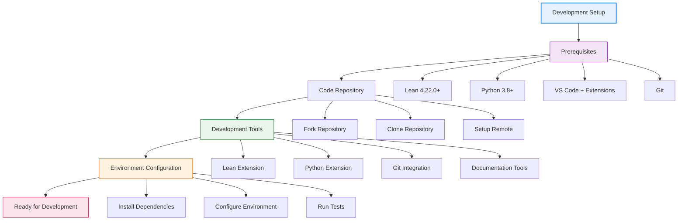
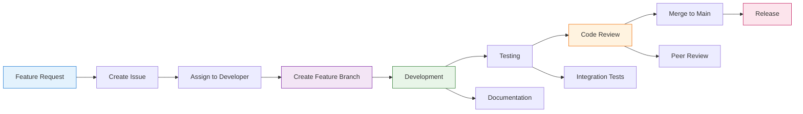
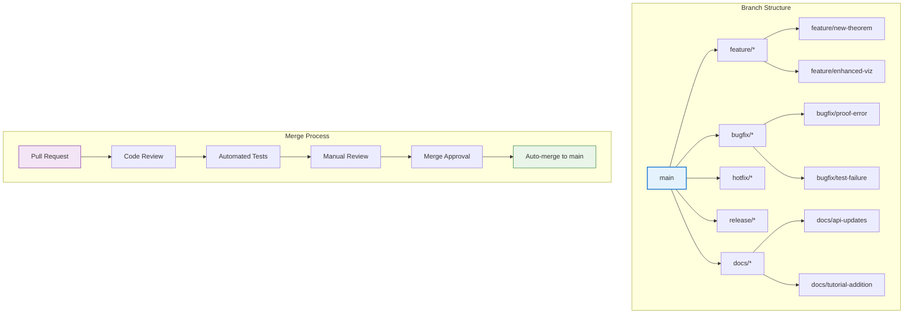
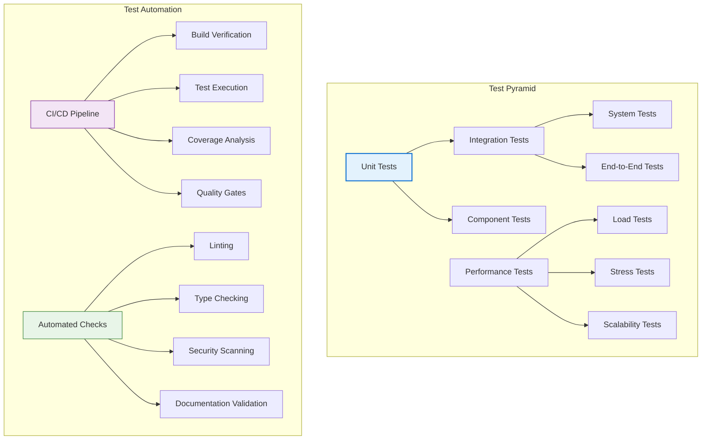
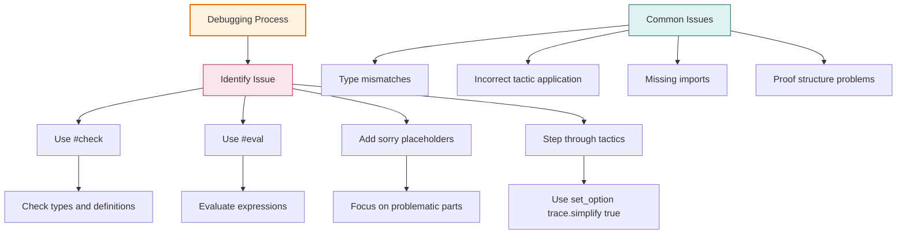
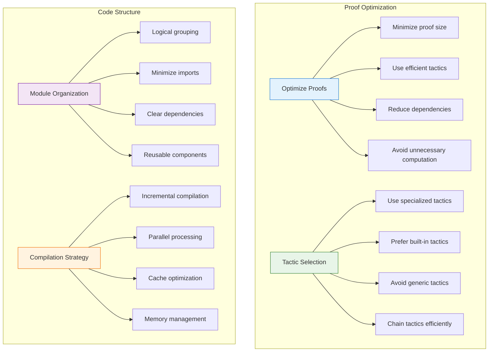
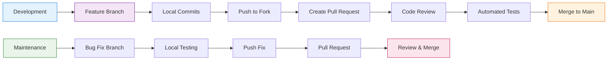
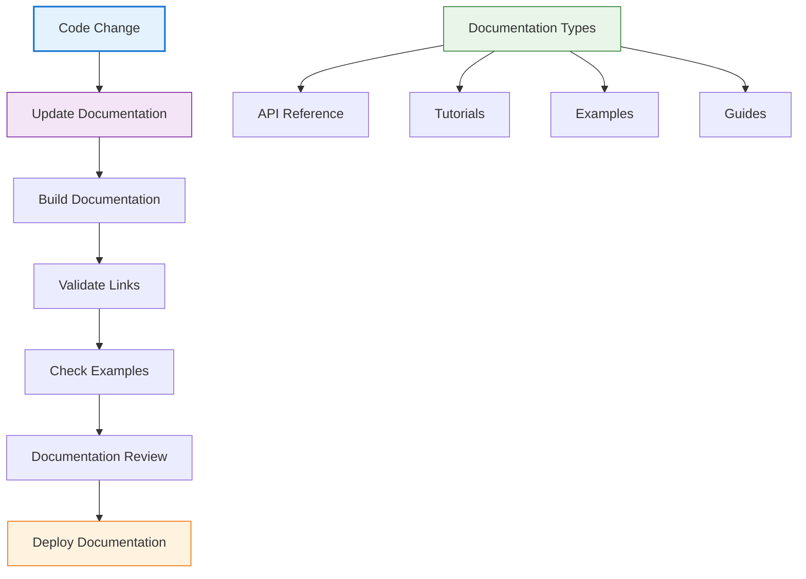
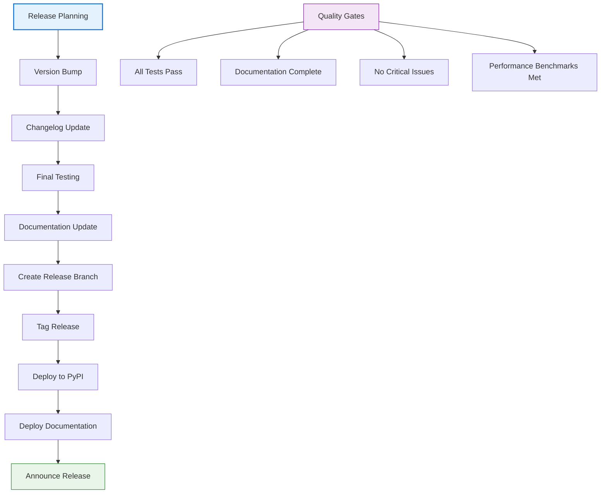

# 🔧 Development Guide

## 📋 Overview

This comprehensive guide covers the development workflow, coding standards, testing practices, and contribution guidelines for the LeanNiche project.

## 🚀 Getting Started

### Development Environment Setup


### Quick Development Setup
```bash
# 1. Clone your fork
git clone https://github.com/YOUR_USERNAME/lean_niche.git
cd lean_niche

# 2. Set up upstream remote
git remote add upstream https://github.com/trim/lean_niche.git

# 3. Install dependencies
./setup.sh

# 4. Activate virtual environment
source venv/bin/activate

# 5. Install development dependencies
pip install -e .[dev]

# 6. Run initial tests
python src/tests/simple_test_runner.py
```

## 🔄 Development Workflow

### Standard Development Cycle


### Branching Strategy


## 🧪 Testing Strategy

### Test Categories


### Running Tests
```bash
# Run all tests
python src/tests/simple_test_runner.py

# Run specific test categories
python src/tests/simple_test_runner.py --lean-only
python src/tests/simple_test_runner.py --python-only

# Run with coverage
python -m pytest src/tests/python/ --cov=src --cov-report=html

# Run performance benchmarks
python src/tests/simple_test_runner.py --performance-only
```

## 📝 Code Standards

### Lean Code Standards
```lean
/-- Good theorem documentation -/
theorem my_theorem {α : Type} [Group α] (x y : α) :
  x * y * x⁻¹ = y * x * y⁻¹ * x * y * x⁻¹ * y⁻¹ := by
  -- Clear mathematical reasoning
  group_theory_tactics
  -- Proof explanation comments
  exact calculation_result

/-- Good function definition -/
def optimized_algorithm (input : List ℕ) : List ℕ :=
  -- Efficient implementation with clear logic
  let rec loop (remaining : List ℕ) (result : List ℕ) : List ℕ :=
    match remaining with
    | [] => result
    | x :: xs =>
      if predicate x then
        loop xs (optimized_insert x result)
      else
        loop xs result
  loop input []

/-- Good module structure -/
namespace MyModule

/-- Clear separation of concerns -/
section BasicOperations

/-- Related functions grouped together -/
def operation1 := ...
def operation2 := ...

end BasicOperations

/-- Advanced operations -/
section AdvancedOperations

/-- Complex functionality -/
def complex_operation := ...

end AdvancedOperations

end MyModule
```

### Python Code Standards
```python
"""Good module documentation with comprehensive docstring."""

import typing as t
from pathlib import Path
from typing import List, Dict, Optional, Union

# Type hints for better code clarity
class MathematicalAnalyzer:
    """Analyze mathematical functions and data.

    This class provides comprehensive mathematical analysis tools
    with performance optimizations and error handling.

    Attributes:
        config: Configuration dictionary for analysis parameters
        cache: Internal cache for computed results
        logger: Logger instance for debugging and monitoring
    """

    def __init__(self, config: Dict[str, t.Any]) -> None:
        """Initialize analyzer with configuration.

        Args:
            config: Dictionary containing analysis parameters

        Raises:
            ValueError: If configuration is invalid
        """
        self.config = self._validate_config(config)
        self.cache: Dict[str, t.Any] = {}
        self.logger = self._setup_logging()

    def analyze_function(
        self,
        func: t.Callable[[float], float],
        domain: Tuple[float, float],
        analysis_type: str = "full"
    ) -> Dict[str, t.Any]:
        """Perform comprehensive function analysis.

        Args:
            func: Mathematical function to analyze
            domain: Domain tuple (start, end)
            analysis_type: Type of analysis to perform

        Returns:
            Dictionary containing analysis results

        Raises:
            ValueError: If domain is invalid
            RuntimeError: If analysis fails
        """
        try:
            # Input validation
            if domain[0] >= domain[1]:
                raise ValueError("Invalid domain")

            # Main analysis logic
            result = self._perform_analysis(func, domain, analysis_type)

            # Cache result for performance
            cache_key = f"{func.__name__}_{domain}_{analysis_type}"
            self.cache[cache_key] = result

            return result

        except Exception as e:
            self.logger.error(f"Analysis failed: {e}")
            raise RuntimeError(f"Function analysis failed: {e}") from e

    def _perform_analysis(
        self,
        func: t.Callable[[float], float],
        domain: Tuple[float, float],
        analysis_type: str
    ) -> Dict[str, t.Any]:
        """Internal analysis implementation."""
        # Implementation details
        pass
```

## 🔍 Debugging Techniques

### Lean Debugging


### Python Debugging
```python
# Comprehensive debugging setup
import logging
import traceback
from typing import Any, Dict

# Configure logging
logging.basicConfig(
    level=logging.DEBUG,
    format='%(asctime)s - %(name)s - %(levelname)s - %(message)s',
    handlers=[
        logging.FileHandler('debug.log'),
        logging.StreamHandler()
    ]
)

class DebugHelper:
    """Helper class for debugging complex operations."""

    @staticmethod
    def debug_function_call(func: callable, *args, **kwargs) -> Any:
        """Debug function calls with comprehensive logging."""
        try:
            logger = logging.getLogger(__name__)
            logger.debug(f"Calling {func.__name__} with args: {args}, kwargs: {kwargs}")

            result = func(*args, **kwargs)

            logger.debug(f"{func.__name__} returned: {result}")
            return result

        except Exception as e:
            logger.error(f"Error in {func.__name__}: {e}")
            logger.error(f"Traceback: {traceback.format_exc()}")
            raise

    @staticmethod
    def profile_execution(func: callable, *args, **kwargs) -> tuple:
        """Profile function execution time and memory usage."""
        import time
        import psutil
        import os

        start_time = time.time()
        process = psutil.Process(os.getpid())
        start_memory = process.memory_info().rss

        result = func(*args, **kwargs)

        end_time = time.time()
        end_memory = process.memory_info().rss

        execution_time = end_time - start_time
        memory_usage = end_memory - start_memory

        logger = logging.getLogger(__name__)
        logger.info(".4f")
        logger.info(".2f")

        return result, execution_time, memory_usage

# Usage example
def complex_analysis():
    """Example of using debug helper."""
    debug = DebugHelper()

    # Debug function calls
    data = debug.debug_function_call(generate_data, 1000)
    result = debug.debug_function_call(analyze_data, data)

    # Profile execution
    profiled_result, time_taken, memory_used = debug.profile_execution(
        complex_calculation, result
    )

    return profiled_result
```

## 📊 Performance Optimization

### Lean Performance Tips


### Python Performance Optimization
```python
# Performance optimization techniques
import functools
import time
from typing import Any, Callable, Dict, List
import numpy as np

class PerformanceOptimizer:
    """Collection of performance optimization techniques."""

    @staticmethod
    def memoize(func: Callable) -> Callable:
        """Memoization decorator for expensive computations."""
        cache: Dict[str, Any] = {}

        @functools.wraps(func)
        def wrapper(*args, **kwargs):
            # Create cache key from arguments
            key = str(args) + str(sorted(kwargs.items()))

            if key not in cache:
                cache[key] = func(*args, **kwargs)

            return cache[key]

        return wrapper

    @staticmethod
    def vectorize_operations(func: Callable) -> Callable:
        """Vectorize numerical operations using NumPy."""
        @functools.wraps(func)
        def wrapper(data: List[float], *args, **kwargs) -> np.ndarray:
            # Convert to NumPy array for vectorized operations
            array_data = np.array(data)

            # Apply vectorized version of the function
            result = func(array_data, *args, **kwargs)

            return result

        return wrapper

    @staticmethod
    def profile_function(func: Callable) -> Callable:
        """Add profiling to function calls."""
        @functools.wraps(func)
        def wrapper(*args, **kwargs):
            start_time = time.perf_counter()

            result = func(*args, **kwargs)

            end_time = time.perf_counter()
            execution_time = end_time - start_time

            print(".6f")

            return result

        return wrapper

# Usage examples
class OptimizedAnalyzer:
    """Example of using performance optimizations."""

    def __init__(self):
        self.cache: Dict[str, Any] = {}

    @PerformanceOptimizer.memoize
    def expensive_computation(self, n: int) -> int:
        """Expensive computation with memoization."""
        if n <= 1:
            return n
        return self.expensive_computation(n-1) + self.expensive_computation(n-2)

    @PerformanceOptimizer.vectorize_operations
    def process_data(self, data: np.ndarray) -> np.ndarray:
        """Vectorized data processing."""
        return np.sin(data) * np.exp(-data/10)

    @PerformanceOptimizer.profile_function
    def analyze_dataset(self, dataset: List[float]) -> Dict[str, Any]:
        """Profile complex analysis operations."""
        # Complex analysis logic here
        result = {
            'mean': np.mean(dataset),
            'std': np.std(dataset),
            'size': len(dataset)
        }
        return result
```

## 🔧 Development Tools

### VS Code Configuration
```json
{
    "lean4.serverArgs": [
        "--memory=8192",
        "--timeout=300"
    ],
    "lean4.input.enabled": true,
    "lean4.input.leader": "\\",
    "lean4.input.languages": [
        "lean"
    ],
    "python.linting.enabled": true,
    "python.linting.pylintEnabled": false,
    "python.linting.flake8Enabled": true,
    "python.formatting.provider": "black",
    "editor.formatOnSave": true,
    "editor.codeActionsOnSave": {
        "source.organizeImports": true
    }
}
```

### Git Workflow


### Continuous Integration
```yaml
# .github/workflows/ci.yml
name: CI

on:
  push:
    branches: [ main ]
  pull_request:
    branches: [ main ]

jobs:
  test:
    runs-on: ubuntu-latest

    steps:
    - uses: actions/checkout@v2

    - name: Setup Lean
      uses: leanprover/lean-action@v1
      with:
        version: '4.22.0'

    - name: Setup Python
      uses: actions/setup-python@v2
      with:
        python-version: '3.8'

    - name: Install dependencies
      run: |
        python -m pip install --upgrade pip
        pip install -e .[dev]

    - name: Run Lean tests
      run: lake exe lean_niche

    - name: Run Python tests
      run: python src/tests/simple_test_runner.py --python-only

    - name: Run linting
      run: |
        black --check src/python/
        flake8 src/python/
```

## 📚 Documentation Standards

### Documentation Workflow


### Documentation Examples
```lean
/-- Complete function documentation example -/
/--
# Mathematical Function Analyzer

Analyzes mathematical functions and provides comprehensive results.

## Mathematical Description
This function performs a complete analysis of a given mathematical function
including domain analysis, range determination, and property verification.

## Parameters
- `func`: The mathematical function to analyze (ℝ → ℝ)
- `domain`: Analysis domain as a pair (start, end) ∈ ℝ × ℝ
- `analysis_type`: Type of analysis to perform

## Returns
A comprehensive analysis result containing:
- Domain and range information
- Function properties (monotonicity, boundedness, etc.)
- Critical points and extrema
- Asymptotic behavior

## Examples
```lean
-- Analyze a quadratic function
def quadratic := λ x => x^2 - 2*x + 1
let result := analyze_function quadratic (-3, 5) "full"

-- Analyze with specific domain
let sine_result := analyze_function (λ x => sin x) (-π, π) "basic"
```

## Complexity Analysis
- **Time Complexity**: O(n) where n is the number of analysis points
- **Space Complexity**: O(1) excluding result storage
- **Proof Complexity**: Linear in the complexity of the function

## Implementation Notes
- Uses interval arithmetic for robust domain analysis
- Employs symbolic computation for exact results
- Includes numerical verification for complex functions

## References
- Mathematical Analysis textbooks
- Numerical Methods literature
- [Related research papers]
-/
def analyze_function (func : ℝ → ℝ) (domain : ℝ × ℝ) (analysis_type : String) : AnalysisResult := ...
```

## 🚀 Release Process

### Release Workflow


### Version Management
```bash
# Version bumping script
#!/bin/bash
current_version=$(grep -o '"version": "[^"]*"' package.json | cut -d'"' -f4)
echo "Current version: $current_version"

# Parse version components
IFS='.' read -ra VERSION_PARTS <<< "$current_version"
major=${VERSION_PARTS[0]}
minor=${VERSION_PARTS[1]}
patch=${VERSION_PARTS[2]}

# Increment patch version
new_patch=$((patch + 1))
new_version="$major.$minor.$new_patch"

echo "New version: $new_version"

# Update version files
sed -i "s/$current_version/$new_version/g" pyproject.toml
sed -i "s/$current_version/$new_version/g" lean-niche.lean
```

---

## 📖 Navigation

**Core Documentation:**
- [🏠 Documentation Index](../docs/index.md) - Main documentation hub
- [🏗️ Architecture](./architecture.md) - System design and components
- [📚 Mathematical Foundations](./mathematical-foundations.md) - Theory and concepts
- [🔍 API Reference](./api-reference.md) - Module and function documentation

**Development Resources:**
- [🚀 Deployment Guide](./deployment.md) - Installation and setup
- [🎯 Examples & Tutorials](./examples.md) - Step-by-step guides
- [🔧 Troubleshooting](./troubleshooting.md) - Problem solving guide

**Community:**
- [🎯 Research Applications](./research-applications.md) - Use cases and applications
- [⚡ Performance Analysis](./performance.md) - Optimization techniques
- [🤝 Contributing](./contributing.md) - How to contribute

---

*This development guide is continuously updated with the latest best practices and development techniques for the LeanNiche project.*
