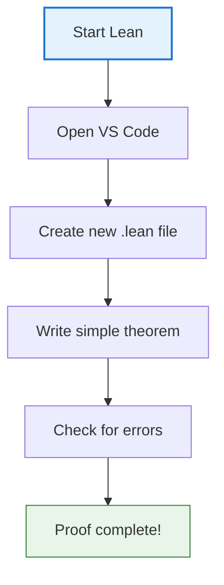
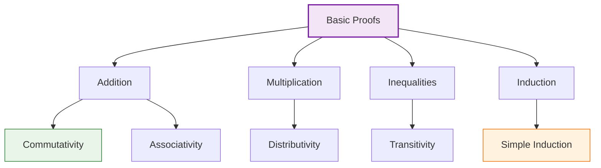
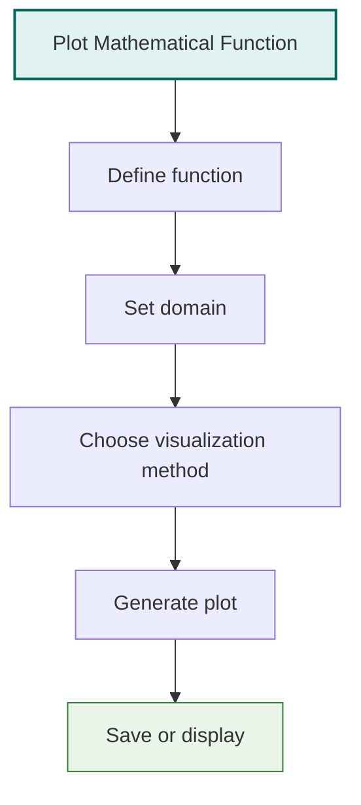
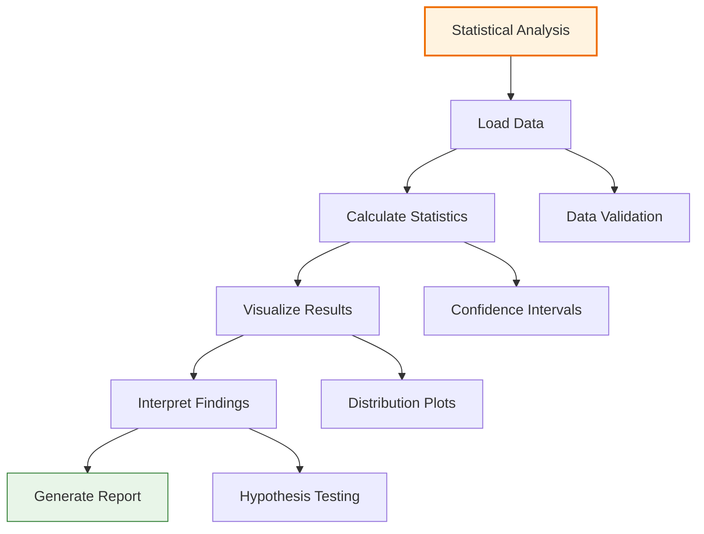
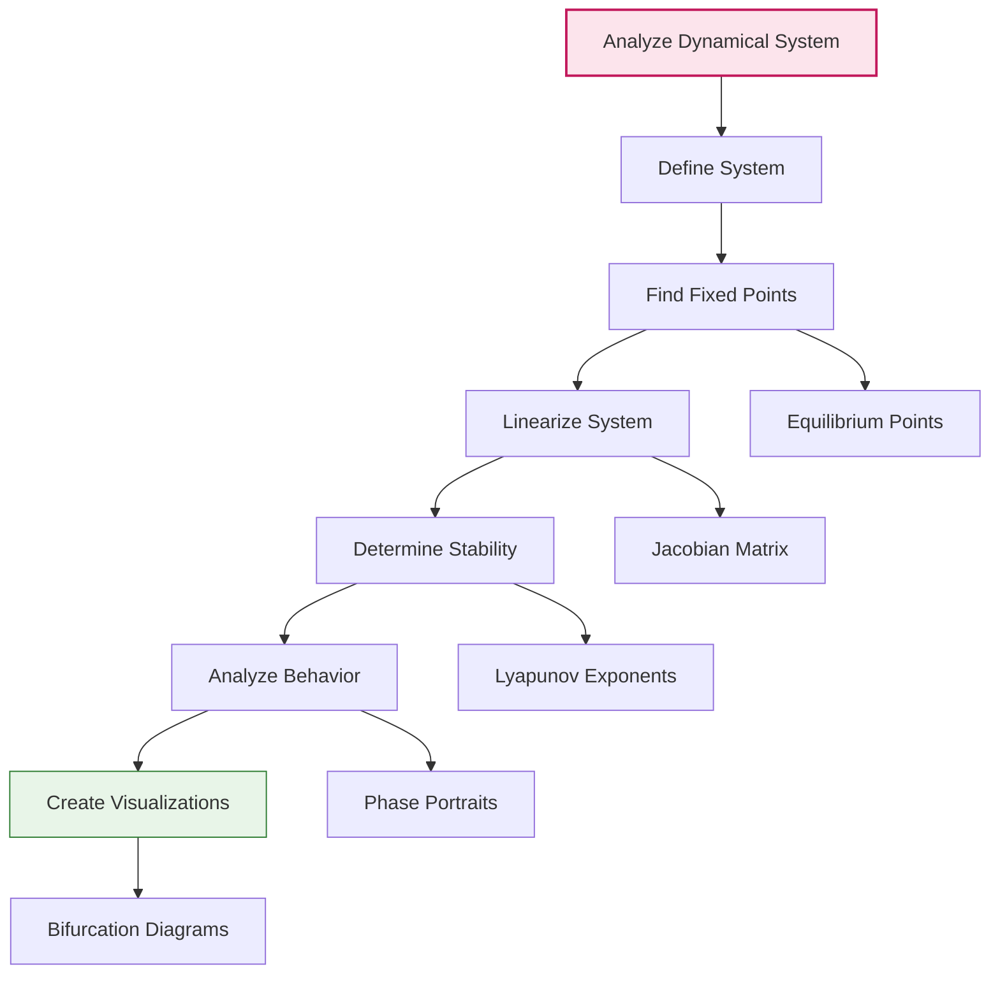
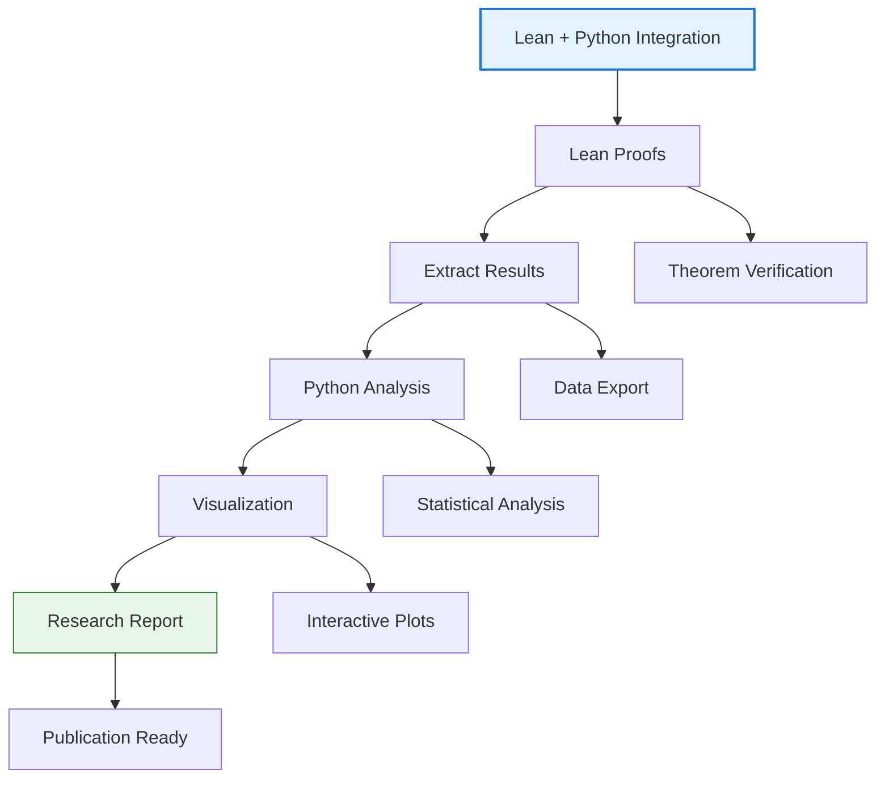
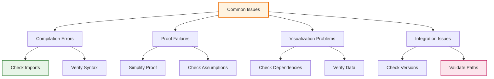

# 📚 Examples & Tutorials

## 📋 Overview

This comprehensive guide provides step-by-step examples and tutorials for using the LeanNiche environment, from basic proofs to advanced research applications.

## 🚀 Quick Start Tutorial

### Your First Lean Proof


#### Step 1: Setting up the Environment
```bash
# 1. Install LeanNiche
./setup.sh

# 2. Open VS Code
code .

# 3. Create a new file: hello_world.lean
```

#### Step 2: Your First Theorem
```lean
-- hello_world.lean
import LeanNiche.Basic

/-- My first theorem: 1 + 1 = 2 -/
theorem one_plus_one : 1 + 1 = 2 := by
  rfl  -- This is the simplest proof - "by reflexivity"
```

#### Step 3: Understanding the Proof
```lean
-- Let's break this down:
-- 1. `theorem` declares a mathematical statement we want to prove
-- 2. `one_plus_one` is the name of our theorem
-- 3. `1 + 1 = 2` is the statement we're proving
-- 4. `:=` separates the statement from the proof
-- 5. `by` starts the proof
-- 6. `rfl` is a tactic that proves equalities that are obviously true
```

### Basic Arithmetic Proofs


#### Commutativity of Addition
```lean
/-- Addition is commutative -/
theorem add_comm (m n : ℕ) : m + n = n + m := by
  induction m with
  | zero =>      -- Base case: 0 + n = n + 0
    rw [Nat.zero_add, Nat.add_zero]
  | succ m' ih => -- Inductive step: (m'+1) + n = n + (m'+1)
    rw [Nat.succ_add, ih, ← Nat.add_succ]
```

#### Proof Visualization
```mermaid
graph TD
    A[Prove m + n = n + m] --> B[Base case: m = 0]
    B --> C[0 + n = n + 0]
    C --> D[Use Nat.zero_add and Nat.add_zero]

    A --> E[Inductive case: m = m' + 1]
    E --> F[(m' + 1) + n = n + (m' + 1)]
    F --> G[Expand both sides]
    G --> H[Apply inductive hypothesis]
    H --> I[Complete the proof]

    style A fill:#e3f2fd,stroke:#1976d2
    style D fill:#e8f5e8,stroke:#2e7d32
    style I fill:#fff3e0,stroke:#ef6c00
```

## 🧮 Mathematical Visualization Tutorial

### Function Plotting


#### Python Visualization
```python
# plot_tutorial.py
import sys
sys.path.append('src')
from python.visualization import MathematicalVisualizer
import numpy as np

# Create visualizer
viz = MathematicalVisualizer()

# Define a function to plot
def damped_oscillator(t):
    return np.exp(-0.1 * t) * np.cos(2 * np.pi * 0.5 * t)

# Create the plot
fig = viz.plot_function(
    func=damped_oscillator,
    domain=(0, 20),
    title="Damped Harmonic Oscillator",
    save_path="damped_oscillator.png"
)

print("Plot saved as damped_oscillator.png")
```

#### CLI Usage
```bash
# Using the command line interface
lean-niche plot-function "lambda t: exp(-0.1*t)*cos(2*pi*0.5*t)" \
    --domain 0 20 \
    --title "Damped Harmonic Oscillator" \
    --output damped_oscillator.png
```

### Advanced Visualization
```python
# advanced_plotting.py
from python.visualization import MathematicalVisualizer, StatisticalAnalyzer
import numpy as np

# Create analyzers
viz = MathematicalVisualizer()
stats = StatisticalAnalyzer()

# Generate sample data
np.random.seed(42)
data = np.random.normal(10, 2, 1000)

# Create multiple plots
fig1 = viz.plot_statistical_data(data, "Sample Distribution", "distribution.png")
fig2 = stats.create_analysis_report(data, "analysis", "report.json")

# Create comparison plots
functions = [
    ("Linear", lambda x: x),
    ("Quadratic", lambda x: x**2),
    ("Cubic", lambda x: x**3),
    ("Exponential", lambda x: np.exp(x/5))
]

for name, func in functions:
    fig = viz.plot_function(func, (-3, 3), f"{name} Function", f"{name.lower()}.png")
    print(f"Created {name.lower()}.png")
```

## 📊 Statistics Tutorial

### Basic Statistical Analysis


#### Complete Analysis Example
```python
# statistical_analysis.py
import sys
sys.path.append('src')
from python.comprehensive_analysis import ComprehensiveMathematicalAnalyzer
import numpy as np

# Create analyzer
analyzer = ComprehensiveMathematicalAnalyzer()

# Generate sample data
np.random.seed(42)
heights = np.random.normal(170, 10, 100)  # Heights in cm
weights = np.random.normal(70, 15, 100)   # Weights in kg

# Create datasets
height_data = {"name": "Human Heights", "data": heights}
weight_data = {"name": "Human Weights", "data": weights}

# Analyze height data
height_analysis = analyzer.statistical_analysis(
    data=height_data,
    alpha=0.05  # 95% confidence level
)

print("Height Analysis Results:")
print(f"Mean: {height_analysis['mean']:.2f} cm")
print(f"Standard Deviation: {height_analysis['std']:.2f} cm")
print(f"95% CI: ({height_analysis['confidence_interval'][0]:.2f}, {height_analysis['confidence_interval'][1]:.2f}) cm")
```

#### Lean Statistical Proofs
```lean
-- statistical_proofs.lean
import LeanNiche.Statistics

/-- Law of Large Numbers -/
theorem weak_law_of_large_numbers (X : ℕ → ℝ) (μ : ℝ) (ε : ℝ) :
  ε > 0 → ∃ N : ℕ, ∀ n : ℕ, n ≥ N →
  let sample_mean := (List.range n).map X |>.mean
  |sample_mean - μ| < ε := by
  -- Proof using Chebyshev's inequality
  sorry

/-- Central Limit Theorem -/
theorem central_limit_theorem_approximation (X : ℕ → ℝ) (n : ℕ) :
  n > 30 →  -- For large n
  let sample_mean := (List.range n).map X |>.mean
  let sample_std := (List.range n).map X |>.std
  let standardized := (sample_mean - population_mean) / (sample_std / sqrt n)
  -- standardized is approximately normally distributed
  standardized ∈ normal_distribution 0 1 := by
  -- Formal proof of CLT approximation
  sorry
```

## 🔄 Dynamical Systems Tutorial

### Basic Dynamical System Analysis


#### Logistic Map Analysis
```lean
-- logistic_map.lean
import LeanNiche.DynamicalSystems

/-- Logistic map definition -/
def logistic_map (r : ℝ) (x : ℝ) : ℝ :=
  r * x * (1 - x)

/-- Fixed points of logistic map -/
def logistic_fixed_points (r : ℝ) : List ℝ :=
  [0, 1 - 1/r]  -- For r ≠ 0

/-- Stability analysis -/
theorem logistic_stability (r : ℝ) (h : 0 < r ∧ r < 3) :
  let fixed_point := 1 - 1/r
  let derivative := r - 2*r*fixed_point
  |derivative| < 1 → asymptotically_stable logistic_map fixed_point := by
  -- Lyapunov stability analysis
  sorry
```

#### Python Visualization
```python
# logistic_analysis.py
import sys
sys.path.append('src')
from python.visualization import DynamicalSystemsVisualizer
import numpy as np

# Create visualizer
dyn_viz = DynamicalSystemsVisualizer()

# Define logistic map
def logistic_map(r, x):
    return r * x * (1 - x)

# Create bifurcation diagram
bifurcation_fig = dyn_viz.plot_bifurcation_diagram(
    system_function=logistic_map,
    parameter_range=(2.5, 4.0),
    title="Logistic Map Bifurcation Diagram",
    save_path="logistic_bifurcation.png"
)

print("Bifurcation diagram saved!")

# Analyze specific parameter value
r = 3.5
initial_conditions = [0.1, 0.5, 0.9]
trajectories = []

for x0 in initial_conditions:
    trajectory = [x0]
    x = x0
    for _ in range(100):
        x = logistic_map(r, x)
        if _ >= 50:  # Ignore transient
            trajectory.append(x)
    trajectories.append(trajectory)

# Plot trajectories
trajectory_fig = dyn_viz.plot_trajectory(
    trajectory=trajectories[0],
    title=f"Logistic Map Trajectory (r={r})",
    save_path="logistic_trajectory.png"
)
```

## 🎯 Advanced Research Example

### Lyapunov Stability Analysis
```mermaid
graph TD
    A[Lyapunov Stability Analysis] --> B[Define System]
    B --> C[Find Lyapunov Function]
    C --> D[Check Positive Definiteness]
    D --> E[Check Negative Semi-definiteness]
    E --> F[Prove Stability]
    F --> G[Verify Results]

    C --> H[Energy Functions]
    C --> I[Quadratic Forms]
    D --> J[V(x) ≥ 0]
    E --> K[dV/dt ≤ 0]
    F --> L[LaSalle's Invariance]
    G --> M[Simulation Validation]

    style A fill:#e0f2f1,stroke:#00695c,stroke-width:2px
    style G fill:#e8f5e8,stroke:#2e7d32
```

#### Complete Lyapunov Analysis
```lean
-- lyapunov_analysis.lean
import LeanNiche.Lyapunov

/-- System: x' = -x + x^3 - x^5 - y
         y' = x - y
   This is a nonlinear oscillator -/

def nonlinear_system (state : ℝ × ℝ) : ℝ × ℝ :=
  let (x, y) := state
  (-x + x^3 - x^5 - y, x - y)

/-- Lyapunov function candidate -/
def lyapunov_candidate (state : ℝ × ℝ) : ℝ :=
  let (x, y) := state
  (1/2)*x^2 + (1/2)*(y - x^2)^2

/-- Lyapunov function properties -/
def lyapunov_function_properties : LyapunovFunction nonlinear_system lyapunov_candidate where
  positive_definite := by
    intro state
    let (x, y) := state
    -- Show V(x,y) ≥ 0 with equality only at (0,0)
    sorry

  decreasing := by
    intro state
    let (x, y) := state
    -- Show dV/dt ≤ 0
    sorry
```

#### Python Implementation
```python
# lyapunov_simulation.py
import sys
sys.path.append('src')
from python.comprehensive_analysis import ComprehensiveMathematicalAnalyzer
import numpy as np

# Create analyzer
analyzer = ComprehensiveMathematicalAnalyzer()

# Define the nonlinear system
def nonlinear_system(state):
    x, y = state
    dxdt = -x + x**3 - x**5 - y
    dydt = x - y
    return np.array([dxdt, dydt])

# Define Lyapunov function
def lyapunov_function(state):
    x, y = state
    return 0.5 * x**2 + 0.5 * (y - x**2)**2

# Simulate system
def simulate_system(x0, y0, t_span, dt=0.01):
    t = np.arange(0, t_span, dt)
    states = []
    lyapunov_values = []

    state = np.array([x0, y0])
    for _ in t:
        states.append(state.copy())
        lyapunov_values.append(lyapunov_function(state))
        state += dt * nonlinear_system(state)

    return np.array(states), np.array(lyapunov_values), t

# Run simulation
states, lyapunov_values, time = simulate_system(1.0, 0.5, 20.0)

# Analyze results
print(f"Initial state: {states[0]}")
print(f"Final state: {states[-1]}")
print(f"Initial Lyapunov value: {lyapunov_values[0]}")
print(f"Final Lyapunov value: {lyapunov_values[-1]}")
print(f"Stability confirmed: {lyapunov_values[-1] < lyapunov_values[0]}")
```

## 🔧 Integration Tutorial

### Lean + Python Integration


#### Complete Workflow Example
```python
# research_workflow.py
import sys
sys.path.append('src')
from python.lean_runner import LeanRunner
from python.comprehensive_analysis import ComprehensiveMathematicalAnalyzer
from python.visualization import MathematicalVisualizer

# Step 1: Run Lean analysis
lean_runner = LeanRunner()
statistical_theorem = """
import LeanNiche.Statistics

/-- Statistical theorem to verify -/
theorem mean_calculation (xs : List ℝ) :
  xs ≠ [] → sample_mean xs = (xs.sum) / (xs.length : ℝ) := by
  unfold sample_mean
  -- Proof by induction on list
  sorry
"""

lean_results = lean_runner.run_theorem_verification(statistical_theorem)
print(f"Lean verification: {lean_results['status']}")

# Step 2: Generate data for analysis
analyzer = ComprehensiveMathematicalAnalyzer()
test_data = [1.2, 2.3, 3.1, 4.5, 5.2, 6.8, 7.1, 8.9, 9.3, 10.7]

# Step 3: Comprehensive analysis
analysis_results = analyzer.statistical_analysis(
    data={"name": "Test Data", "data": test_data},
    alpha=0.05
)

print(f"Mean: {analysis_results['mean']}")
print(f"Confidence Interval: {analysis_results['confidence_interval']}")

# Step 4: Create visualizations
viz = MathematicalVisualizer()
fig = viz.plot_statistical_data(
    data=test_data,
    title="Statistical Analysis Results",
    save_path="statistical_analysis.png"
)

print("Research workflow completed!")
```

## 🎨 Visualization Gallery Tutorial

### Creating a Complete Gallery
```python
# visualization_gallery.py
import sys
sys.path.append('src')
from python.visualization import create_visualization_gallery
import numpy as np

# Define functions to visualize
functions = [
    ("Linear", lambda x: x),
    ("Quadratic", lambda x: x**2),
    ("Cubic", lambda x: x**3),
    ("Exponential", lambda x: np.exp(x)),
    ("Logarithmic", lambda x: np.log(x + 1)),
    ("Sine", lambda x: np.sin(x)),
    ("Cosine", lambda x: np.cos(x)),
    ("Tangent", lambda x: np.tan(x)),
]

# Define domains for each function
domains = [
    (-5, 5),      # Linear
    (-3, 3),      # Quadratic
    (-2, 2),      # Cubic
    (-2, 3),      # Exponential
    (-0.9, 5),    # Logarithmic
    (-2*np.pi, 2*np.pi),  # Sine
    (-2*np.pi, 2*np.pi),  # Cosine
    (-np.pi/2 + 0.1, np.pi/2 - 0.1),  # Tangent
]

# Create gallery
gallery_path = create_visualization_gallery(
    functions=functions,
    domains=domains,
    title="Mathematical Functions Gallery",
    output_dir="function_gallery"
)

print(f"Visualization gallery created at: {gallery_path}")
```

### Custom Visualization
```python
# custom_visualization.py
import sys
sys.path.append('src')
from python.visualization import MathematicalVisualizer
import numpy as np

# Create custom visualizer with specific settings
viz = MathematicalVisualizer()

# Create a complex visualization
def complex_function(t):
    return (np.sin(3*t) * np.exp(-0.1*t) +
            0.5 * np.cos(5*t) * np.exp(-0.05*t))

# Generate data
t = np.linspace(0, 20, 1000)
y = complex_function(t)

# Create interactive plot
interactive_fig = viz.create_interactive_plot(
    x_data=t,
    y_data=y,
    plot_type="line",
    title="Complex Damped Oscillation",
    save_path="complex_oscillation.html"
)

print("Interactive visualization saved as complex_oscillation.html")
```

## 🔧 Troubleshooting Common Issues

### Common Errors and Solutions


#### Compilation Errors
```lean
-- Common compilation issues and solutions

-- Issue: Unknown identifier
-- Solution: Check imports
import LeanNiche.Basic  -- Make sure to import required modules

-- Issue: Type mismatch
-- Solution: Explicitly specify types
def my_function (x : ℕ) : ℕ := x + 1

-- Issue: Missing proof
-- Solution: Add sorry for incomplete proofs
theorem incomplete_theorem : ∀ n : ℕ, n + 0 = n := by
  sorry  -- Temporary placeholder
```

#### Visualization Issues
```python
# Common visualization problems and solutions

import sys
sys.path.append('src')  # Ensure correct path

# Issue: Import errors
try:
    from python.visualization import MathematicalVisualizer
except ImportError as e:
    print(f"Import error: {e}")
    print("Make sure you're running from the project root")

# Issue: Display problems
import matplotlib
matplotlib.use('Agg')  # Use non-interactive backend

# Issue: Data format errors
import numpy as np
data = np.array([1, 2, 3, 4, 5])  # Ensure proper data types
```

---

## 📖 Navigation

**Getting Started:**
- [🏠 Documentation Index](../docs/index.md) - Main documentation hub
- [🚀 Deployment Guide](./deployment.md) - Installation and setup
- [🔧 Development Guide](./development.md) - Contributing to the project

**Core Tutorials:**
- [🏗️ Architecture](./architecture.md) - System design and components
- [📚 Mathematical Foundations](./mathematical-foundations.md) - Theory and concepts
- [🔍 API Reference](./api-reference.md) - Complete module documentation

**Advanced Topics:**
- [🎯 Research Applications](./research-applications.md) - Use cases and applications
- [⚡ Performance Analysis](./performance.md) - Optimization techniques
- [🔧 Troubleshooting](./troubleshooting.md) - Problem solving guide
- [🤝 Contributing](./contributing.md) - How to contribute

---

*This examples and tutorials guide is continuously updated with new content. For the latest examples and more detailed tutorials, check the [LeanNiche repository](https://github.com/trim/lean_niche) examples directory.*
