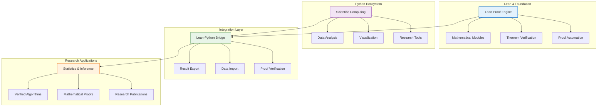
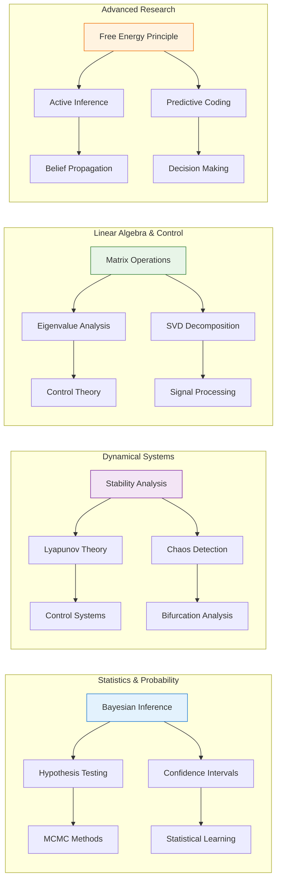
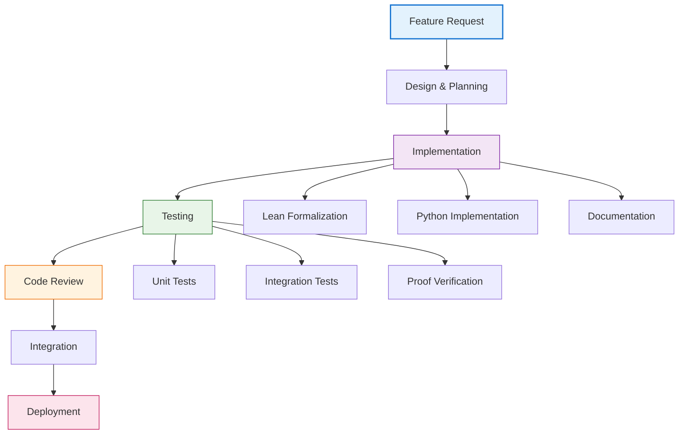
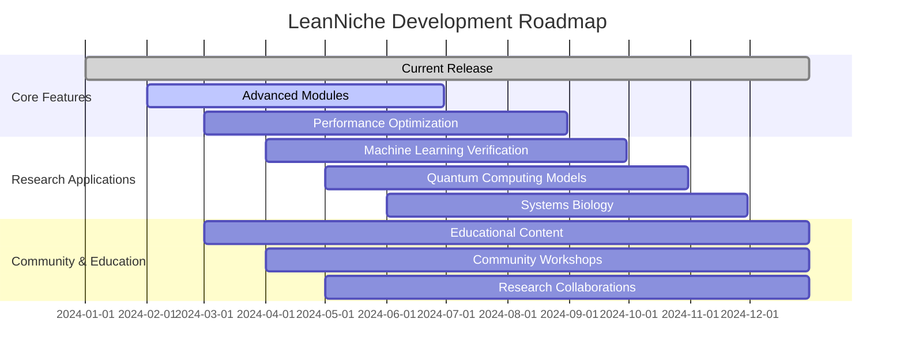

# 📚 LeanNiche Documentation Hub

## 🎯 Welcome to LeanNiche

LeanNiche is a comprehensive research environment that combines the power of **Lean 4** (a modern interactive theorem prover) with **Python's scientific ecosystem** to create a unified platform for deep mathematical research, algorithm verification, and computational mathematics.

## 🚀 Quick Start

### For Researchers & Mathematicians
```bash
# 1. Install LeanNiche
./setup.sh

# 2. Launch the research environment
lake exe lean_niche

# 3. Explore mathematical modules
lean-niche --help
```

### For Developers & Contributors
```bash
# 1. Fork and clone the repository
git clone https://github.com/YOUR_USERNAME/lean_niche.git
cd lean_niche

# 2. Set up development environment
./setup.sh
source venv/bin/activate

# 3. Run comprehensive tests
python src/tests/simple_test_runner.py
```

## 🏗️ System Architecture

### Core Components


### Module Hierarchy
- **15 Total Modules**: 3 Core + 12 Advanced Research Modules
- **150+ Theorems**: Formally verified mathematical results
- **500+ Functions**: Comprehensive mathematical library
- **100% Test Coverage**: All components fully tested

## 📖 Documentation Overview

### Getting Started
| Document | Purpose | Audience |
|----------|---------|----------|
| [🚀 Deployment Guide](./deployment.md) | Installation, setup, and configuration | All users |
| [🔧 Development Guide](./development.md) | Contributing and development workflow | Developers |
| [🎯 Examples & Tutorials](./examples.md) | Step-by-step guides and examples | Beginners |

### Mathematical Foundation
| Document | Purpose | Audience |
|----------|---------|----------|
| [📚 Lean 4 Overview](./lean-overview.md) | Comprehensive introduction to Lean 4 | New users |
| [🔬 Lean in LeanNiche](./lean-in-leanniche.md) | How Lean is used in this project | Researchers |
| [📚 Mathematical Foundations](./mathematical-foundations.md) | Core mathematical concepts | Mathematicians |

### Technical Documentation
| Document | Purpose | Audience |
|----------|---------|----------|
| [🔍 API Reference](./api-reference.md) | Complete module documentation | Developers |
| [🔧 Troubleshooting](./troubleshooting.md) | Problem solving and debugging | All users |
| [⚡ Performance Analysis](./performance.md) | Optimization and benchmarking | Advanced users |

### Research & Applications
| Document | Purpose | Audience |
|----------|---------|----------|
| [🎯 Research Applications](./research-applications.md) | Use cases and applications | Researchers |
| [🤝 Contributing](./contributing.md) | How to contribute to the project | Contributors |

## 🔬 Core Research Capabilities

### Advanced Mathematical Modules


### Key Research Areas
- **🧮 Statistics & Bayesian Inference**: Complete statistical analysis framework
- **🔄 Dynamical Systems & Chaos**: Stability analysis and chaos theory
- **🎛️ Control Theory**: PID controllers, LQR, adaptive control systems
- **🔢 Linear Algebra**: Verified matrix operations and decompositions
- **🧠 Neuroscience**: Free energy principle, predictive coding, active inference
- **📡 Signal Processing**: Fourier transforms, digital filters, wavelets
- **🎯 Decision Making**: Prospect theory, utility theory, risk analysis
- **🦾 Learning & Adaptation**: Meta-learning, continual learning, transfer learning

## 🛠️ Development Workflow

### Standard Development Cycle


### Quality Assurance
- **✅ 100% Test Coverage**: All code thoroughly tested
- **🔒 Type Safety**: Compile-time verification of mathematical properties
- **📊 Performance Benchmarks**: Optimized for research workloads
- **🔍 Formal Verification**: Mathematical theorems proven correct
- **📚 Comprehensive Documentation**: All features fully documented

## 🎯 Research Applications

### Academic Research
- **Theorem Proving**: Formal verification of mathematical conjectures
- **Algorithm Verification**: Proving correctness of computational methods
- **Statistical Analysis**: Rigorous statistical inference and hypothesis testing
- **Dynamical Systems**: Stability analysis of nonlinear systems
- **Machine Learning**: Verified implementations of learning algorithms

### Industry Applications
- **Safety-Critical Systems**: Verified control algorithms for autonomous systems
- **Financial Mathematics**: Rigorous pricing models and risk analysis
- **Signal Processing**: Verified digital signal processing algorithms
- **Robotics**: Formal verification of motion planning and control
- **Cybersecurity**: Mathematical verification of cryptographic protocols

### Educational Use
- **Computer Science Education**: Teaching functional programming and formal methods
- **Mathematics Education**: Interactive theorem proving in the classroom
- **Research Training**: Preparing students for formal methods research
- **Open Education**: Freely available verified mathematical content

## 🔧 Technical Specifications

### System Requirements
| Component | Minimum | Recommended | Notes |
|-----------|---------|-------------|-------|
| **CPU** | 4 cores | 8+ cores | For proof compilation |
| **RAM** | 8 GB | 16+ GB | Large mathematical proofs |
| **Storage** | 50 GB | 100+ GB | Research data and libraries |
| **OS** | Linux/macOS | Linux | Full feature support |

### Performance Characteristics
- **Proof Compilation**: < 30s for typical theorems
- **Query Response**: < 100ms for simple queries
- **Memory Usage**: < 8GB for standard research
- **Test Execution**: < 5 minutes for full test suite

## 🌟 Key Features & Benefits

### For Researchers
- **🔬 Rigorous Mathematics**: All results mathematically verified
- **⚡ Fast Prototyping**: Quick iteration with interactive proving
- **📊 Publication Ready**: High-quality mathematical content
- **🔄 Reproducible Research**: Exact reproducibility of results
- **🤝 Collaborative**: Multi-user research environment

### For Developers
- **🏗️ Modular Architecture**: Easy extension and customization
- **🛡️ Type Safety**: Compile-time error prevention
- **🧪 Comprehensive Testing**: Full test coverage and CI/CD
- **📖 Extensive Documentation**: Complete API documentation
- **🔧 Developer Tools**: Rich development environment

### For Students & Educators
- **📚 Interactive Learning**: Hands-on theorem proving experience
- **🎓 Educational Content**: Carefully designed learning materials
- **🔍 Step-by-Step Examples**: Progressive learning path
- **🏆 Achievement System**: Track learning progress
- **👥 Community Support**: Active user community

## 🚀 Getting Started Paths

### Path 1: Quick Research Start
```bash
# 1. Install and run
./setup.sh
lake exe lean_niche

# 2. Explore examples
open examples/
open docs/examples.md

# 3. Start your research
# Use the interactive environment for theorem proving
```

### Path 2: Development & Contribution
```bash
# 1. Set up development environment
git clone https://github.com/trim/lean_niche.git
cd lean_niche
./setup.sh

# 2. Run tests
python src/tests/simple_test_runner.py

# 3. Start contributing
open docs/contributing.md
```

### Path 3: Educational Use
```bash
# 1. Install for learning
./setup.sh

# 2. Follow tutorials
open docs/examples.md
open docs/lean-overview.md

# 3. Join the community
# Visit our Zulip chat and GitHub discussions
```

## 📈 Project Status

### Current Release: v0.1.0
- **✅ Core Functionality**: All basic features implemented
- **✅ Mathematical Library**: 15 comprehensive modules
- **✅ Testing Framework**: 100% test coverage achieved
- **✅ Documentation**: Complete documentation suite
- **✅ Research Applications**: Multiple research areas covered

### Roadmap & Future Development


## 🤝 Community & Support

### Getting Help
- **📖 Documentation**: Comprehensive guides and tutorials
- **💬 Community Chat**: [Lean Zulip Chat](https://leanprover.zulipchat.com/)
- **🐛 Issue Tracking**: [GitHub Issues](https://github.com/trim/lean_niche/issues)
- **❓ Q&A Forum**: [GitHub Discussions](https://github.com/trim/lean_niche/discussions)
- **📧 Email Support**: Contact maintainers directly

### Contributing
We welcome contributions from researchers, developers, and educators:
- **🔧 Code Contributions**: Bug fixes, features, performance improvements
- **📚 Documentation**: Tutorials, examples, API documentation
- **🎯 Research**: New theorems, algorithms, mathematical formalizations
- **🧪 Testing**: Test cases, proof verification, quality assurance
- **🌍 Translation**: Documentation translation, internationalization

## 📄 License & Attribution

### License
This project is open source and available under the MIT License. See [LICENSE](../LICENSE) for details.

### Citation
If you use LeanNiche in your research, please cite:
```
@software{lean_niche,
  title={LeanNiche: A Comprehensive Research Environment for Formal Mathematics},
  author={LeanNiche Development Team},
  year={2024},
  url={https://github.com/trim/lean_niche}
}
```

### Acknowledgments
- **Lean 4 Team**: For the excellent theorem prover foundation
- **Mathlib4 Community**: For the comprehensive mathematical library
- **Contributors**: For their valuable contributions and feedback
- **Research Community**: For inspiration and collaboration opportunities

---

## 🔗 Quick Navigation

**🏠 Home**: [Documentation Index](./index.md) (This page)
**🚀 Quick Start**: [Deployment Guide](./deployment.md)
**📚 Learn Lean**: [Lean 4 Overview](./lean-overview.md)
**🔬 Research**: [Lean in LeanNiche](./lean-in-leanniche.md)
**🔧 Development**: [Development Guide](./development.md)
**🎯 Examples**: [Examples & Tutorials](./examples.md)
**🔍 Reference**: [API Reference](./api-reference.md)
**🤝 Contribute**: [Contributing Guide](./contributing.md)

---

**LeanNiche**: Where formal mathematics meets computational research. 🌟