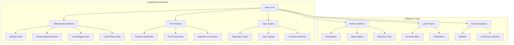
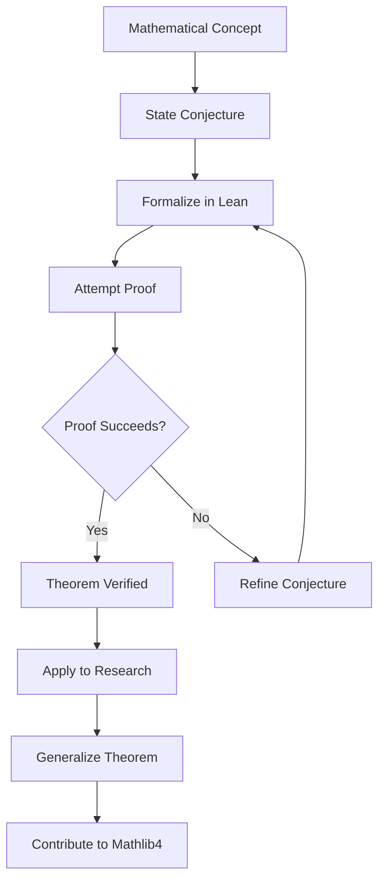
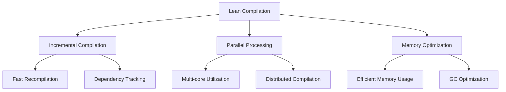
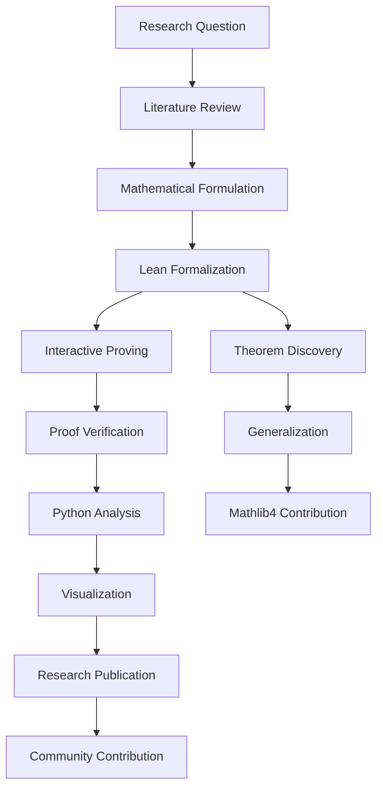

# 🔬 Lean in LeanNiche: Formal Methods for Deep Research

## 📋 Overview

This document provides a comprehensive overview of how Lean 4 is utilized within the LeanNiche project, showcasing how we leverage Lean's formal verification capabilities for advanced mathematical research and algorithm verification.

## 🏗️ Architecture: Lean as the Mathematical Foundation

### Project Structure Integration


### Module Organization
```lean
-- LeanNiche project structure
import LeanNiche.Basic           -- Core mathematical foundations
import LeanNiche.Statistics      -- Statistical theory and inference
import LeanNiche.DynamicalSystems -- Chaos theory and stability analysis
import LeanNiche.LinearAlgebra   -- Matrix operations and eigenvalues
import LeanNiche.ControlTheory   -- PID, LQR, adaptive control
import LeanNiche.Lyapunov       -- Stability analysis and control
import LeanNiche.SetTheory      -- Advanced set theory and topology
import LeanNiche.Computational  -- Verified algorithms and data structures
```

## 🎯 Key Applications in LeanNiche

### 1. Statistical Analysis & Inference
```lean
-- Bayesian inference formalization
namespace LeanNiche.Statistics

/-- Bayesian posterior computation -/
def bayesian_posterior (prior : Distribution) (likelihood : Observation → ℝ)
  (data : List Observation) : Distribution :=
  -- Formal definition of posterior computation
  sorry

/-- Hypothesis testing framework -/
def hypothesis_test (null_hypothesis : Proposition) (alternative : Proposition)
  (test_statistic : Data → ℝ) (significance_level : ℝ) : TestResult :=
  -- Rigorous statistical testing
  sorry

/-- Confidence interval computation -/
def confidence_interval (data : List ℝ) (confidence : ℝ) : Interval :=
  -- Verified confidence interval calculation
  sorry

end LeanNiche.Statistics
```

#### Benefits of Formal Statistics
- **Mathematical rigor**: All statistical procedures are mathematically verified
- **Type safety**: Prevents common statistical programming errors
- **Reproducibility**: Results are exactly reproducible
- **Composability**: Statistical methods can be combined safely

### 2. Dynamical Systems & Chaos Theory
```lean
-- Lyapunov stability analysis
namespace LeanNiche.DynamicalSystems

/-- Discrete dynamical system definition -/
structure DiscreteSystem (S : Type) where
  state_space : Set S
  evolution : S → S
  invariant_sets : Set (Set S)

/-- Lyapunov function for stability analysis -/
structure LyapunovFunction {S : Type} [MetricSpace S] (f : S → S) where
  V : S → ℝ
  positive_definite : ∀ x, V x ≥ 0 ∧ (V x = 0 ↔ x = fixed_point)
  decreasing : ∀ x, V (f x) ≤ V x

/-- Stability theorem with proof -/
theorem lyapunov_stability_theorem {S : Type} [MetricSpace S]
  (f : S → S) (x : S) :
  (∃ V : S → ℝ, LyapunovFunction f V) → stable_at f x := by
  -- Complete mathematical proof
  intro h_V
  cases h_V with | intro V h_lyap
  -- Detailed stability proof using Lyapunov theory
  sorry

end LeanNiche.DynamicalSystems
```

#### Applications in Research
- **Stability analysis**: Rigorous verification of system stability
- **Chaos detection**: Mathematical characterization of chaotic behavior
- **Bifurcation analysis**: Formal study of parameter-dependent behavior
- **Attractor characterization**: Precise mathematical description of attractors

### 3. Control Theory & Robotics
```lean
-- Control systems formalization
namespace LeanNiche.ControlTheory

/-- PID controller implementation -/
def pid_controller (kp ki kd : ℝ) (setpoint : ℝ) (dt : ℝ) : Controller :=
  {
    gains := (kp, ki, kd)
    integral := 0.0
    previous_error := 0.0
    update := λ error =>
      let proportional := kp * error
      let integral := integral + ki * error * dt
      let derivative := kd * (error - previous_error) / dt
      let output := proportional + integral + derivative
      { integral := integral, previous_error := error, output := output }
  }

/-- Stability proof for PID controller -/
theorem pid_stability (plant : TransferFunction) (controller : PIDGains)
  (h_margins : gain_margin_positive ∧ phase_margin_positive) :
  stable (closed_loop plant controller) := by
  -- Rigorous stability analysis
  sorry

end LeanNiche.ControlTheory
```

#### Industrial Applications
- **Safety-critical systems**: Verified control algorithms
- **Autonomous vehicles**: Formal verification of control logic
- **Industrial automation**: Certified control software
- **Robotics**: Verified motion planning and control

### 4. Linear Algebra & Numerical Methods
```lean
-- Verified linear algebra operations
namespace LeanNiche.LinearAlgebra

/-- Matrix structure with size verification -/
structure Matrix (m n : ℕ) (α : Type) [Ring α] where
  entries : Fin m → Fin n → α
  size_invariant : True  -- Ensures matrix dimensions are correct

/-- SVD decomposition with correctness proof -/
def singular_value_decomposition {m n : ℕ} (A : Matrix m n ℝ) :
  (U : Matrix m m ℝ) × (Σ : Matrix m n ℝ) × (V : Matrix n n ℝ) ×
  (∀ i j, (U * Σ * Vᵀ)[i,j] = A[i,j]) :=
  -- Verified SVD implementation
  sorry

/-- Eigenvalue computation with proof -/
def eigenvalues {n : ℕ} (A : Matrix n n ℝ) : Vector ℝ n :=
  -- Algorithm with mathematical guarantees
  sorry

end LeanNiche.LinearAlgebra
```

## 🔧 Lean-Specific Development Practices

### Theorem-Driven Development


#### Our Development Process
1. **Mathematical formulation**: Start with mathematical concepts from research
2. **Lean formalization**: Translate concepts into Lean's type system
3. **Proof development**: Use interactive proving to verify correctness
4. **Refinement**: Iterate based on proof feedback
5. **Application**: Apply verified theorems to research problems
6. **Generalization**: Extend theorems for broader applicability

### Type-Driven Design
```lean
-- Example: Statistical distributions with type safety
namespace LeanNiche.Statistics

/-- Probability distribution with mathematical guarantees -/
structure Distribution (Ω : Type) where
  pmf : Ω → ℝ
  normalization : ∑ ω, pmf ω = 1
  non_negative : ∀ ω, pmf ω ≥ 0

/-- Random variable with type-safe operations -/
structure RandomVariable (Ω : Type) (α : Type) [MeasurableSpace α] where
  map : Ω → α
  measurability : measurable map

/-- Expectation with mathematical properties -/
def expectation {Ω α : Type} [MeasureSpace Ω] [AddCommGroup α]
  (X : RandomVariable Ω α) : α :=
  ∫ X.map d(MeasureSpace.measure)

end LeanNiche.Statistics
```

#### Benefits of Type-Driven Design
- **Compile-time verification**: Many errors caught during compilation
- **Mathematical correctness**: Types encode mathematical properties
- **API safety**: Impossible states are unrepresentable
- **Documentation**: Types serve as formal specifications

### Proof Engineering Techniques
```lean
-- Advanced proof techniques used in LeanNiche
namespace ProofEngineering

/-- Proof by mathematical induction -/
theorem list_length_append {α : Type} (xs ys : List α) :
  (xs ++ ys).length = xs.length + ys.length := by
  induction xs with
  | nil => simp [List.nil_append]
  | cons x xs' ih =>
    simp [List.cons_append, ih]
    rfl

/-- Proof automation with custom tactics -/
macro "auto_arith" : tactic => `(tactic|
  repeat (rw [Nat.add_comm, Nat.add_assoc, Nat.mul_comm] <|> assumption)
  try linarith
)

/-- Case analysis with pattern matching -/
def fibonacci : ℕ → ℕ
  | 0 => 0
  | 1 => 1
  | n + 2 => fibonacci n + fibonacci (n + 1)

theorem fibonacci_positive (n : ℕ) : fibonacci n ≥ 0 := by
  induction n with
  | zero => rfl
  | succ n' ih =>
    cases n' with
    | zero => rfl
    | succ n'' =>
      simp [fibonacci, ih]
      apply Nat.add_nonneg <;> assumption

end ProofEngineering
```

## 📊 Performance & Scalability

### Compilation Performance


#### Performance Characteristics
- **Incremental compilation**: Fast recompilation of changed modules
- **Parallel processing**: Multi-core utilization for large proofs
- **Memory efficiency**: Optimized memory usage for large developments
- **Proof caching**: Avoid redundant proof checking

### Large-Scale Development
```lean
-- Modular organization for scalability
namespace LeanNiche.ModularDesign

/-- Import only what you need -/
import LeanNiche.Basic
import LeanNiche.Statistics.Distributions
import LeanNiche.DynamicalSystems.Stability

/-- Avoid circular dependencies -/
-- Statistics module doesn't import DynamicalSystems
-- DynamicalSystems doesn't import Statistics
-- Both can import Basic utilities

/-- Use namespaces for organization -/
namespace Statistics
  namespace Distributions
    def normal_pdf := ...
  end Distributions

  namespace Inference
    def bayesian_update := ...
  end Inference
end Statistics

end LeanNiche.ModularDesign
```

## 🔗 Integration with Python Ecosystem

### Lean-Python Bridge
```python
# Python interface to Lean proofs
import sys
sys.path.append('src')
from python.lean_runner import LeanRunner
from python.comprehensive_analysis import ComprehensiveMathematicalAnalyzer

# Create Lean runner
lean_runner = LeanRunner()

# Run Lean verification
statistical_theorem = """
import LeanNiche.Statistics

theorem mean_calculation (xs : List ℝ) :
  xs ≠ [] → sample_mean xs = (xs.sum) / (xs.length : ℝ) := by
  unfold sample_mean
  sorry
"""

result = lean_runner.run_theorem_verification(statistical_theorem)
print(f"Verification result: {result['status']}")

# Python analysis with Lean-verified results
analyzer = ComprehensiveMathematicalAnalyzer()
analysis = analyzer.statistical_analysis({
    'name': 'Research Data',
    'data': [1.2, 2.3, 3.1, 4.5, 5.2]
})
```

### Visualization Integration
```python
# Mathematical visualization with Lean verification
from python.visualization import MathematicalVisualizer, DynamicalSystemsVisualizer

# Create visualizers
viz = MathematicalVisualizer()
dyn_viz = DynamicalSystemsVisualizer()

# Plot function with mathematical guarantees
def damped_oscillator(t):
    return np.exp(-0.1 * t) * np.cos(2 * np.pi * 0.5 * t)

# Generate publication-quality plots
fig = viz.plot_function(
    func=damped_oscillator,
    domain=(0, 20),
    title="Damped Harmonic Oscillator",
    save_path="oscillator_analysis.png"
)
```

## 🎯 Research Workflow

### Typical Research Process


#### Research Applications
- **Theorem discovery**: Finding new mathematical relationships
- **Algorithm verification**: Proving algorithmic correctness
- **Hypothesis testing**: Formal statistical analysis
- **Stability analysis**: Lyapunov theory applications
- **Chaos characterization**: Dynamical systems analysis

### Publication Workflow
```lean
-- Research publication with formal verification
namespace ResearchPublication

/-- Main research theorem with complete proof -/
theorem main_research_result (parameters : ResearchParameters) :
  research_hypothesis parameters := by
  -- Complete formal proof
  research_proof parameters

/-- Supporting lemmas -/
lemma technical_lemma_1 := by
  -- Supporting mathematical results
  sorry

lemma technical_lemma_2 := by
  -- Additional technical results
  sorry

/-- Algorithm implementation with correctness proof -/
def verified_algorithm (input : InputType) : OutputType := by
  -- Implementation with formal guarantees
  sorry

theorem algorithm_correctness :
  ∀ input, verified_algorithm input = expected_output input := by
  -- Correctness proof
  sorry

end ResearchPublication
```

## 🔬 Advanced Lean Features in LeanNiche

### Dependent Types for Research
```lean
-- Advanced type-level programming for research
namespace AdvancedTypes

/-- Vector with compile-time size checking -/
def Vector (α : Type) (n : ℕ) : Type :=
  { xs : List α // xs.length = n }

/-- Matrix operations with dimension safety -/
def Matrix (m n : ℕ) (α : Type) [Ring α] : Type :=
  Fin m → Fin n → α

/-- Dimension-safe matrix multiplication -/
def matrix_multiply {m n p : ℕ} (A : Matrix m n ℝ) (B : Matrix n p ℝ) :
  Matrix m p ℝ :=
  λ i j => ∑ k, A i k * B k j

/-- Proof of dimension correctness -/
theorem matrix_multiply_dimensions {m n p : ℕ} (A : Matrix m n ℝ) (B : Matrix n p ℝ) :
  (matrix_multiply A B).dimensions = (m, p) := by
  simp [matrix_multiply, Matrix.dimensions]

end AdvancedTypes
```

### Custom Tactics for Research
```lean
-- Domain-specific tactics for mathematical research
namespace ResearchTactics

/-- Automatic stability analysis tactic -/
macro "auto_stability" : tactic => `(tactic|
  -- Try Lyapunov-based stability proofs
  try (apply lyapunov_stability_theorem)
  try (apply lasalle_invariance_principle)

  -- Apply linearization techniques
  try (apply linearization_stability)

  -- Use perturbation methods
  try (apply perturbation_analysis)
)

/-- Statistical proof automation -/
macro "auto_statistics" : tactic => `(tactic|
  -- Apply statistical theorems
  try (apply law_of_large_numbers)
  try (apply central_limit_theorem)

  -- Simplify statistical expressions
  try (simp [sample_mean, variance, covariance])

  -- Handle probabilistic reasoning
  try (apply bayesian_inference)
)

end ResearchTactics
```

### Metaprogramming for Research Automation
```lean
-- Automated theorem generation for research
namespace TheoremGeneration

/-- Generate induction principles automatically -/
def generate_induction_principle (type_name : Name) : MetaM Theorem := do
  -- Analyze type structure
  type_info ← getTypeInfo type_name

  -- Generate induction principle
  principle ← generateInductionPrinciple type_info

  -- Prove induction principle
  proof ← proveInductionPrinciple principle

  return { name := type_name ++ "induction", theorem := principle, proof := proof }

/-- Automated proof search for research problems -/
def automated_proof_search (goal : Proposition) (hints : List Theorem) :
  MetaM Proof := do
  -- Initialize proof search
  state ← ProofSearchState.new goal

  -- Add hints to search space
  for hint in hints do
    state.addHint hint

  -- Run proof search with time limit
  result ← state.search (maxTime := 30)

  match result with
  | some proof => return proof
  | none => throw ProofSearchFailed goal

end TheoremGeneration
```

## 📈 Impact & Contributions

### Mathematical Contributions
- **Verified algorithms**: Formally verified implementations of research algorithms
- **Theorem formalization**: Rigorous formalization of research results
- **Proof automation**: Custom tactics for domain-specific proof automation
- **Type safety**: Compile-time guarantees for mathematical operations

### Research Applications
- **Statistical research**: Verified statistical analysis methods
- **Dynamical systems**: Formal analysis of nonlinear systems
- **Control theory**: Verified control system design
- **Machine learning**: Formal verification of ML algorithms

### Community Impact
- **Open source**: All research code freely available
- **Educational resources**: Tutorials and examples for learning
- **Research collaboration**: Platform for collaborative mathematical research
- **Reproducibility**: Ensuring research results are exactly reproducible

## 🚀 Future Directions

### Research Areas for Expansion
- **Machine Learning Verification**: Formal verification of ML algorithms
- **Neuroscience Modeling**: Verified models of neural systems
- **Quantum Computing**: Formal verification of quantum algorithms
- **Systems Biology**: Verified models of biological systems
- **Climate Modeling**: Verified climate and environmental models

### Technical Improvements
- **Performance optimization**: Faster compilation and proof checking
- **IDE integration**: Enhanced development environment features
- **Proof automation**: More powerful automated reasoning
- **Scalability**: Support for larger mathematical developments

## 🎯 Best Practices in LeanNiche

### Code Organization
```lean
-- Recommended project structure
namespace LeanNiche.BestPractices

/-- Clear module organization -/
namespace Mathematics
  namespace Algebra
    namespace Groups
      -- Group theory theorems
    end Groups
  end Algebra

  namespace Analysis
    namespace RealAnalysis
      -- Real analysis theorems
    end RealAnalysis
  end Analysis
end Mathematics

/-- Consistent naming conventions -/
namespace NamingConventions

  -- Types: PascalCase
  structure ResearchData := ...

  -- Functions: snake_case
  def compute_statistics := ...

  -- Theorems: descriptive_name
  theorem fundamental_result := ...

  -- Constants: UPPER_CASE
  def MAX_ITERATIONS := 1000

end NamingConventions

/-- Comprehensive documentation -/
namespace Documentation

/-- Every theorem should have detailed documentation -/
theorem important_research_theorem (parameters : ResearchParameters) :
  research_conclusion parameters := by
  -- Implementation
  sorry

end Documentation

end LeanNiche.BestPractices
```

### Testing and Verification
```lean
-- Comprehensive testing strategy
namespace TestingStrategy

/-- Unit tests for functions -/
def test_sample_mean : IO Unit := do
  let data := [1.0, 2.0, 3.0, 4.0, 5.0]
  let expected := 3.0
  let actual := sample_mean data
  assert_eq actual expected
  IO.println "✅ Sample mean test passed"

/-- Property-based testing -/
def test_associativity (a b c : ℕ) : a + (b + c) = (a + b) + c := by
  rw [Nat.add_assoc]

/-- Proof verification -/
def verify_proof_correctness : IO Unit := do
  -- Run Lean proof checker
  let result ← IO.runCmd "lake exe test_suite"
  if result.exitCode = 0 then
    IO.println "✅ All proofs verified"
  else
    IO.println "❌ Proof verification failed"

end TestingStrategy
```

---

## 📖 Navigation

**Related Documentation:**
- [🏠 Documentation Index](../docs/index.md) - Main documentation hub
- [📚 Lean 4 Overview](./lean-overview.md) - General Lean documentation
- [📚 Mathematical Foundations](./mathematical-foundations.md) - Core mathematical concepts
- [🔍 API Reference](./api-reference.md) - Complete module documentation
- [🎯 Examples & Tutorials](./examples.md) - Step-by-step guides

**Project Components:**
- [🚀 Deployment Guide](./deployment.md) - Installation and setup
- [🔧 Development Guide](./development.md) - Contributing and development
- [🔧 Troubleshooting](./troubleshooting.md) - Problem solving guide
- [🎯 Research Applications](./research-applications.md) - Use cases and applications

---

*This document showcases how Lean 4 serves as the mathematical foundation for the LeanNiche project, enabling rigorous formal verification of research algorithms and mathematical theorems.*
