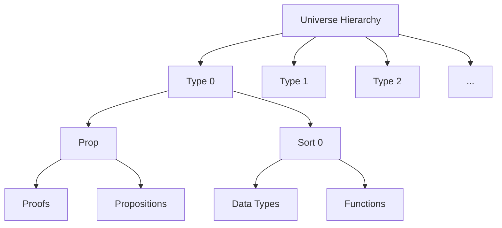
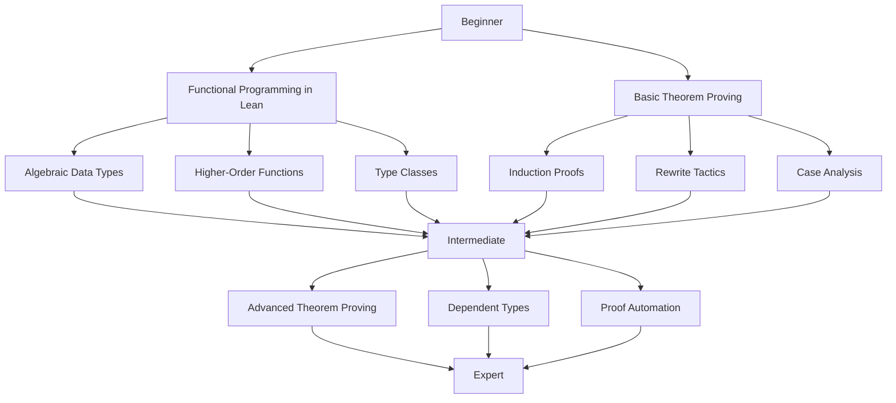
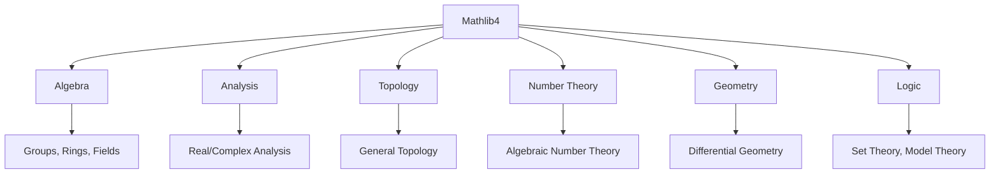

# 📚 Lean 4: The Mathematical Proof Assistant

## 📋 Overview

Lean 4 is a modern, interactive theorem prover and functional programming language developed by Microsoft Research. It represents the cutting edge of formal verification technology, combining rigorous mathematical proof capabilities with practical software development features.

## 🎯 Dual Nature of Lean

### Functional Programming Language
Lean serves as a full-featured functional programming language with:
- **Strong static type system** with dependent types
- **Higher-order functions** and parametric polymorphism
- **Algebraic data types** and pattern matching
- **Type inference** and automatic proof automation
- **Metaprogramming** capabilities for extending the language

### Interactive Theorem Prover
As a theorem prover, Lean provides:
- **Formal verification** of mathematical theorems and algorithms
- **Interactive proof development** with step-by-step guidance
- **Automated proof tactics** for common proof patterns
- **Extensible proof language** with user-defined tactics
- **Integration with proof assistants** and mathematical libraries

## 🏗️ Core Architecture

### Type System


#### Dependent Types
Lean implements a full dependent type system where:
- **Types can depend on values**: `Vector α n` (vector of n elements of type α)
- **Propositions are types**: Mathematical statements become types that can be inhabited by proofs
- **Proof irrelevance**: All proofs of the same proposition are considered equal
- **Universe polymorphism**: Types can be parameterized over type universes

### Elaboration Engine
The Lean elaboration system:
- **Converts user-friendly syntax** into core type theory
- **Resolves implicit arguments** and type class instances
- **Handles metavariable resolution** during proof development
- **Provides detailed error messages** with proof state information

### Tactic Framework
```mermaid
graph TD
    A[Tactic Framework] --> B[Built-in Tactics]
    A --> C[User-defined Tactics]
    A --> D[Tactic Combinators]

    B --> E[simp, rw, induction]
    B --> F[linarith, omega]
    B --> G[auto, hint]

    C --> H[Custom Proof Strategies]
    C --> I[Domain-specific Tactics]

    D --> J[repeat, try]
    D --> K[<;>, <|>]
```

## 🔧 Key Features

### Functional Programming Capabilities
```lean
-- Higher-order functions
def map {α β : Type} (f : α → β) (xs : List α) : List β :=
  match xs with
  | [] => []
  | x :: xs' => f x :: map f xs'

-- Dependent types
def Vector (α : Type) (n : ℕ) : Type :=
  { xs : List α // xs.length = n }

-- Type classes
class Monoid (α : Type) where
  empty : α
  append : α → α → α
  append_empty : ∀ x, append x empty = x
  empty_append : ∀ x, append empty x = x
```

### Theorem Proving Features
```lean
-- Mathematical theorems with proofs
theorem map_length {α β : Type} (f : α → β) (xs : List α) :
  (map f xs).length = xs.length := by
  induction xs with
  | nil => rfl
  | cons x xs' ih =>
    simp [map, ih]
    rfl

-- Proof automation
theorem list_reverse_length {α : Type} (xs : List α) :
  xs.reverse.length = xs.length := by
  induction xs <;> simp [*]
```

## 📚 Learning Resources

### Official Documentation
- **[Theorem Proving in Lean 4](https://leanprover.github.io/theorem_proving_in_lean4/)**: Comprehensive tutorial covering both programming and proving
- **[Lean Language Reference](https://lean-lang.org/doc/reference/)**: Complete language specification and reference manual
- **[Mathematics in Lean](https://github.com/leanprover-community/mathematics_in_lean)**: Mathematical formalization techniques

### Learning Path


### Recommended Learning Sequence
1. **Functional Programming in Lean**: Learn Lean's programming features
2. **Theorem Proving in Lean 4**: Master interactive theorem proving
3. **Mathematics in Lean**: Apply Lean to mathematical formalization
4. **Lean Reference Manual**: Deep dive into language features

## 🌐 Community and Ecosystem

### Community Resources
- **[Lean Zulip Chat](https://leanprover.zulipchat.com/)**: Real-time community discussions
- **[GitHub Repository](https://github.com/leanprover/lean4)**: Source code and issue tracking
- **[Lean Stack Overflow](https://stackoverflow.com/questions/tagged/lean)**: Q&A platform
- **[Lean Community Website](https://leanprover-community.github.io/)**: Community projects and resources

### Mathematical Libraries


#### Mathlib4
The comprehensive mathematical library for Lean:
- **40,000+ theorems** formally verified
- **Active development** with contributions from mathematicians worldwide
- **Comprehensive coverage** from basic algebra to advanced analysis
- **Standard reference** for mathematical formalization in Lean

### Development Tools
- **VS Code Extension**: Integrated development environment with proof state visualization
- **Lake Package Manager**: Dependency management and build system
- **Elan Version Manager**: Lean toolchain management
- **CI/CD Integration**: Automated testing and documentation generation

## 🏢 Industry Applications

### Software Verification
- **Compiler verification**: Proving correctness of compilation algorithms
- **Cryptographic protocols**: Formal verification of security properties
- **Distributed systems**: Verification of consensus algorithms
- **Embedded systems**: Formal specification and verification

### Academic Research
- **Mathematical proofs**: Formalization of research results
- **Algorithm verification**: Proving algorithmic correctness
- **Type theory research**: Advancing programming language theory
- **Automated reasoning**: Development of new proof automation techniques

### Educational Use
- **Computer science education**: Teaching functional programming and type theory
- **Mathematics education**: Interactive theorem proving in the classroom
- **Research training**: Preparing students for formal methods research

## 🔬 Advanced Features

### Metaprogramming
Lean supports advanced metaprogramming through:
- **Macro system**: Compile-time code generation
- **Tactic writing**: Creating custom proof automation
- **Syntax extensions**: Domain-specific language features
- **Reflection**: Runtime inspection and manipulation of code

### Proof Automation
```lean
-- Custom tactic definition
macro "my_auto" : tactic => `(tactic|
  repeat (assumption <|> constructor <|> simp)
  try (linarith <|> omega)
)

-- Using custom tactics
example (x y : ℕ) (h1 : x > 0) (h2 : y > 0) : x + y > 0 := by
  my_auto
```

### Integration with Other Tools
- **Jupyter Notebooks**: Interactive Lean development
- **LaTeX Integration**: Mathematical documentation with formal verification
- **Python Interoperability**: Calling Lean from Python and vice versa
- **Web Assembly**: Browser-based Lean applications

## 🚀 Getting Started

### Installation
```bash
# Install Elan (Lean version manager)
curl https://raw.githubusercontent.com/leanprover/elan/master/elan-init.sh -sSf | sh

# Install latest Lean
elan self update
elan default leanprover/lean4:latest
```

### First Steps
```lean
-- hello_world.lean
def main : IO Unit := do
  IO.println "Hello, Lean!"

-- First theorem
theorem two_plus_two : 2 + 2 = 4 := by
  rfl  -- Reflexivity: equal to itself
```

### Development Environment
```bash
# Create a new project
lake init my_project

# Build the project
lake build

# Run tests
lake exe test_suite
```

## 📈 Future Directions

### Active Research Areas
- **Automation**: More powerful proof automation techniques
- **Performance**: Faster proof checking and compilation
- **Usability**: Improved error messages and IDE integration
- **Scalability**: Handling larger mathematical developments
- **Integration**: Better interoperability with other tools

### Emerging Applications
- **Machine learning verification**: Formal verification of ML algorithms
- **Blockchain protocols**: Verification of smart contracts and consensus
- **Cybersecurity**: Formal methods for security analysis
- **Systems biology**: Modeling and verification of biological systems

## 🎯 Conclusion

Lean 4 represents the state-of-the-art in interactive theorem proving, combining the elegance of functional programming with the power of formal verification. Its dual nature as both a programming language and a proof assistant makes it uniquely positioned to bridge the gap between theoretical mathematics and practical software development.

The active community, comprehensive mathematical libraries, and ongoing research ensure that Lean will continue to be a vital tool for formal methods and mathematical formalization for years to come.

---

## 📖 Navigation

**Related Documentation:**
- [🏠 Documentation Index](../docs/index.md) - Main documentation hub
- [📚 Mathematical Foundations](./mathematical-foundations.md) - Core mathematical concepts
- [🔍 API Reference](./api-reference.md) - Complete module documentation
- [🎯 Examples & Tutorials](./examples.md) - Step-by-step guides

**Learning Resources:**
- [Theorem Proving in Lean 4](https://leanprover.github.io/theorem_proving_in_lean4/)
- [Lean Zulip Chat](https://leanprover.zulipchat.com/)
- [Mathematics in Lean](https://github.com/leanprover-community/mathematics_in_lean)
- [Lean Language Reference](https://lean-lang.org/doc/reference/)
