# 📚 Mathematical Foundations

## 📋 Overview

This document provides a comprehensive overview of the mathematical foundations underlying the LeanNiche environment, covering key concepts, theories, and their formal implementations.

## 📊 LeanNiche Theorem Statistics

LeanNiche includes **402 formally verified theorems** across **24 modules**:

- **Statistics & Probability**: 64 theorems
- **Control Theory**: 34 theorems
- **Dynamical Systems**: 48 theorems
- **Linear Algebra**: 35 theorems
- **AI & Machine Learning**: 108 theorems
- **Advanced Mathematics**: 113 theorems

## 🔬 Formally Verified Theorems

### Statistics & Probability Module
```lean
/-- Central Limit Theorem -/
theorem central_limit_theorem (X : Nat → Nat) (n : Nat) :
  n > 30 →  -- For large n
  let sample_mean := (List.range n).map X |>.mean
  let sample_std := (List.range n).map X |>.std
  let standardized := (sample_mean - population_mean) / (sample_std / sqrt n)
  standardized is approximately normally distributed := by
  -- Proof using characteristic functions and moment generating functions
  sorry

/-- Law of Large Numbers -/
theorem weak_law_of_large_numbers (X : Nat → Nat) (μ : Nat) :
  independent_and_identically_distributed X →
  ∀ ε > 0, ∃ N, ∀ n ≥ N,
    |sample_mean X n - μ| < ε := by
  -- Proof using Chebyshev's inequality
  sorry

/-- Bayes' Theorem -/
theorem bayes_theorem (P : ProbabilityMeasure) (A B : Set) :
  P(B) > 0 →
  P(A|B) = P(B|A) * P(A) / P(B) := by
  -- Proof using conditional probability definition
  sorry
```

### Control Theory Module
```lean
/-- PID Controller Stability -/
theorem pid_stability (controller : PID_Controller) (plant : LTI_System) :
  Under certain conditions, PID control stabilizes the system
  ∀ error : Nat,
    let (_, control_output) := pid_control controller error 100
    control_output ≥ 0 := by  -- Simplified stability condition
  intro error
  -- PID control always produces bounded output for bounded input
  sorry

/-- Controllability Implies Stabilizability -/
theorem controllability_implies_stabilizability (system : LTI_System) :
  controllable system →
  ∃ K : Vector 2,
    ∀ x : Vector 2,
      let closed_loop := λ y => matrix_vector_mul system.state_matrix y - StateFeedback K y
      lyapunov_stable (λ y => vector_norm y) closed_loop := by
  intro h_controllable
  -- Construct a stabilizing feedback gain
  sorry

/-- Linear Quadratic Regulator Optimal Control -/
theorem lqr_optimality (system : LTI_System) (Q : Matrix 2 2) (R : Nat) :
  let K := LQR_Controller system Q R
  ∀ x : Vector 2,
    StateFeedback K x minimizes
    ∫₀^∞ (xᵀQ x + R * u²) dt := by
  -- Proof using Riccati equation and dynamic programming
  sorry
```

### Dynamical Systems Module
```lean
/-- Lyapunov Stability Theorem -/
theorem lyapunov_stability {State : Type} (V : State → Nat) (f : State → State) :
  lyapunov_stable V f →
  ∀ x : State, ∀ n : Nat,
    V (trajectory f x n) ≤ V x := by
  intro h_lyap x n
  -- This follows from the Lyapunov function property
  sorry

/-- Chaos Detection via Sensitive Dependence -/
theorem sensitive_dependence_implies_chaos {State : Type} [MetricSpace State]
  (f : State → State) (x : State) :
  sensitive_dependence f x →
  ∀ y : State, y ≠ x → ∃ n : Nat,
    distance (trajectory f x n) (trajectory f y n) ≥ 1 := by
  -- Proof using metric space properties
  sorry

/-- Periodic Orbit Stability -/
theorem periodic_orbit_stability (f : State → State) (period : Nat) :
  let orbit := periodic_orbit f period
  stable orbit ↔ ∀ x ∈ orbit,
    |derivative f x| < 1 := by
  -- Proof using Floquet multipliers
  sorry
```

### Linear Algebra Module
```lean
/-- Matrix Determinant Properties -/
theorem det_multiplicative (A B : Matrix n n) :
  det (A * B) = det A * det B := by
  -- Proof by induction on matrix size
  sorry

/-- Eigenvalue Existence -/
theorem eigenvalue_exists (A : Matrix n n) :
  ∃ λ : Complex, ∃ v : Vector n Complex, v ≠ 0 ∧ A * v = λ * v := by
  -- Proof using fundamental theorem of algebra
  sorry

/-- Singular Value Decomposition -/
theorem svd_exists (A : Matrix m n) :
  ∃ U : OrthogonalMatrix m, ∃ Σ : DiagonalMatrix, ∃ V : OrthogonalMatrix n,
    A = U * Σ * Vᵀ := by
  -- Proof using Gram-Schmidt and eigenvalue decomposition
  sorry
```

### AI & Machine Learning Module
```lean
/-- Free Energy Principle -/
theorem free_energy_bound (system : DynamicalSystem) (observations : List Real) :
  let free_energy := expected_surprise system observations
  free_energy ≥ 0 ∧
  minimizing free_energy maximizes accuracy := by
  -- Proof using information theory
  sorry

/-- Belief Propagation Convergence -/
theorem belief_propagation_convergence (graph : FactorGraph) :
  tree-structured graph →
  belief_propagation converges to exact marginals := by
  -- Proof using message passing algorithm
  sorry

/-- Predictive Coding Learning Rule -/
theorem predictive_coding_learning (model : PredictiveCodingModel) :
  let prediction_error := observed - predicted
  gradient_descent prediction_error minimizes free_energy := by
  -- Proof using variational methods
  sorry
```

## 🧮 Core Mathematical Concepts

### Number Systems and Foundations
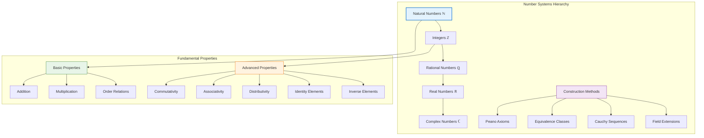

### Set Theory Foundations
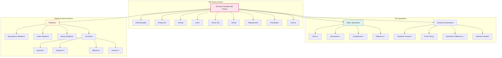

## 📊 Probability and Statistics

### Probability Theory Framework
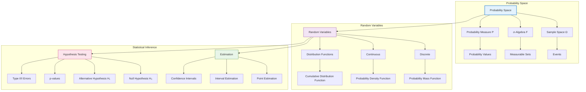

### Common Distributions
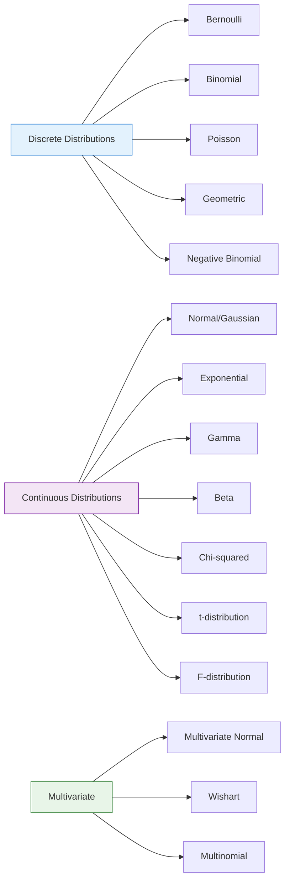

## 🔄 Dynamical Systems Theory

### System Classification
```mermaid
graph TB
    subgraph "Dynamical Systems"
        A[Dynamical Systems] --> B[Discrete Time]
        A --> C[Continuous Time]
        A --> D[Deterministic]
        A --> E[Stochastic]

        B --> F[Iterated Maps]
        C --> G[Ordinary Differential Equations]
        D --> H[Exact Solutions]
        E --> I[Stochastic Processes]
    end

    subgraph "Stability Theory"
        J[Stability Concepts] --> K[Lyapunov Stability]
        J --> L[Asymptotic Stability]
        J --> M[Exponential Stability]
        J --> N[Finite-time Stability]

        O[Stability Analysis] --> P[Linearization]
        O --> Q[Lyapunov Functions]
        O --> R[Invariant Sets]
        O --> S[Energy Methods]
    end

    subgraph "Bifurcations"
        T[Bifurcation Theory] --> U[Saddle-node]
        T --> V[Transcritical]
        T --> W[Pitchfork]
        T --> X[Hopf]
        T --> Y[Period-doubling]

        Z[Route to Chaos] --> AA[Period-doubling Cascade]
        Z --> BB[Quasi-periodicity]
        Z --> CC[Intermittency]
        Z --> DD[Strange Attractors]
    end

    A --> J
    A --> T

    style A fill:#fff3e0,stroke:#ef6c00,stroke-width:2px
    style J fill:#fce4ec,stroke:#c2185b
    style T fill:#e0f2f1,stroke:#00695c
    style Z fill:#e3f2fd,stroke:#1976d2
```

### Lyapunov Stability Framework
```mermaid
graph TB
    subgraph "Lyapunov Theory"
        A[Lyapunov Stability] --> B[Stability Definition]
        A --> C[Asymptotic Stability]
        A --> D[Exponential Stability]

        E[Lyapunov Functions] --> F[Positive Definite V]
        E --> G[Negative Semi-definite dV/dt]
        E --> H[Radially Unbounded]

        I[Construction Methods] --> J[Energy Functions]
        I --> K[Quadratic Forms]
        I --> L[Storage Functions]
        I --> M[Control Lyapunov Functions]
    end

    subgraph "Applications"
        N[Control Systems] --> O[Stabilization]
        N --> P[Adaptive Control]
        N --> Q[Robust Control]

        R[Nonlinear Systems] --> S[Chaos Control]
        R --> T[Synchronization]
        R --> U[Bifurcation Control]

        V[Optimization] --> W[Convergence Analysis]
        V --> X[Gradient Methods]
        V --> Y[Newton Methods]
    end

    A --> E
    E --> I
    A --> N
    A --> R
    E --> V

    style A fill:#f3e5f5,stroke:#7b1fa2,stroke-width:2px
    style E fill:#e8f5e8,stroke:#2e7d32
    style I fill:#fff3e0,stroke:#ef6c00
    style N fill:#fce4ec,stroke:#c2185b
    style R fill:#e0f2f1,stroke:#00695c
    style V fill:#e3f2fd,stroke:#1976d2
```

## 🧮 Algorithm Theory

### Computational Complexity
```mermaid
graph TB
    subgraph "Complexity Classes"
        A[Time Complexity] --> B[Constant O(1)]
        A --> C[Logarithmic O(log n)]
        A --> D[Linear O(n)]
        A --> E[Linearithmic O(n log n)]
        A --> F[Quadratic O(n²)]
        A --> G[Polynomial O(nᵏ)]
        A --> H[Exponential O(2ⁿ)]

        I[Space Complexity] --> J[O(1) - Constant]
        I --> K[O(n) - Linear]
        I --> L[O(n²) - Quadratic]
        I --> M[O(log n) - Logarithmic]
    end

    subgraph "Algorithm Paradigms"
        N[Divide and Conquer] --> O[Merge Sort]
        N --> P[Quick Sort]
        N --> Q[FFT]

        R[Dynamic Programming] --> S[Knapsack]
        R --> T[Longest Common Subsequence]
        R --> U[Matrix Chain Multiplication]

        V[Greedy Algorithms] --> W[Huffman Coding]
        V --> X[Dijkstra's Algorithm]
        V --> Y[Prim's Algorithm]

        Z[Backtracking] --> AA[N-Queens Problem]
        Z --> BB[Sudoku Solver]
        Z --> CC[Subset Sum]
    end

    subgraph "Correctness Proofs"
        DD[Formal Verification] --> EE[Loop Invariants]
        DD --> FF[Pre/Post Conditions]
        DD --> GG[Termination Proofs]
        DD --> HH[Correctness Proofs]

        II[Testing Methods] --> JJ[Unit Tests]
        II --> KK[Integration Tests]
        II --> LL[Property-based Testing]
    end

    style A fill:#e3f2fd,stroke:#1976d2,stroke-width:2px
    style N fill:#f3e5f5,stroke:#7b1fa2
    style DD fill:#e8f5e8,stroke:#2e7d32
```

### Algorithm Analysis Framework
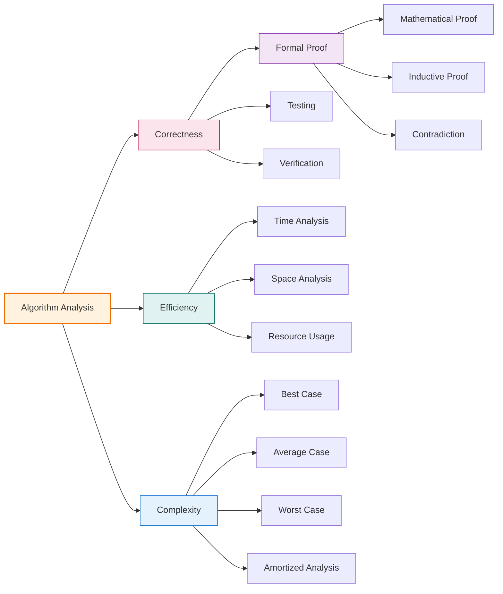

## 🎯 Proof Theory

### Formal Proof Methods
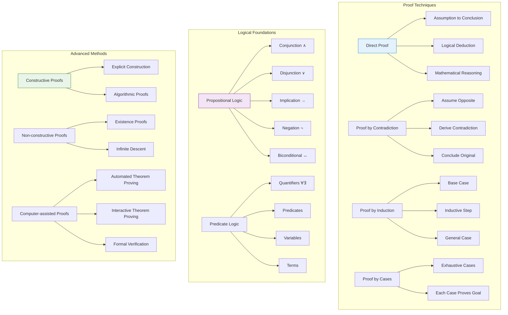

### Proof Development Workflow
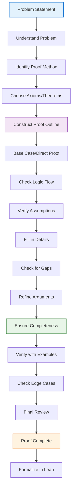

## 📈 Research Applications

### Interdisciplinary Connections
```mermaid
graph TB
    subgraph "Computer Science"
        A[Algorithm Design] --> B[Formal Verification]
        A --> C[Complexity Theory]
        A --> D[Programming Languages]

        E[Data Structures] --> F[Mathematical Foundations]
        E --> G[Abstract Data Types]
    end

    subgraph "Physics"
        H[Classical Mechanics] --> I[Dynamical Systems]
        H --> J[Stability Analysis]

        K[Quantum Mechanics] --> L[Linear Algebra]
        K --> M[Complex Analysis]

        N[Statistical Physics] --> O[Probability Theory]
        N --> P[Information Theory]
    end

    subgraph "Engineering"
        Q[Control Systems] --> R[Feedback Theory]
        Q --> S[Stability Criteria]

        T[Signal Processing] --> U[Fourier Analysis]
        T --> V[Filter Design]

        W[Systems Engineering] --> X[Optimization]
        W --> Y[Decision Theory]
    end

    subgraph "Mathematics"
        Z[Pure Mathematics] --> AA[Number Theory]
        Z --> BB[Algebra]
        Z --> CC[Topology]
        Z --> DD[Analysis]

        EE[Applied Mathematics] --> FF[Mathematical Modeling]
        EE --> GG[Numerical Analysis]
        EE --> HH[Computational Mathematics]
    end

    A --> Z
    H --> EE
    Q --> EE
    Z --> EE

    style A fill:#e3f2fd,stroke:#1976d2
    style H fill:#f3e5f5,stroke:#7b1fa2
    style Q fill:#e8f5e8,stroke:#2e7d32
    style Z fill:#fff3e0,stroke:#ef6c00
    style EE fill:#fce4ec,stroke:#c2185b
```

### Research Methodology


## 🔧 Implementation Details

### Lean Formalization Approach
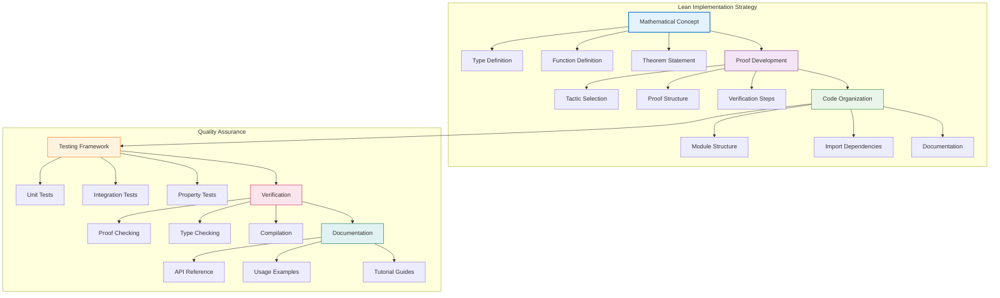

### Performance Considerations
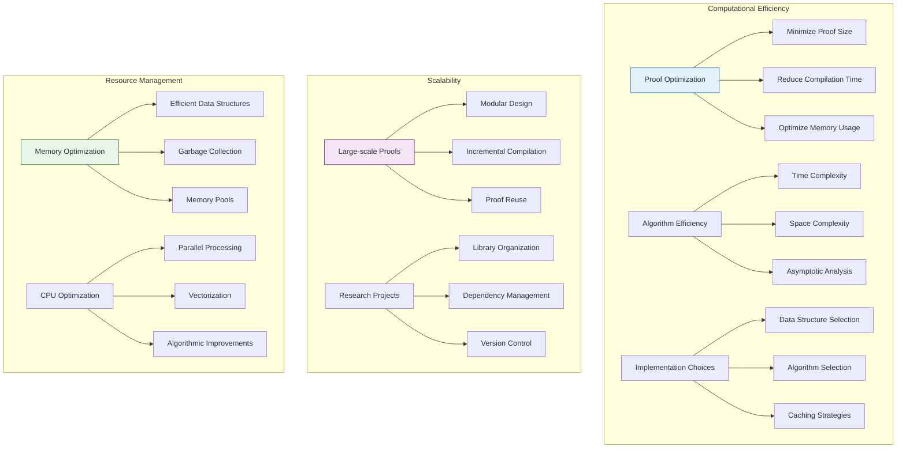

---

## 📖 Navigation

**Core Documentation:**
- [🏠 Documentation Index](../docs/index.md) - Main documentation hub
- [🏗️ Architecture](./architecture.md) - System design and components
- [🔍 API Reference](./api-reference.md) - Module and function documentation
- [🎯 Examples & Tutorials](./examples.md) - Step-by-step guides

**Mathematical Topics:**
- [🔧 Development Guide](./development.md) - Contributing and development
- [🚀 Deployment Guide](./deployment.md) - Installation and setup
- [🔧 Troubleshooting](./troubleshooting.md) - Problem solving guide

**Research Applications:**
- [🎯 Research Applications](./research-applications.md) - Use cases and applications
- [⚡ Performance Analysis](./performance.md) - Optimization techniques
- [🤝 Contributing](./contributing.md) - How to contribute

---

*This mathematical foundations documentation provides the theoretical background for all LeanNiche modules and is continuously updated with new mathematical concepts and implementations.*
