# 📚 Mathematical Foundations

## 📋 Overview

This document provides a comprehensive overview of the mathematical foundations underlying the LeanNiche environment, covering key concepts, theories, and their formal implementations.

## 🧮 Core Mathematical Concepts

### Number Systems and Foundations

```mermaid
graph TB
    subgraph "Number Systems Hierarchy"
        A[Natural Numbers ℕ] --> B[Integers ℤ]
        B --> C[Rational Numbers ℚ]
        C --> D[Real Numbers ℝ]
        D --> E[Complex Numbers ℂ]

        F[Construction Methods] --> G[Peano Axioms]
        F --> H[Equivalence Classes]
        F --> I[Cauchy Sequences]
        F --> J[Field Extensions]
    end

    subgraph "Fundamental Properties"
        K[Basic Properties] --> L[Addition]
        K --> M[Multiplication]
        K --> N[Order Relations]

        O[Advanced Properties] --> P[Commutativity]
        O --> Q[Associativity]
        O --> R[Distributivity]
        O --> S[Identity Elements]
        O --> T[Inverse Elements]
    end

    A --> K
    B --> O

    style A fill:#e3f2fd,stroke:#1976d2,stroke-width:2px
    style F fill:#f3e5f5,stroke:#7b1fa2
    style K fill:#e8f5e8,stroke:#2e7d32
    style O fill:#fff3e0,stroke:#ef6c00
```


### Set Theory Foundations


## 📊 Probability and Statistics

### Probability Theory Framework


### Common Distributions


## 🔄 Dynamical Systems Theory

### System Classification


### Lyapunov Stability Framework


## 🧮 Algorithm Theory

### Computational Complexity
```mermaid
graph TB
    subgraph "Complexity Classes"
        A[Time Complexity] --> B[Constant O(1)]
        A --> C[Logarithmic O(log n)]
        A --> D[Linear O(n)]
        A --> E[Linearithmic O(n log n)]
        A --> F[Quadratic O(n²)]
        A --> G[Polynomial O(nᵏ)]
        A --> H[Exponential O(2ⁿ)]

        I[Space Complexity] --> J[O(1) - Constant]
        I --> K[O(n) - Linear]
        I --> L[O(n²) - Quadratic]
        I --> M[O(log n) - Logarithmic]
    end

    subgraph "Algorithm Paradigms"
        N[Divide and Conquer] --> O[Merge Sort]
        N --> P[Quick Sort]
        N --> Q[FFT]

        R[Dynamic Programming] --> S[Knapsack]
        R --> T[Longest Common Subsequence]
        R --> U[Matrix Chain Multiplication]

        V[Greedy Algorithms] --> W[Huffman Coding]
        V --> X[Dijkstra's Algorithm]
        V --> Y[Prim's Algorithm]

        Z[Backtracking] --> AA[N-Queens Problem]
        Z --> BB[Sudoku Solver]
        Z --> CC[Subset Sum]
    end

    subgraph "Correctness Proofs"
        DD[Formal Verification] --> EE[Loop Invariants]
        DD --> FF[Pre/Post Conditions]
        DD --> GG[Termination Proofs]
        DD --> HH[Correctness Proofs]

        II[Testing Methods] --> JJ[Unit Tests]
        II --> KK[Integration Tests]
        II --> LL[Property-based Testing]
    end

    style A fill:#e3f2fd,stroke:#1976d2,stroke-width:2px
    style N fill:#f3e5f5,stroke:#7b1fa2
    style DD fill:#e8f5e8,stroke:#2e7d32
```

### Algorithm Analysis Framework


## 🎯 Proof Theory

### Formal Proof Methods

```mermaid
graph TB
    subgraph "Proof Techniques"
        A[Direct Proof] --> B[Assumption to Conclusion]
        A --> C[Logical Deduction]
        A --> D[Mathematical Reasoning]

        E[Proof by Contradiction] --> F[Assume Opposite]
        E --> G[Derive Contradiction]
        E --> H[Conclude Original]

        I[Proof by Induction] --> J[Base Case]
        I --> K[Inductive Step]
        I --> L[General Case]

        M[Proof by Cases] --> N[Exhaustive Cases]
        M --> O[Each Case Proves Goal]
    end

    subgraph "Logical Foundations"
        P[Propositional Logic] --> Q[Conjunction ∧]
        P --> R[Disjunction ∨]
        P --> S[Implication →]
        P --> T[Negation ¬]
        P --> U[Biconditional ↔]

        V[Predicate Logic] --> W[Quantifiers ∀∃]
        V --> X[Predicates]
        V --> Y[Variables]
        V --> Z[Terms]
    end

    subgraph "Advanced Methods"
        AA[Constructive Proofs] --> BB[Explicit Construction]
        AA --> CC[Algorithmic Proofs]

        DD[Non-constructive Proofs] --> EE[Existence Proofs]
        DD --> FF[Infinite Descent]

        GG[Computer-assisted Proofs] --> HH[Automated Theorem Proving]
        GG --> II[Interactive Theorem Proving]
        GG --> JJ[Formal Verification]
    end

    style A fill:#e3f2fd,stroke:#1976d2
    style P fill:#f3e5f5,stroke:#7b1fa2
    style AA fill:#e8f5e8,stroke:#2e7d32
```


### Proof Development Workflow


## 📈 Research Applications

### Interdisciplinary Connections


### Research Methodology


## 🔧 Implementation Details

### Lean Formalization Approach


### Performance Considerations


---

## 📖 Navigation

**Core Documentation:**
- [🏠 Documentation Index](../docs/index.md) - Main documentation hub
- [🏗️ Architecture](./architecture.md) - System design and components
- [🔍 API Reference](./api-reference.md) - Module and function documentation
- [🎯 Examples & Tutorials](./examples.md) - Step-by-step guides

**Mathematical Topics:**
- [🔧 Development Guide](./development.md) - Contributing and development
- [🚀 Deployment Guide](./deployment.md) - Installation and setup
- [🔧 Troubleshooting](./troubleshooting.md) - Problem solving guide

**Research Applications:**
- [🎯 Research Applications](./research-applications.md) - Use cases and applications
- [⚡ Performance Analysis](./performance.md) - Optimization techniques
- [🤝 Contributing](./contributing.md) - How to contribute

---

*This mathematical foundations documentation provides the theoretical background for all LeanNiche modules and is continuously updated with new mathematical concepts and implementations.*
