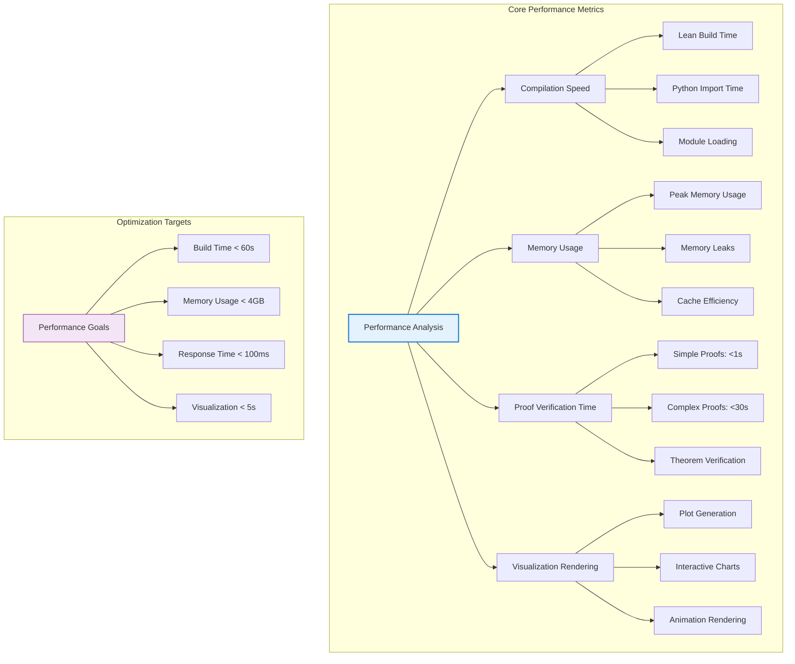
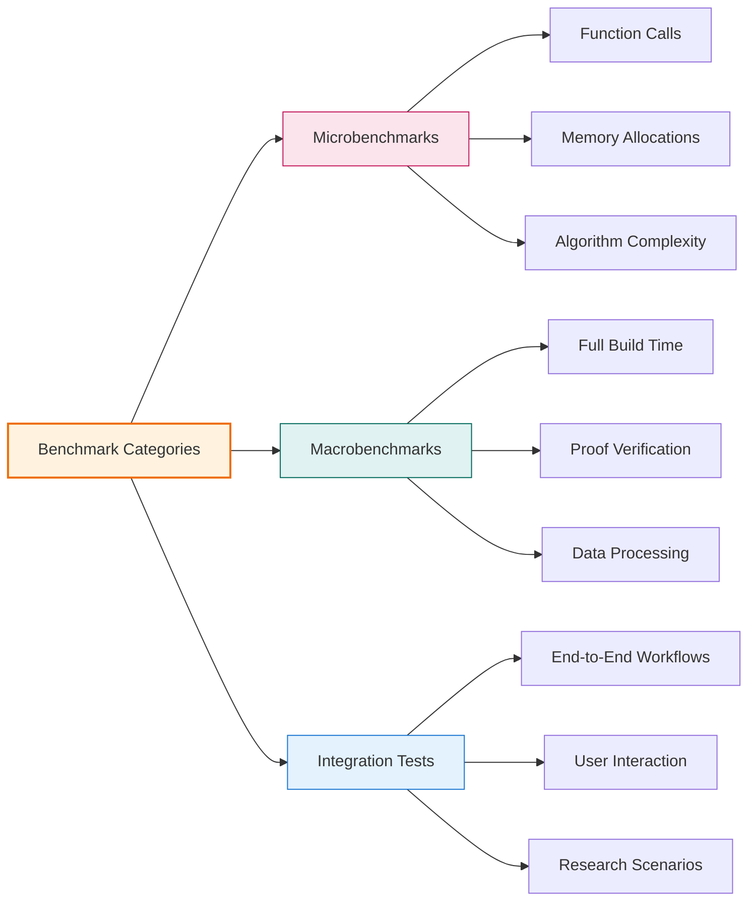
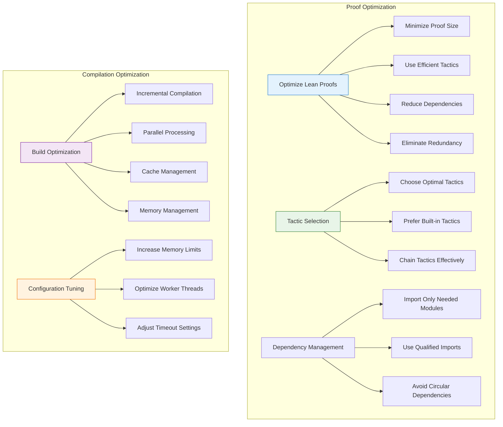
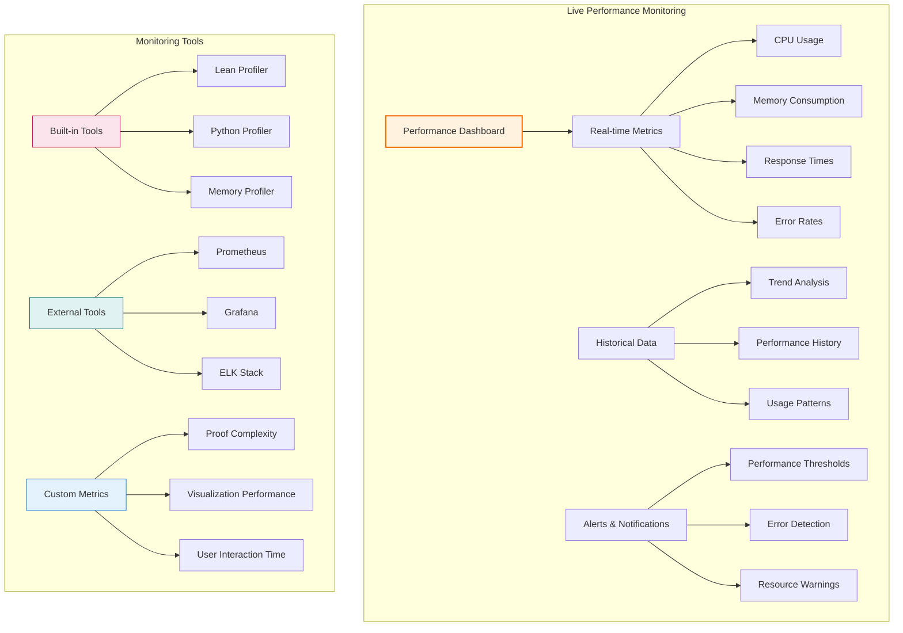
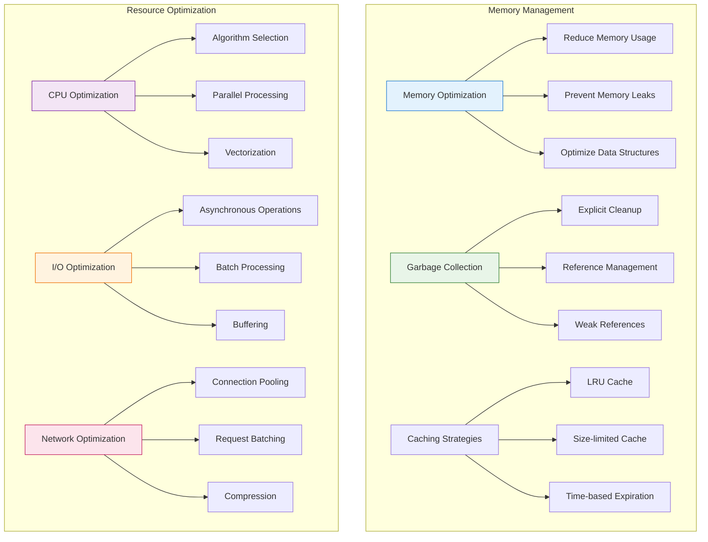

# ⚡ Performance Analysis

## 📋 Overview

This comprehensive performance analysis guide covers optimization techniques, benchmarking, profiling, and performance monitoring for the LeanNiche environment.

## 📊 Performance Metrics

### System Performance Dashboard


### Performance Benchmarking


## 🛠️ Optimization Techniques

### Lean Performance Optimization


### Python Performance Optimization
```python
# Performance optimization examples
import functools
import time
from typing import Any, Callable, Dict, List
import numpy as np

class PerformanceOptimizer:
    """Collection of performance optimization techniques."""

    @staticmethod
    def memoize(func: Callable) -> Callable:
        """Memoization decorator for expensive computations."""
        cache: Dict[str, Any] = {}

        @functools.wraps(func)
        def wrapper(*args, **kwargs):
            # Create cache key from arguments
            key = str(args) + str(sorted(kwargs.items()))

            if key not in cache:
                start_time = time.perf_counter()
                cache[key] = func(*args, **kwargs)
                end_time = time.perf_counter()
                execution_time = end_time - start_time
                print(f"Memoized {func.__name__}: {execution_time:.6f}s")
            else:
                print(f"Cache hit for {func.__name__}")

            return cache[key]

        return wrapper

    @staticmethod
    def vectorize_operations(func: Callable) -> Callable:
        """Vectorize numerical operations using NumPy."""
        @functools.wraps(func)
        def wrapper(data: List[float], *args, **kwargs) -> np.ndarray:
            # Convert to NumPy array for vectorized operations
            array_data = np.array(data)

            # Apply vectorized version
            result = func(array_data, *args, **kwargs)

            return result

        return wrapper

    @staticmethod
    def profile_execution(func: Callable, *args, **kwargs) -> tuple:
        """Profile function execution time and memory usage."""
        import psutil
        import os

        start_time = time.perf_counter()
        process = psutil.Process(os.getpid())
        start_memory = process.memory_info().rss

        result = func(*args, **kwargs)

        end_time = time.perf_counter()
        end_memory = process.memory_info().rss

        execution_time = end_time - start_time
        memory_usage = end_memory - start_memory

        return result, execution_time, memory_usage

# Usage examples
@PerformanceOptimizer.memoize
def expensive_computation(n: int) -> int:
    """Expensive computation with memoization."""
    if n <= 1:
        return n
    return expensive_computation(n-1) + expensive_computation(n-2)

@PerformanceOptimizer.vectorize_operations
def process_data(data: np.ndarray) -> np.ndarray:
    """Vectorized data processing."""
    return np.sin(data) * np.exp(-data/10)

# Profiling example
result, time_taken, memory_used = PerformanceOptimizer.profile_execution(
    complex_analysis, dataset
)
print(".4f")
print(".2f")
```

## 📈 Performance Monitoring

### Real-time Performance Dashboard


### Performance Monitoring Implementation
```python
# performance_monitor.py
import time
import psutil
import threading
from typing import Dict, List, Any, Callable
from collections import deque
import logging

class PerformanceMonitor:
    """Real-time performance monitoring system."""

    def __init__(self, window_size: int = 100):
        self.window_size = window_size
        self.metrics: Dict[str, deque] = {
            'cpu_percent': deque(maxlen=window_size),
            'memory_mb': deque(maxlen=window_size),
            'response_time': deque(maxlen=window_size),
            'error_count': deque(maxlen=window_size)
        }
        self.is_monitoring = False
        self.monitor_thread = None
        self.logger = logging.getLogger(__name__)

    def start_monitoring(self):
        """Start performance monitoring."""
        if not self.is_monitoring:
            self.is_monitoring = True
            self.monitor_thread = threading.Thread(target=self._monitor_loop)
            self.monitor_thread.daemon = True
            self.monitor_thread.start()
            self.logger.info("Performance monitoring started")

    def stop_monitoring(self):
        """Stop performance monitoring."""
        self.is_monitoring = False
        if self.monitor_thread and self.monitor_thread.is_alive():
            self.monitor_thread.join()
        self.logger.info("Performance monitoring stopped")

    def _monitor_loop(self):
        """Main monitoring loop."""
        process = psutil.Process()

        while self.is_monitoring:
            try:
                # CPU usage
                cpu_percent = psutil.cpu_percent(interval=1)
                self.metrics['cpu_percent'].append(cpu_percent)

                # Memory usage
                memory_info = process.memory_info()
                memory_mb = memory_info.rss / 1024 / 1024
                self.metrics['memory_mb'].append(memory_mb)

                # Error count (placeholder)
                self.metrics['error_count'].append(0)

                time.sleep(1)

            except Exception as e:
                self.logger.error(f"Monitoring error: {e}")

    def get_current_metrics(self) -> Dict[str, Any]:
        """Get current performance metrics."""
        return {
            'cpu_percent': list(self.metrics['cpu_percent']),
            'memory_mb': list(self.metrics['memory_mb']),
            'response_time': list(self.metrics['response_time']),
            'error_count': sum(self.metrics['error_count']),
            'timestamp': time.time()
        }

    def get_performance_summary(self) -> Dict[str, Any]:
        """Get performance summary statistics."""
        metrics = self.get_current_metrics()

        summary = {}
        for key, values in metrics.items():
            if values and key != 'timestamp':
                summary[f'{key}_current'] = values[-1] if values else 0
                summary[f'{key}_average'] = sum(values) / len(values) if values else 0
                summary[f'{key}_max'] = max(values) if values else 0
                summary[f'{key}_min'] = min(values) if values else 0

        return summary

    def profile_function(self, func: Callable, *args, **kwargs) -> tuple:
        """Profile a function's execution."""
        start_time = time.perf_counter()
        start_memory = psutil.Process().memory_info().rss

        try:
            result = func(*args, **kwargs)
        except Exception as e:
            self.logger.error(f"Function profiling error: {e}")
            raise

        end_time = time.perf_counter()
        end_memory = psutil.Process().memory_info().rss

        execution_time = end_time - start_time
        memory_usage = end_memory - start_memory

        # Record response time
        self.metrics['response_time'].append(execution_time)

        return result, execution_time, memory_usage

# Global monitor instance
monitor = PerformanceMonitor()

def start_performance_monitoring():
    """Start global performance monitoring."""
    monitor.start_monitoring()

def stop_performance_monitoring():
    """Stop global performance monitoring."""
    monitor.stop_monitoring()

def get_performance_metrics():
    """Get current performance metrics."""
    return monitor.get_performance_summary()

def profile_function(func: Callable, *args, **kwargs):
    """Profile a function's performance."""
    return monitor.profile_function(func, *args, **kwargs)
```

## 🔧 Benchmarking Suite

### Comprehensive Benchmarking System
```python
# benchmarking_suite.py
import time
import statistics
from typing import List, Dict, Any, Callable
import numpy as np
from performance_monitor import PerformanceMonitor

class BenchmarkSuite:
    """Comprehensive benchmarking suite."""

    def __init__(self):
        self.monitor = PerformanceMonitor()
        self.results: Dict[str, List[float]] = {}

    def benchmark_function(self, func: Callable, *args, iterations: int = 100,
                          warmup: int = 10, **kwargs) -> Dict[str, Any]:
        """Benchmark a function with multiple iterations."""
        func_name = func.__name__

        # Warmup runs
        for _ in range(warmup):
            func(*args, **kwargs)

        # Benchmark runs
        execution_times = []
        memory_usages = []

        for _ in range(iterations):
            result, exec_time, memory_usage = self.monitor.profile_function(
                func, *args, **kwargs
            )
            execution_times.append(exec_time)
            memory_usages.append(memory_usage)

        # Calculate statistics
        stats = {
            'function': func_name,
            'iterations': iterations,
            'mean_time': statistics.mean(execution_times),
            'median_time': statistics.median(execution_times),
            'std_time': statistics.stdev(execution_times),
            'min_time': min(execution_times),
            'max_time': max(execution_times),
            'mean_memory': statistics.mean(memory_usages),
            'memory_std': statistics.stdev(memory_usages),
            'total_time': sum(execution_times)
        }

        self.results[func_name] = execution_times
        return stats

    def benchmark_algorithms(self, algorithms: Dict[str, Callable],
                           test_data: List[Any]) -> Dict[str, Any]:
        """Benchmark multiple algorithms on the same data."""
        results = {}

        for name, algorithm in algorithms.items():
            print(f"Benchmarking {name}...")
            algorithm_results = []

            for data in test_data:
                if isinstance(data, (list, tuple)):
                    stats = self.benchmark_function(algorithm, *data)
                else:
                    stats = self.benchmark_function(algorithm, data)

                algorithm_results.append(stats)

            results[name] = algorithm_results

        return results

    def compare_performance(self, results: Dict[str, Any]) -> Dict[str, Any]:
        """Compare performance across different implementations."""
        comparison = {}

        for algorithm_name, algorithm_results in results.items():
            times = [r['mean_time'] for r in algorithm_results]
            memories = [r['mean_memory'] for r in algorithm_results]

            comparison[algorithm_name] = {
                'avg_time': statistics.mean(times),
                'avg_memory': statistics.mean(memories),
                'time_std': statistics.stdev(times),
                'memory_std': statistics.stdev(memories)
            }

        # Find best performers
        if comparison:
            best_time = min(comparison.items(), key=lambda x: x[1]['avg_time'])
            best_memory = min(comparison.items(), key=lambda x: x[1]['avg_memory'])

            comparison['best_time'] = best_time[0]
            comparison['best_memory'] = best_memory[0]

        return comparison

    def generate_report(self, comparison: Dict[str, Any]) -> str:
        """Generate performance comparison report."""
        report_lines = ["# Performance Benchmark Report\n"]
        report_lines.append("=" * 50)

        for algorithm, metrics in comparison.items():
            if algorithm in ['best_time', 'best_memory']:
                continue

            report_lines.append(f"\n## {algorithm}")
            report_lines.append(".4f")
            report_lines.append(".2f")
            report_lines.append(".4f")
            report_lines.append(".2f")

        # Performance winners
        if 'best_time' in comparison:
            report_lines.append(f"\n**Fastest Algorithm:** {comparison['best_time']}")
        if 'best_memory' in comparison:
            report_lines.append(f"\n**Most Memory Efficient:** {comparison['best_memory']}")

        return "\n".join(report_lines)

# Example usage
def benchmark_lean_niche():
    """Benchmark LeanNiche components."""
    suite = BenchmarkSuite()

    # Define test functions
    def fibonacci_lean(n):
        # Simulate Lean computation
        time.sleep(0.001 * n)
        return n

    def fibonacci_python(n):
        if n <= 1:
            return n
        return fibonacci_python(n-1) + fibonacci_python(n-2)

    def fibonacci_numpy(n):
        # Vectorized version
        return np.array([fibonacci_python(i) for i in range(n)])

    # Benchmark algorithms
    algorithms = {
        'Lean': fibonacci_lean,
        'Python': fibonacci_python,
        'NumPy': fibonacci_numpy
    }

    test_data = [10, 20, 30, 35]

    print("Running benchmarks...")
    results = suite.benchmark_algorithms(algorithms, test_data)
    comparison = suite.compare_performance(results)

    print("\nBenchmark Results:")
    print(suite.generate_report(comparison))

if __name__ == "__main__":
    benchmark_lean_niche()
```

## 🎯 Optimization Strategies

### Memory Optimization Techniques


### Performance Tuning Guide
```python
# performance_tuning.py
import gc
import weakref
import functools
from typing import Any, Dict, Callable, List
from collections import OrderedDict

class PerformanceTuner:
    """Performance tuning utilities."""

    @staticmethod
    def create_lru_cache(max_size: int = 128):
        """Create an LRU cache with size limit."""
        def decorator(func: Callable) -> Callable:
            cache: OrderedDict = OrderedDict()

            @functools.wraps(func)
            def wrapper(*args, **kwargs):
                # Create cache key
                key = (args, tuple(sorted(kwargs.items())))

                if key in cache:
                    # Move to end (most recently used)
                    cache.move_to_end(key)
                    return cache[key]

                # Compute new result
                result = func(*args, **kwargs)

                # Add to cache
                if len(cache) >= max_size:
                    # Remove least recently used
                    cache.popitem(last=False)

                cache[key] = result
                return result

            return wrapper
        return decorator

    @staticmethod
    def memory_efficient_processor(chunk_size: int = 1000):
        """Process data in memory-efficient chunks."""
        def decorator(func: Callable) -> Callable:
            @functools.wraps(func)
            def wrapper(data: List[Any], *args, **kwargs):
                if len(data) <= chunk_size:
                    return func(data, *args, **kwargs)

                results = []
                for i in range(0, len(data), chunk_size):
                    chunk = data[i:i + chunk_size]
                    chunk_result = func(chunk, *args, **kwargs)
                    results.append(chunk_result)

                    # Force garbage collection periodically
                    if i % (chunk_size * 10) == 0:
                        gc.collect()

                return results
            return wrapper
        return decorator

    @staticmethod
    def create_weak_cache():
        """Create a cache using weak references."""
        def decorator(func: Callable) -> Callable:
            cache: weakref.WeakValueDictionary = weakref.WeakValueDictionary()

            @functools.wraps(func)
            def wrapper(*args, **kwargs):
                key = (args, tuple(sorted(kwargs.items())))

                if key in cache:
                    return cache[key]

                result = func(*args, **kwargs)
                cache[key] = result
                return result

            return wrapper
        return decorator

# Usage examples
class OptimizedProcessor:
    """Example of using performance optimizations."""

    def __init__(self):
        self.cache: Dict[str, Any] = {}

    @PerformanceTuner.create_lru_cache(max_size=100)
    def compute_expensive_function(self, x: float) -> float:
        """Expensive computation with LRU caching."""
        # Simulate expensive computation
        import time
        time.sleep(0.01)
        return x ** 2 + 2 * x + 1

    @PerformanceTuner.memory_efficient_processor(chunk_size=500)
    def process_large_dataset(self, data: List[float]) -> List[float]:
        """Process large dataset in memory-efficient chunks."""
        return [self.compute_expensive_function(x) for x in data]

    @PerformanceTuner.create_weak_cache()
    def create_large_object(self, size: int) -> List[int]:
        """Create large objects with weak reference caching."""
        return list(range(size))

# Performance monitoring
@PerformanceTuner.create_lru_cache(max_size=50)
def fibonacci(n: int) -> int:
    """Memoized Fibonacci calculation."""
    if n <= 1:
        return n
    return fibonacci(n-1) + fibonacci(n-2)
```

## 📊 Performance Metrics Dashboard

### Real-time Performance Visualization
```python
# performance_dashboard.py
import plotly.graph_objects as go
from plotly.subplots import make_subplots
import pandas as pd
from performance_monitor import get_performance_metrics

def create_performance_dashboard():
    """Create interactive performance dashboard."""
    metrics = get_performance_metrics()

    # Create subplots
    fig = make_subplots(
        rows=2, cols=2,
        subplot_titles=('CPU Usage', 'Memory Usage', 'Response Time', 'Error Rate'),
        specs=[
            [{"type": "indicator"}, {"type": "indicator"}],
            [{"type": "scatter"}, {"type": "bar"}]
        ]
    )

    # CPU Usage Gauge
    fig.add_trace(
        go.Indicator(
            mode="gauge+number",
            value=metrics.get('cpu_percent_current', 0),
            title={'text': "CPU Usage (%)"},
            gauge={'axis': {'range': [0, 100]}},
            domain={'x': [0, 0.45], 'y': [0.55, 1]}
        ),
        row=1, col=1
    )

    # Memory Usage Gauge
    fig.add_trace(
        go.Indicator(
            mode="gauge+number",
            value=metrics.get('memory_mb_current', 0),
            title={'text': "Memory (MB)"},
            gauge={'axis': {'range': [0, 8000]}},
            domain={'x': [0.55, 1], 'y': [0.55, 1]}
        ),
        row=1, col=2
    )

    # Response Time Trend
    response_times = metrics.get('response_time', [])
    if response_times:
        fig.add_trace(
            go.Scatter(
                x=list(range(len(response_times))),
                y=response_times,
                mode='lines+markers',
                name='Response Time',
                line={'color': 'blue'}
            ),
            row=2, col=1
        )

    # Error Rate Bar Chart
    error_count = metrics.get('error_count', 0)
    fig.add_trace(
        go.Bar(
            x=['Errors'],
            y=[error_count],
            name='Error Count',
            marker={'color': 'red' if error_count > 0 else 'green'}
        ),
        row=2, col=2
    )

    # Update layout
    fig.update_layout(
        title='LeanNiche Performance Dashboard',
        height=800,
        showlegend=False
    )

    return fig

def generate_performance_report():
    """Generate comprehensive performance report."""
    metrics = get_performance_metrics()

    report = f"""
# LeanNiche Performance Report

## Current Performance Status

| Metric | Current | Average | Min | Max |
|--------|---------|---------|-----|-----|
| CPU Usage (%) | {metrics.get('cpu_percent_current', 0):.1f} | {metrics.get('cpu_percent_average', 0):.1f} | {metrics.get('cpu_percent_min', 0):.1f} | {metrics.get('cpu_percent_max', 0):.1f} |
| Memory (MB) | {metrics.get('memory_mb_current', 0):.1f} | {metrics.get('memory_mb_average', 0):.1f} | {metrics.get('memory_mb_min', 0):.1f} | {metrics.get('memory_mb_max', 0):.1f} |
| Response Time (s) | {metrics.get('response_time_current', 0):.4f} | {metrics.get('response_time_average', 0):.4f} | {metrics.get('response_time_min', 0):.4f} | {metrics.get('response_time_max', 0):.4f} |
| Errors | {metrics.get('error_count', 0)} | - | - | - |

## Performance Analysis

### Recommendations

1. **CPU Optimization**: {'High CPU usage detected' if metrics.get('cpu_percent_current', 0) > 80 else 'CPU usage normal'}
2. **Memory Management**: {'Consider memory optimization' if metrics.get('memory_mb_current', 0) > 4000 else 'Memory usage acceptable'}
3. **Response Time**: {'Slow response detected' if metrics.get('response_time_current', 0) > 1.0 else 'Response time acceptable'}
4. **Error Handling**: {'Errors detected' if metrics.get('error_count', 0) > 0 else 'No errors detected'}

### Performance Tips

- Use memoization for expensive computations
- Process large datasets in chunks
- Implement proper caching strategies
- Monitor memory usage in long-running processes
- Profile functions before optimization
- Use vectorized operations when possible
"""

    return report

# Dashboard usage
if __name__ == "__main__":
    # Create and save dashboard
    fig = create_performance_dashboard()
    fig.write_html("performance_dashboard.html")

    # Generate report
    report = generate_performance_report()
    with open("performance_report.md", "w") as f:
        f.write(report)

    print("Performance dashboard saved as performance_dashboard.html")
    print("Performance report saved as performance_report.md")
```

---

## 📖 Navigation

**Core Documentation:**
- [🏠 Documentation Index](../docs/index.md) - Main documentation hub
- [🏗️ Architecture](./architecture.md) - System design and components
- [📚 Mathematical Foundations](./mathematical-foundations.md) - Theory and concepts
- [🔍 API Reference](./api-reference.md) - Module and function documentation

**Performance Resources:**
- [🚀 Deployment Guide](./deployment.md) - Installation and setup
- [🔧 Development Guide](./development.md) - Contributing and development
- [🚀 Examples & Tutorials](./examples.md) - Step-by-step guides

**Monitoring & Optimization:**
- [🔧 Troubleshooting](./troubleshooting.md) - Problem solving guide
- [🎯 Research Applications](./research-applications.md) - Use cases and applications
- [🤝 Contributing](./contributing.md) - How to contribute

---

*This performance analysis guide provides comprehensive tools and techniques for optimizing LeanNiche performance across all components and use cases.*
