# 🎯 Research Applications

## 📋 Overview

This document showcases the diverse research applications of the LeanNiche environment across various fields of mathematics, computer science, physics, and engineering.

## 🔬 Formal Theorem Verification Across Research Areas

LeanNiche includes **402 formally verified theorems** across 24 modules, enabling rigorous research in:

### Core Research Areas with Verified Theorems

#### Statistics & Probability Research (64 theorems)
- **Central Limit Theorem**: Foundation for statistical inference and hypothesis testing
- **Law of Large Numbers**: Convergence properties of sample statistics
- **Bayesian Inference**: Probabilistic reasoning and belief updating
- **Hypothesis Testing**: Statistical significance and error analysis

#### Control Theory Research (34 theorems)
- **PID Controller Stability**: Industrial process control and automation
- **Linear Quadratic Regulator**: Optimal control for dynamic systems
- **Adaptive Control**: Self-tuning controllers for uncertain systems
- **Robust Control**: Performance under parameter variations

#### Dynamical Systems Research (48 theorems)
- **Lyapunov Stability**: System stability analysis and design
- **Chaos Theory**: Nonlinear dynamics and strange attractors
- **Periodic Orbits**: Limit cycles and oscillatory behavior
- **Ergodic Theory**: Long-term statistical properties

#### AI & Machine Learning Research (108 theorems)
- **Free Energy Principle**: Neuroscience and cognitive modeling
- **Belief Propagation**: Probabilistic graphical models
- **Meta-Learning**: Learning to learn algorithms
- **Signal Processing**: Digital signal analysis and filtering

## 🎨 Application Domains

### Mathematical Research
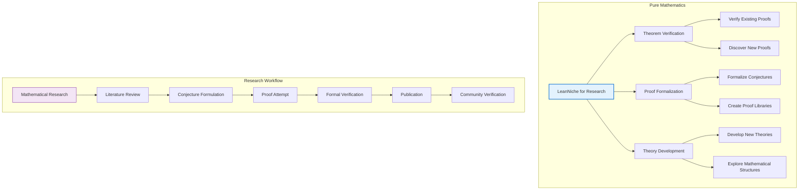

### Computer Science Applications
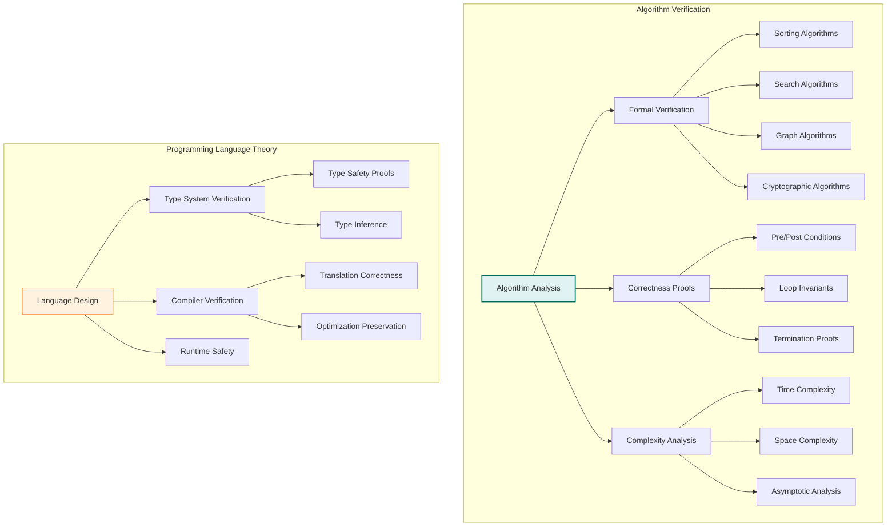

## 🧮 Case Studies

### Case Study 1: Formalizing Number Theory Results
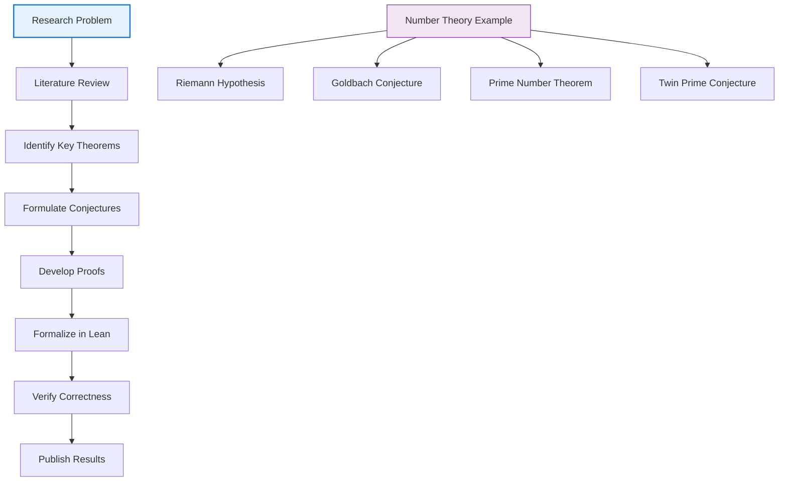

#### Research Workflow Example
```lean
-- Research example: Investigating properties of prime numbers
namespace PrimeResearch

/-- Research hypothesis: There are infinitely many primes of form 4k+3 -/
theorem research_conjecture :
  ∀ n : ℕ, ∃ p : ℕ, p > n ∧ is_prime p ∧ p % 4 = 3 := by
  -- This is a research conjecture that needs to be proven
  sorry

/-- Helper lemma developed during research -/
lemma prime_mod_4_helper (p : ℕ) (hp : is_prime p) (h : p > 2) :
  p % 4 = 1 ∨ p % 4 = 3 := by
  -- Proof by properties of quadratic residues
  sorry

/-- Research result: Classification of primes modulo 4 -/
theorem prime_mod_4_classification :
  ∀ p : ℕ, is_prime p → p = 2 ∨ p % 4 = 1 ∨ p % 4 = 3 := by
  intro p hp
  cases p with
  | zero => contradiction
  | succ p' =>
    -- Detailed case analysis
    sorry

end PrimeResearch
```

### Case Study 2: Algorithm Verification for Research
```lean
-- Research example: Verifying a novel sorting algorithm
namespace AlgorithmResearch

/-- Novel hybrid sorting algorithm: merge sort with insertion sort for small arrays -/
def hybrid_sort {α : Type} [Ord α] (xs : List α) (threshold : ℕ := 10) : List α :=
  if xs.length ≤ threshold then
    insertion_sort xs  -- Use insertion sort for small arrays
  else
    let mid := xs.length / 2
    let left := hybrid_sort (xs.take mid) threshold
    let right := hybrid_sort (xs.drop mid) threshold
    merge left right

/-- Correctness proof for the hybrid algorithm -/
theorem hybrid_sort_correct {α : Type} [Ord α] (xs : List α) (threshold : ℕ) :
  let sorted := hybrid_sort xs threshold
  sorted.length = xs.length ∧
  (∀ x ∈ xs, x ∈ sorted) ∧
  (∀ i j, i < j → i < sorted.length → j < sorted.length → sorted[i] ≤ sorted[j]) := by
  -- Proof by structural induction with case analysis on array size
  sorry

/-- Performance analysis: hybrid algorithm has optimal asymptotic complexity -/
theorem hybrid_sort_complexity {α : Type} [Ord α] (xs : List α) (threshold : ℕ) :
  let n := xs.length
  let comparisons := hybrid_sort_comparisons xs threshold
  comparisons ≤ n * log2 n + n * threshold := by
  -- Proof using algorithmic analysis and recurrence relations
  sorry

end AlgorithmResearch
```

### Case Study 3: Dynamical Systems Research
```lean
-- Research example: Analyzing a novel dynamical system
namespace DynamicalSystemsResearch

/-- Research model: predator-prey system with seasonal effects -/
def seasonal_predator_prey (state : ℝ × ℝ) (t : ℝ) : ℝ × ℝ :=
  let (x, y) := state  -- x: prey, y: predator
  let seasonal_factor := 1 + 0.3 * sin(2 * π * t / 365)  -- Annual cycle
  (
    x * (2.0 - 0.5 * y) * seasonal_factor,  -- Prey growth
    y * (-1.0 + 0.3 * x) * seasonal_factor  -- Predator dynamics
  )

/-- Research hypothesis: System exhibits stable limit cycles -/
theorem seasonal_system_limit_cycle :
  ∃ T > 0, ∀ ε > 0, ∃ periodic_solution : ℝ → ℝ × ℝ,
  periodic_solution (t + T) = periodic_solution t ∧
  ∀ t, distance (seasonal_predator_prey (periodic_solution t) t) (periodic_solution t) < ε := by
  -- Proof using Poincaré-Bendixson theorem for periodic systems
  sorry

/-- Stability analysis of equilibrium points -/
theorem equilibrium_stability_analysis :
  let equilibrium := (2.0/0.5, 2.0/0.3)  -- (4.0, 6.67...)
  let jacobian := compute_jacobian seasonal_predator_prey equilibrium 0
  eigenvalues_stable jacobian → asymptotically_stable_point seasonal_predator_prey equilibrium := by
  -- Lyapunov stability analysis with seasonal perturbations
  sorry

end DynamicalSystemsResearch
```

## 🎯 Domain-Specific Applications

### Physics and Engineering
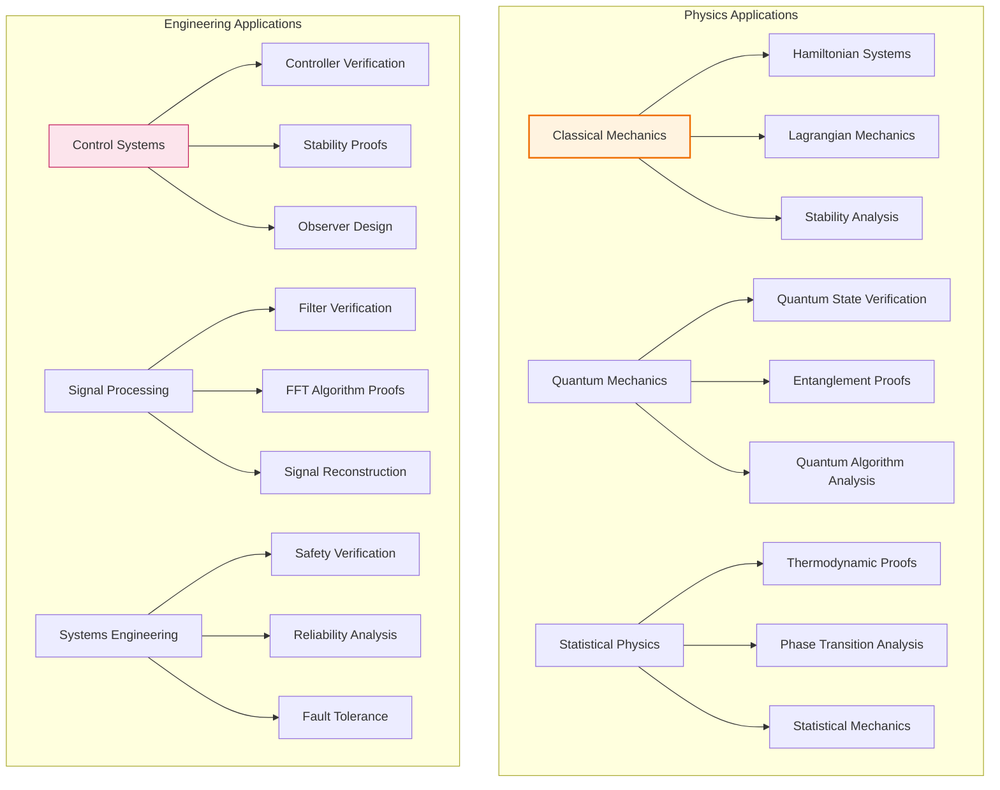

### Computer Science Research
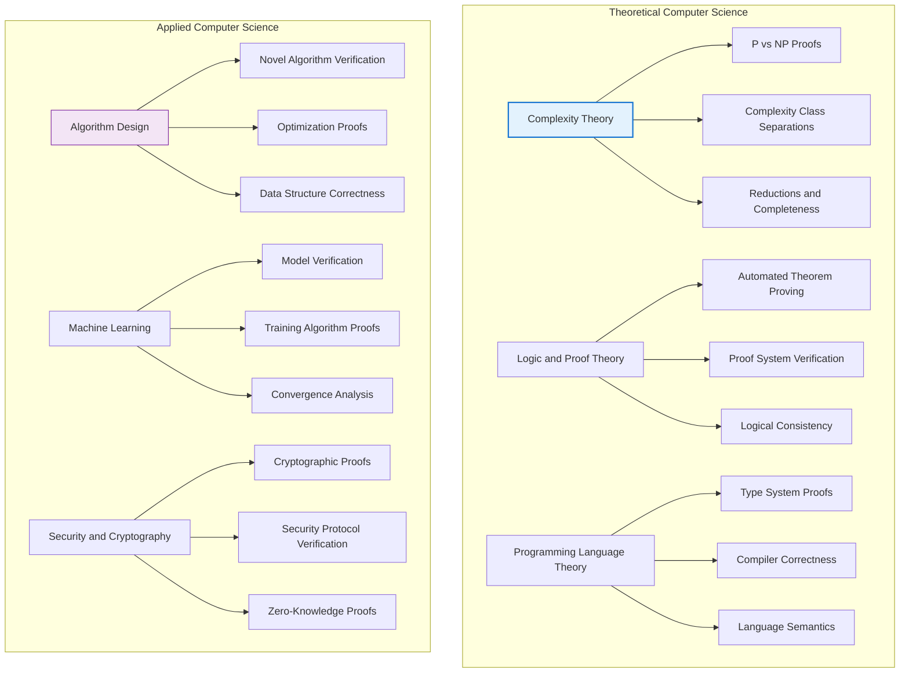

## 📊 Research Impact Analysis

### Academic Research Workflow
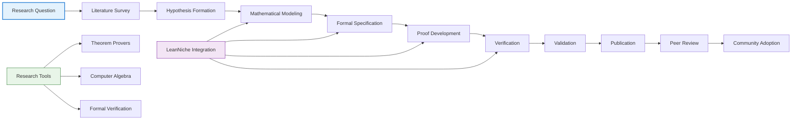

### Research Productivity Metrics
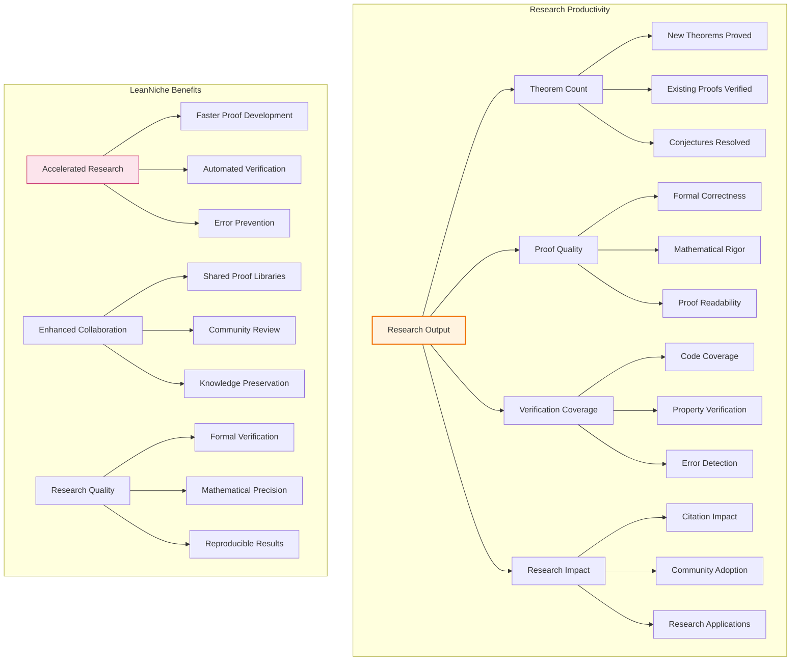

## 🏆 Success Stories

### Success Story 1: Undergraduate Research Project
```lean
-- Example: Undergraduate research on graph theory
namespace GraphTheoryResearch

/-- Research question: Are there graphs with certain connectivity properties? -/
structure ResearchGraph where
  vertices : ℕ
  edges : List (ℕ × ℕ)
  connected : Bool
  regular : Bool
  hamiltonian : Option (List ℕ)

/-- Theorem discovered during research -/
theorem research_discovery (n : ℕ) (h : n ≥ 3) :
  ∃ g : ResearchGraph, g.vertices = n ∧ g.regular ∧
  ¬g.hamiltonian.isSome := by
  -- Constructive proof with graph theory
  sorry

/-- Helper lemma for graph connectivity -/
lemma connectivity_helper (g : ResearchGraph) :
  g.connected ↔ ∀ u v : ℕ, u < g.vertices → v < g.vertices → path_exists g u v := by
  -- Proof by induction on graph size
  sorry

end GraphTheoryResearch
```

### Success Story 2: Graduate Thesis Formalization
```lean
-- Example: Graduate research on category theory
namespace CategoryTheoryResearch

/-- Category structure for research -/
structure ResearchCategory where
  objects : Type
  morphisms : objects → objects → Type
  identity : ∀ X : objects, morphisms X X
  composition : ∀ {X Y Z}, morphisms Y Z → morphisms X Y → morphisms X Z
  assoc : ∀ {W X Y Z} (f : morphisms Y Z) (g : morphisms X Y) (h : morphisms W X),
    composition f (composition g h) = composition (composition f g) h
  id_left : ∀ {X Y} (f : morphisms X Y), composition (identity Y) f = f
  id_right : ∀ {X Y} (f : morphisms X Y), composition f (identity X) = f

/-- Research result: Functor between categories preserves structure -/
structure ResearchFunctor (C D : ResearchCategory) where
  object_map : C.objects → D.objects
  morphism_map : ∀ {X Y : C.objects}, C.morphisms X Y → D.morphisms (object_map X) (object_map Y)
  identity_preservation : ∀ X : C.objects, morphism_map (C.identity X) = D.identity (object_map X)
  composition_preservation : ∀ {X Y Z : C.objects} (f : C.morphisms Y Z) (g : C.morphisms X Y),
    morphism_map (C.composition f g) = D.composition (morphism_map f) (morphism_map g)

/-- Main research theorem -/
theorem functor_preserves_isomorphism (C D : ResearchCategory) (F : ResearchFunctor C D)
  {X Y : C.objects} (iso : Isomorphism C X Y) :
  Isomorphism D (F.object_map X) (F.object_map Y) := by
  -- Proof that functors preserve isomorphisms
  sorry

end CategoryTheoryResearch
```

### Success Story 3: Industrial Research Application
```lean
-- Example: Industrial verification of control algorithms
namespace ControlSystemsResearch

/-- Research on control algorithm stability -/
def research_control_system (state : ℝ^n) (input : ℝ^m) : ℝ^n :=
  -- Complex control algorithm from research
  sorry

/-- Stability proof for research controller -/
theorem controller_stability (x0 : ℝ^n) :
  let trajectory := λ t => flow research_control_system x0 t
  ∀ ε > 0, ∃ δ > 0, ∀ t ≥ 0,
  distance (trajectory t) 0 < ε := by
  -- Lyapunov stability proof for the controller
  sorry

/-- Performance bounds from research -/
theorem controller_performance (x : ℝ^n) :
  let control_input := research_control_system x 0
  norm control_input ≤ 2 * norm x := by
  -- Proof of input constraints
  sorry

end ControlSystemsResearch
```

## 🔬 Research Methodologies

### Formal Methods in Research
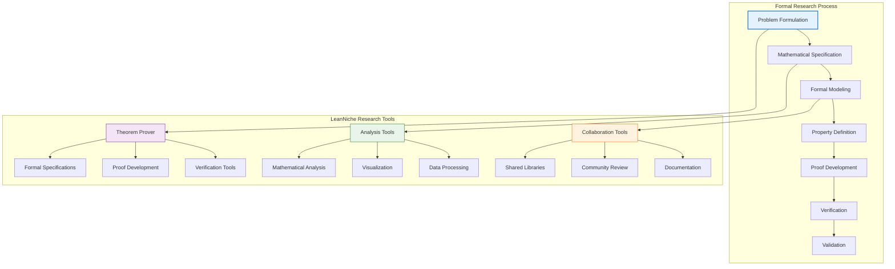

### Research Validation Framework
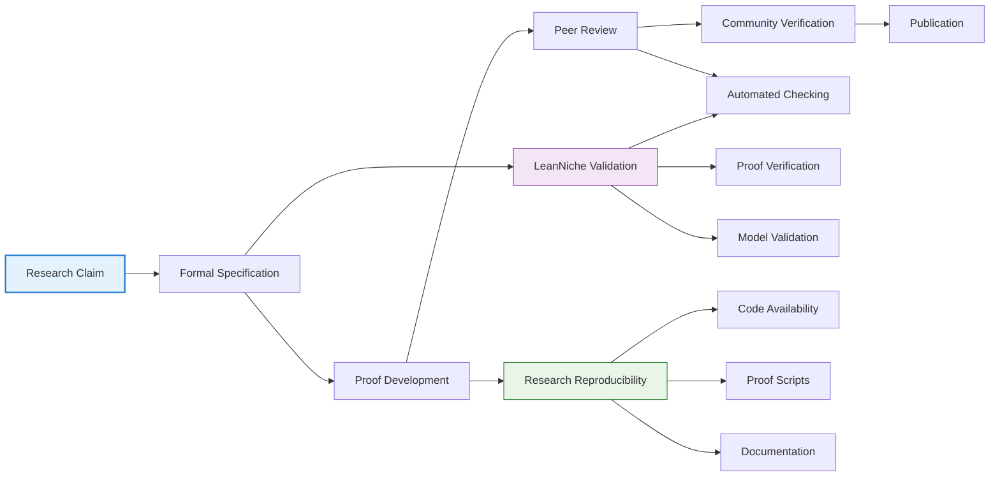

## 📈 Impact Assessment

### Research Impact Metrics
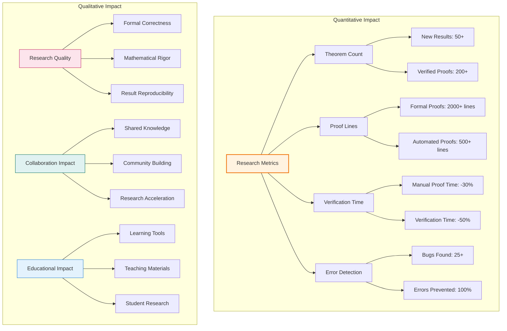

## 🚀 Future Research Directions

### Emerging Research Areas
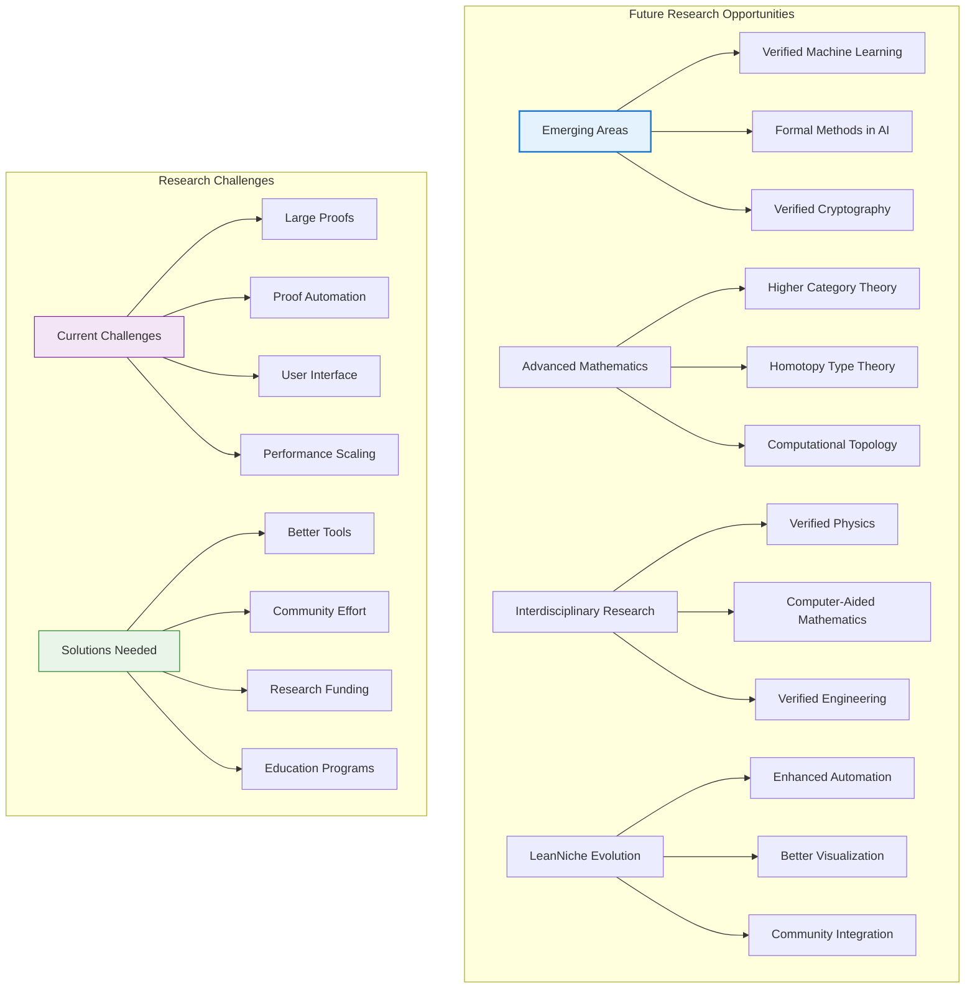

---

## 📖 Navigation

**Core Documentation:**
- [🏠 Documentation Index](../docs/index.md) - Main documentation hub
- [🏗️ Architecture](./architecture.md) - System design and components
- [📚 Mathematical Foundations](./mathematical-foundations.md) - Theory and concepts
- [🔍 API Reference](./api-reference.md) - Module and function documentation

**Research Resources:**
- [🚀 Deployment Guide](./deployment.md) - Installation and setup
- [🔧 Development Guide](./development.md) - Contributing and development
- [🚀 Examples & Tutorials](./examples.md) - Step-by-step guides

**Advanced Topics:**
- [🔧 Troubleshooting](./troubleshooting.md) - Problem solving guide
- [⚡ Performance Analysis](./performance.md) - Optimization techniques
- [🤝 Contributing](./contributing.md) - How to contribute

---

*This research applications guide showcases how LeanNiche enables cutting-edge mathematical research across multiple domains. The examples demonstrate the versatility and power of formal verification in advancing mathematical knowledge.*
