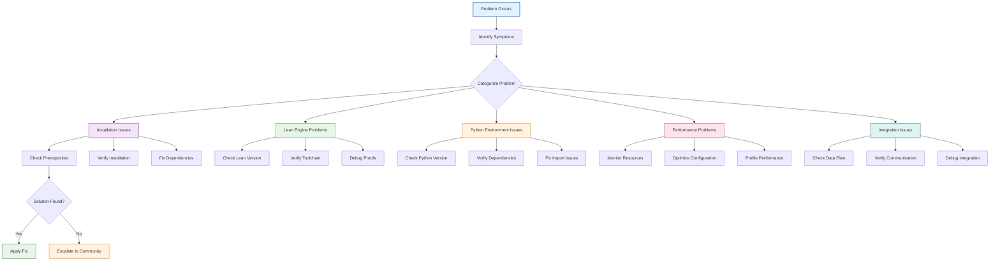
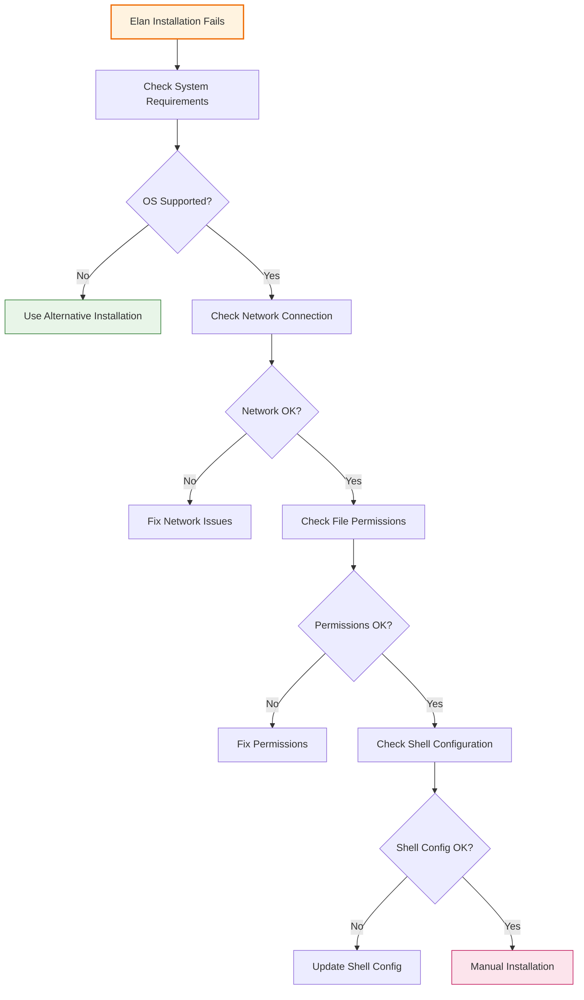
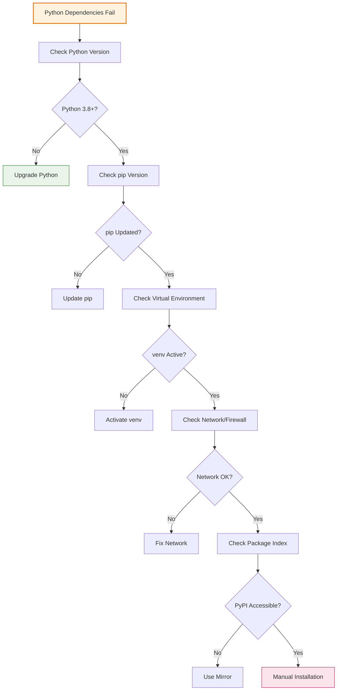
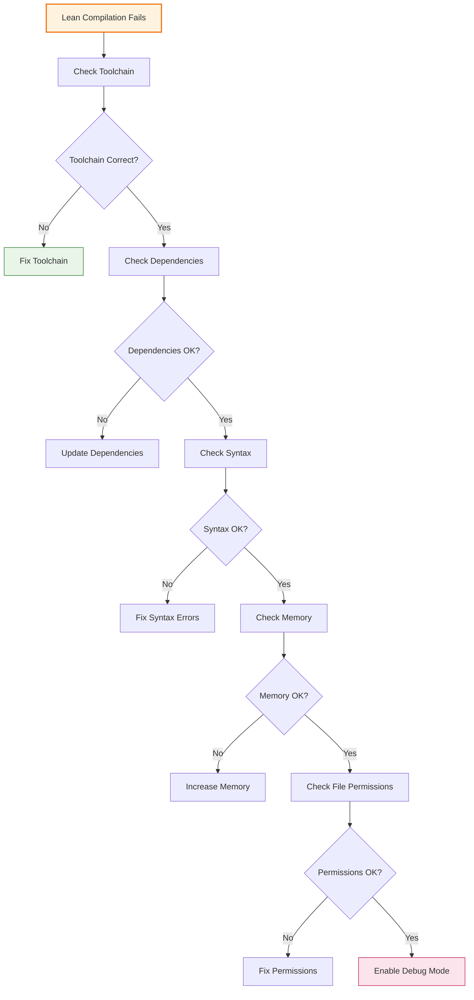
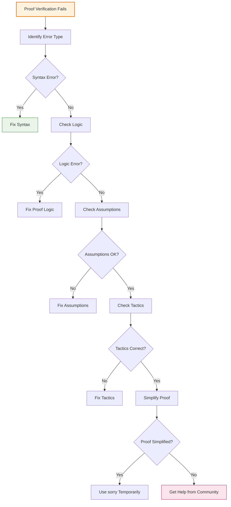
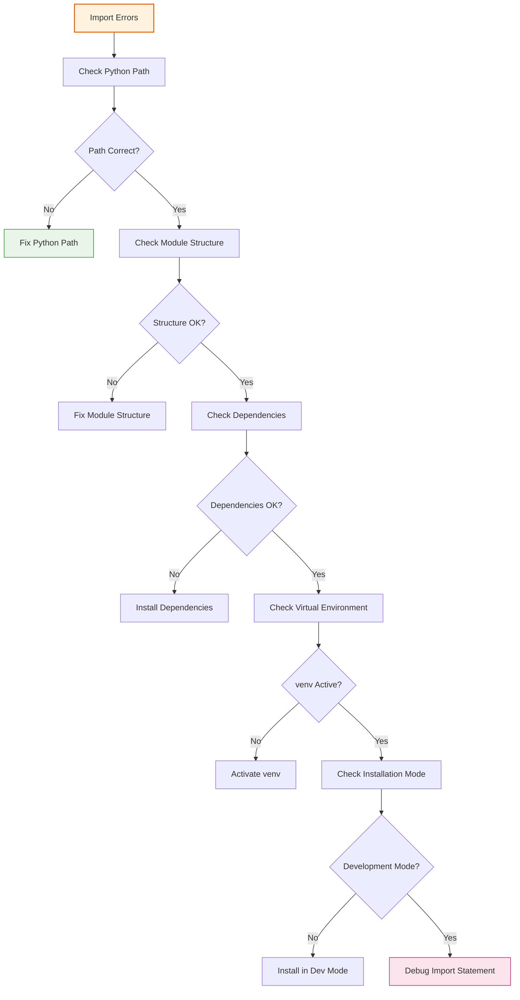
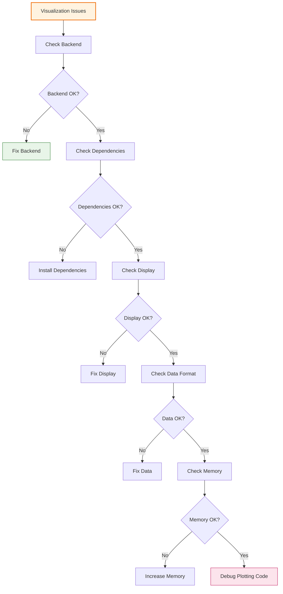
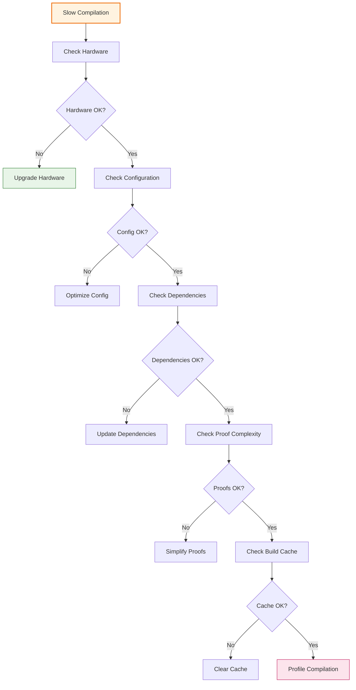
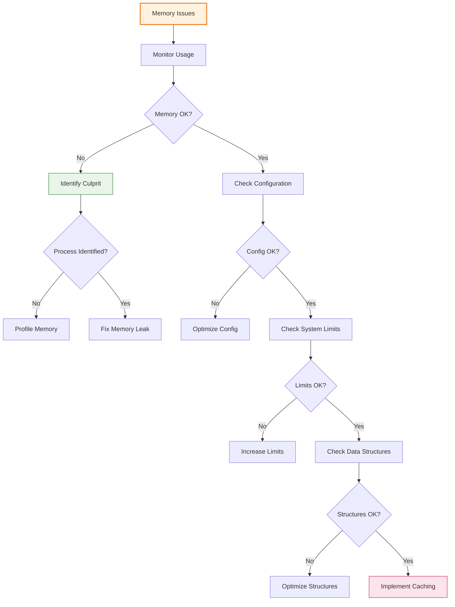
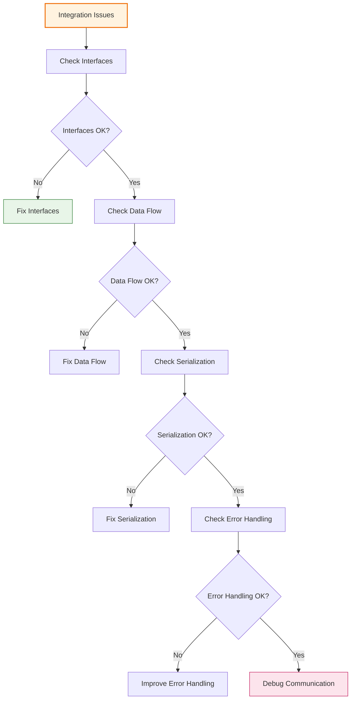

# 🔧 Troubleshooting Guide

## 📋 Overview

This comprehensive troubleshooting guide provides solutions to common issues encountered when using the LeanNiche environment. Each problem includes diagnostic steps, solutions, and prevention tips.

## 🔍 Problem Diagnosis Framework

### Systematic Troubleshooting Process


### Quick Diagnostic Commands
```bash
# System information
echo "=== System Information ==="
uname -a
echo "Memory: $(free -h | grep '^Mem:' | awk '{print $3 "/" $2}')"
echo "Disk: $(df -h . | tail -1 | awk '{print $3 "/" $2}')"
echo "CPU: $(nproc) cores"

# Lean diagnostics
echo "=== Lean Diagnostics ==="
elan --version
lean --version
lake --version
echo "Lean path: $(which lean)"
echo "Lake path: $(which lake)"

# Python diagnostics
echo "=== Python Diagnostics ==="
python3 --version
which python3
which pip
echo "Virtual environment: $VIRTUAL_ENV"

# Project diagnostics
echo "=== Project Diagnostics ==="
ls -la lakefile.toml pyproject.toml lean-toolchain
ls -la src/lean/Main.lean
ls -la src/python/cli.py
```

## 🚫 Common Installation Issues

### Problem 1: Elan Installation Fails


#### Symptoms
- `elan: command not found`
- Installation script exits with error
- Permission denied errors during installation

#### Solutions
```bash
# Solution 1: Manual installation
curl -L https://github.com/leanprover/elan/releases/latest/download/elan-x86_64-unknown-linux-gnu.tar.gz -o elan.tar.gz
tar -xzf elan.tar.gz
sudo mv elan /usr/local/bin/
source $HOME/.elan/env

# Solution 2: Fix permissions
sudo chown -R $USER:$USER $HOME/.elan
chmod +x $HOME/.elan/bin/*

# Solution 3: Update PATH
echo 'export PATH=$HOME/.elan/bin:$PATH' >> ~/.bashrc
source ~/.bashrc

# Solution 4: Clean reinstall
rm -rf $HOME/.elan
curl https://raw.githubusercontent.com/leanprover/elan/master/elan-init.sh -sSf | sh -s -- -y --no-modify-path
```

#### Prevention
```bash
# Add to ~/.bashrc or ~/.zshrc
export PATH=$HOME/.elan/bin:$PATH
source $HOME/.elan/env

# Verify installation
elan --version
lean --version
```

### Problem 2: Python Dependencies Fail to Install


#### Symptoms
- `ModuleNotFoundError` for installed packages
- Installation hangs or fails with network errors
- Import errors after successful installation

#### Solutions
```bash
# Solution 1: Update pip and setuptools
pip install --upgrade pip setuptools wheel

# Solution 2: Install in correct environment
source venv/bin/activate  # Activate virtual environment
pip install -e .  # Install in development mode

# Solution 3: Install specific packages
pip install matplotlib numpy scipy pandas seaborn plotly

# Solution 4: Use requirements file
pip install -r requirements.txt

# Solution 5: Fix import path issues
export PYTHONPATH=$PYTHONPATH:src/python
python -c "from python.cli import cli; print('Import successful')"

# Solution 6: Reinstall problematic packages
pip uninstall package_name
pip install --no-cache-dir package_name
```

#### Prevention
```bash
# Create requirements.txt
pip freeze > requirements.txt

# Use virtual environment consistently
source venv/bin/activate

# Check imports regularly
python -c "import sys; print('Python path:', sys.path)"
```

## 🔬 Lean Engine Issues

### Problem 3: Lean Compilation Fails


#### Symptoms
- `error: failed to build` messages
- Memory allocation errors
- Permission denied errors
- Toolchain mismatch errors

#### Solutions
```bash
# Solution 1: Check and fix toolchain
elan show
cat lean-toolchain
elan toolchain install leanprover/lean4:v4.22.0
elan default leanprover/lean4:v4.22.0

# Solution 2: Update dependencies
lake update
lake clean
lake build

# Solution 3: Increase memory limit
export LEAN_EXTRA_OPTIONS="-Dmemory=8192"
lake build

# Solution 4: Check syntax errors
lean --check src/lean/Main.lean

# Solution 5: Fix import issues
# Check that all imported files exist
find src/lean -name "*.lean" | head -10

# Solution 6: Rebuild from scratch
rm -rf .lake build
lake update
lake build
```

#### Prevention
```bash
# Add to .env
LEAN_EXTRA_OPTIONS=-Dmemory=8192
LEAN_PATH=$HOME/.elan/bin

# Monitor compilation
lake build --verbose

# Regular cleanup
lake clean  # Remove build artifacts
```

### Problem 4: Proof Verification Fails


#### Symptoms
- `tactic failed` errors
- Type mismatch errors
- `sorry` placeholders remaining
- Infinite loops in proofs

#### Solutions
```lean
-- Solution 1: Use sorry for incomplete proofs during development
theorem incomplete_proof (n : ℕ) : n + 0 = n := by
  sorry  -- Temporary placeholder

-- Solution 2: Check types explicitly
def add_zero (n : ℕ) : ℕ := n + 0

# Check with #check
#check add_zero
#check λ n : ℕ => n + 0 = n

-- Solution 3: Use intermediate lemmas
lemma add_zero_eq (n : ℕ) : n + 0 = n := by
  induction n with
  | zero => rfl
  | succ n' ih => rw [Nat.succ_add, ih]

theorem main_theorem (n : ℕ) : n + 0 = n := by
  exact add_zero_eq n

-- Solution 4: Debug with #eval
def test_function (n : ℕ) : ℕ := n + 0
#eval test_function 5  -- Should return 5

-- Solution 5: Use different tactics
example (a b : ℕ) : a + b = b + a := by
  -- Try different approaches
  rw [Nat.add_comm]  -- Direct rewrite
  -- or
  induction a with  -- Induction
  | zero => simp
  | succ a' ih => rw [Nat.succ_add, ih, ← Nat.add_succ]

-- Solution 6: Use automation
example (a b c : ℕ) : a + (b + c) = (a + b) + c := by
  linarith  -- Automatic linear arithmetic
  -- or
  ring      -- Automatic ring operations
```

#### Prevention
```lean
-- Use comprehensive testing
def test_proofs : IO Unit := do
  -- Test all theorems with concrete examples
  IO.println "Testing add_zero_eq..."
  let result1 := add_zero_eq 5
  assert_eq result1 rfl

  IO.println "Testing main_theorem..."
  let result2 := main_theorem 10
  assert_eq result2 rfl

  IO.println "✅ All proof tests passed"
```

## 🐍 Python Environment Issues

### Problem 5: Import Errors


#### Symptoms
- `ModuleNotFoundError`
- `ImportError`
- `AttributeError` for missing functions

#### Solutions
```bash
# Solution 1: Fix Python path
export PYTHONPATH=$PYTHONPATH:src/python
echo 'export PYTHONPATH=$PYTHONPATH:src/python' >> ~/.bashrc

# Solution 2: Check module structure
find src/python -name "*.py" -type f

# Solution 3: Verify __init__.py files
ls -la src/python/__init__.py
touch src/python/__init__.py  # Create if missing

# Solution 4: Install in development mode
source venv/bin/activate
pip install -e .

# Solution 5: Check import syntax
python -c "
import sys
sys.path.append('src')
try:
    from python.cli import cli
    print('✅ CLI import successful')
except ImportError as e:
    print(f'❌ CLI import failed: {e}')

try:
    from python.visualization import MathematicalVisualizer
    print('✅ Visualization import successful')
except ImportError as e:
    print(f'❌ Visualization import failed: {e}')
"

# Solution 6: Fix circular imports
# Move common imports to a separate module
# Use lazy imports when necessary
```

#### Prevention
```python
# Use proper import structure
# src/python/__init__.py
from .cli import cli
from .visualization import MathematicalVisualizer

__all__ = ['cli', 'MathematicalVisualizer']

# Use absolute imports
from src.python.visualization import MathematicalVisualizer

# Avoid circular imports
# Use TYPE_CHECKING for forward references
from typing import TYPE_CHECKING

if TYPE_CHECKING:
    from .other_module import OtherClass
```

### Problem 6: Visualization Issues


#### Symptoms
- Plots don't display
- Backend errors (Qt, Tkinter)
- Memory errors with large datasets
- Incorrect plot output

#### Solutions
```python
# Solution 1: Set correct backend
import matplotlib
matplotlib.use('Agg')  # Non-interactive backend

# Solution 2: Fix Qt issues
export QT_QPA_PLATFORM=offscreen
export MPLBACKEND=Agg

# Solution 3: Check dependencies
python -c "
import matplotlib
import numpy as np
import seaborn as sns
import plotly.graph_objects as go
print('✅ All visualization dependencies OK')
"

# Solution 4: Fix memory issues
# Process data in chunks
def process_large_dataset(data, chunk_size=1000):
    for i in range(0, len(data), chunk_size):
        chunk = data[i:i+chunk_size]
        yield process_chunk(chunk)

# Solution 5: Debug plotting
import matplotlib.pyplot as plt

def debug_plot():
    try:
        fig, ax = plt.subplots()
        ax.plot([1, 2, 3], [1, 4, 2])
        ax.set_title('Debug Plot')
        plt.savefig('debug_plot.png')
        print('✅ Plot saved successfully')
        plt.close()
    except Exception as e:
        print(f'❌ Plot failed: {e}')
        import traceback
        traceback.print_exc()

debug_plot()
```

#### Prevention
```python
# Visualization best practices
import matplotlib.pyplot as plt
import seaborn as sns

# Set style at the beginning
plt.style.use('seaborn-v0_8')
sns.set_palette('husl')

# Always close figures to prevent memory leaks
def create_plot(data):
    fig, ax = plt.subplots(figsize=(10, 6))
    ax.plot(data)
    plt.tight_layout()
    return fig

# Usage
fig = create_plot(data)
fig.savefig('plot.png', dpi=300, bbox_inches='tight')
plt.close(fig)  # Always close!
```

## ⚡ Performance Issues

### Problem 7: Slow Compilation


#### Symptoms
- Long compilation times (>30 seconds)
- Out of memory errors
- Build failures due to timeouts

#### Solutions
```bash
# Solution 1: Optimize Lean configuration
export LEAN_EXTRA_OPTIONS="-Dmemory=8192 -Dtimeout=300"
echo 'export LEAN_EXTRA_OPTIONS="-Dmemory=8192 -Dtimeout=300"' >> ~/.bashrc

# Solution 2: Clear build cache
lake clean
rm -rf .lake/build

# Solution 3: Build incrementally
lake build --incremental

# Solution 4: Profile compilation
time lake build  # Time the build process

# Solution 5: Simplify complex proofs
-- Replace complex proofs with simpler versions
theorem complex_theorem : ∀ n : ℕ, complex_property n := by
  -- Original complex proof
  sorry  -- Simplified for now

-- Solution 6: Use parallel compilation
lake build --threads 4
```

#### Prevention
```bash
# Add to .env
MAX_MEMORY_GB=8
MAX_THREADS=4
LEAN_EXTRA_OPTIONS=-Dmemory=8192

# Monitor compilation time
start_time=$(date +%s)
lake build
end_time=$(date +%s)
echo "Build time: $((end_time - start_time)) seconds"
```

### Problem 8: Memory Issues


#### Symptoms
- Out of memory errors
- System becomes unresponsive
- Slow performance over time

#### Solutions
```python
# Solution 1: Monitor memory usage
import psutil
import os

def monitor_memory():
    process = psutil.Process(os.getpid())
    memory_mb = process.memory_info().rss / 1024 / 1024
    print(".1f")

    if memory_mb > 1000:  # 1GB threshold
        print("⚠️ High memory usage detected")

# Solution 2: Implement memory-efficient data structures
from collections import deque

# Use deque for sliding windows instead of lists
recent_data = deque(maxlen=1000)  # Keeps only last 1000 items

# Solution 3: Implement caching with size limits
import functools
from typing import Dict, Any

class LimitedCache:
    def __init__(self, max_size: int = 100):
        self.cache: Dict[str, Any] = {}
        self.max_size = max_size

    def get(self, key: str) -> Any:
        return self.cache.get(key)

    def set(self, key: str, value: Any) -> None:
        if len(self.cache) >= self.max_size:
            # Remove oldest item (simple LRU approximation)
            oldest_key = next(iter(self.cache))
            del self.cache[oldest_key]
        self.cache[key] = value

# Solution 4: Process large datasets in chunks
def process_large_data(data, chunk_size=1000):
    """Process data in chunks to manage memory"""
    for i in range(0, len(data), chunk_size):
        chunk = data[i:i+chunk_size]
        yield process_chunk(chunk)
```

#### Prevention
```python
# Memory management best practices
import gc
import weakref

# Use weak references for large objects
large_data_ref = weakref.ref(large_data)

# Explicit garbage collection when needed
def memory_intensive_operation():
    try:
        # Your operation here
        pass
    finally:
        gc.collect()  # Force garbage collection

# Monitor memory in long-running processes
import threading
import time

def memory_monitor():
    while True:
        monitor_memory()
        time.sleep(60)  # Check every minute

monitor_thread = threading.Thread(target=memory_monitor, daemon=True)
monitor_thread.start()
```

## 🔗 Integration Issues

### Problem 9: Lean-Python Communication Fails


#### Symptoms
- Data transfer failures between Lean and Python
- Serialization/deserialization errors
- Interface mismatch errors

#### Solutions
```python
# Solution 1: Implement robust data exchange
import json
import subprocess
from typing import Dict, Any, List

def lean_to_python_data_exchange(lean_code: str) -> Dict[str, Any]:
    """Safe data exchange between Lean and Python"""
    try:
        # Run Lean code and capture output
        result = subprocess.run(
            ['lake', 'exe', 'lean_niche', '--eval', lean_code],
            capture_output=True,
            text=True,
            timeout=30
        )

        if result.returncode != 0:
            raise RuntimeError(f"Lean execution failed: {result.stderr}")

        # Parse Lean output (assuming JSON format)
        return json.loads(result.stdout)

    except subprocess.TimeoutExpired:
        raise TimeoutError("Lean execution timed out")
    except json.JSONDecodeError as e:
        raise ValueError(f"Failed to parse Lean output: {e}")

# Solution 2: Implement error recovery
def robust_integration():
    max_retries = 3
    for attempt in range(max_retries):
        try:
            result = lean_to_python_data_exchange(code)
            return result
        except Exception as e:
            if attempt == max_retries - 1:
                raise e
            print(f"Attempt {attempt + 1} failed: {e}")
            time.sleep(1)

# Solution 3: Validate data formats
def validate_data_format(data: Dict[str, Any]) -> bool:
    """Validate data format between systems"""
    required_keys = {'result', 'type', 'metadata'}

    if not all(key in data for key in required_keys):
        return False

    if not isinstance(data['result'], (list, dict, str, int, float)):
        return False

    return True
```

#### Prevention
```python
# Integration best practices
class IntegrationManager:
    """Manages Lean-Python integration safely"""

    def __init__(self):
        self.connection_pool = []
        self.error_count = 0
        self.max_errors = 10

    def safe_execute(self, lean_code: str) -> Dict[str, Any]:
        """Execute Lean code with error handling"""
        try:
            result = self.execute_lean_code(lean_code)
            self.error_count = 0  # Reset error count on success
            return result
        except Exception as e:
            self.error_count += 1
            if self.error_count >= self.max_errors:
                raise RuntimeError("Too many consecutive errors")

            # Log error and retry with simplified code
            print(f"Integration error: {e}")
            return self.fallback_execution()

    def validate_communication(self) -> bool:
        """Validate communication channel"""
        try:
            # Simple health check
            test_result = self.execute_lean_code("#eval 1 + 1")
            return test_result.get('result') == 2
        except:
            return False
```

## 📊 Diagnostic Tools

### Comprehensive System Diagnostics
```bash
#!/bin/bash
# comprehensive_diagnostic.sh

echo "🔍 LeanNiche Comprehensive Diagnostics"
echo "====================================="

# System diagnostics
echo "📊 System Information:"
echo "  OS: $(uname -a)"
echo "  Memory: $(free -h | grep '^Mem:' | awk '{print $3 "/" $2}')"
echo "  Disk: $(df -h . | tail -1 | awk '{print $3 "/" $2}')"
echo "  CPU: $(nproc) cores"

# Lean diagnostics
echo "🔬 Lean Diagnostics:"
if command -v elan >/dev/null 2>&1; then
    echo "  Elan: $(elan --version)"
else
    echo "  ❌ Elan not found"
fi

if command -v lean >/dev/null 2>&1; then
    echo "  Lean: $(lean --version)"
else
    echo "  ❌ Lean not found"
fi

if command -v lake >/dev/null 2>&1; then
    echo "  Lake: $(lake --version)"
else
    echo "  ❌ Lake not found"
fi

# Python diagnostics
echo "🐍 Python Diagnostics:"
if command -v python3 >/dev/null 2>&1; then
    echo "  Python: $(python3 --version)"
    echo "  Virtual Environment: ${VIRTUAL_ENV:-'None'}"

    # Test key imports
    python3 -c "
try:
    import sys
    sys.path.append('src')
    from python.cli import cli
    from python.visualization import MathematicalVisualizer
    print('  ✅ Core imports successful')
except ImportError as e:
    print(f'  ❌ Import error: {e}')
"
else
    echo "  ❌ Python 3 not found"
fi

# Project diagnostics
echo "📁 Project Diagnostics:"
if [ -f "lakefile.toml" ]; then
    echo "  ✅ lakefile.toml found"
else
    echo "  ❌ lakefile.toml missing"
fi

if [ -f "pyproject.toml" ]; then
    echo "  ✅ pyproject.toml found"
else
    echo "  ❌ pyproject.toml missing"
fi

if [ -d "src/lean" ]; then
    echo "  ✅ Lean source directory found"
    echo "  Lean files: $(find src/lean -name '*.lean' | wc -l)"
else
    echo "  ❌ Lean source directory missing"
fi

if [ -d "src/python" ]; then
    echo "  ✅ Python source directory found"
    echo "  Python files: $(find src/python -name '*.py' | wc -l)"
else
    echo "  ❌ Python source directory missing"
fi

# Performance diagnostics
echo "⚡ Performance Diagnostics:"
if command -v lake >/dev/null 2>&1; then
    echo "  Testing Lean build time..."
    start_time=$(date +%s)
    timeout 30 lake build >/dev/null 2>&1
    end_time=$(date +%s)
    build_time=$((end_time - start_time))

    if [ $build_time -lt 30 ]; then
        echo "  ✅ Build time acceptable: ${build_time}s"
    else
        echo "  ⚠️ Build time slow: ${build_time}s"
    fi
fi

echo "====================================="
echo "Diagnostics complete!"
```

---

## 📖 Navigation

**Core Documentation:**
- [🏠 Documentation Index](../docs/index.md) - Main documentation hub
- [🏗️ Architecture](./architecture.md) - System design and components
- [📚 Mathematical Foundations](./mathematical-foundations.md) - Theory and concepts
- [🔍 API Reference](./api-reference.md) - Module and function documentation

**Getting Help:**
- [🚀 Deployment Guide](./deployment.md) - Installation and setup
- [🔧 Development Guide](./development.md) - Contributing and development
- [🚀 Examples & Tutorials](./examples.md) - Step-by-step guides

**Community Support:**
- [🎯 Research Applications](./research-applications.md) - Use cases and applications
- [⚡ Performance Analysis](./performance.md) - Optimization techniques
- [🤝 Contributing](./contributing.md) - How to contribute

---

*This troubleshooting guide is continuously updated with solutions to common issues. If you encounter a problem not covered here, please [open an issue](https://github.com/trim/lean_niche/issues) on GitHub with detailed diagnostic information.*
